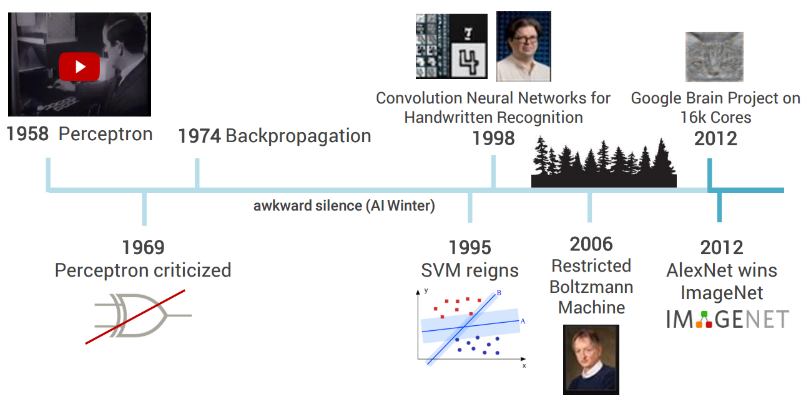
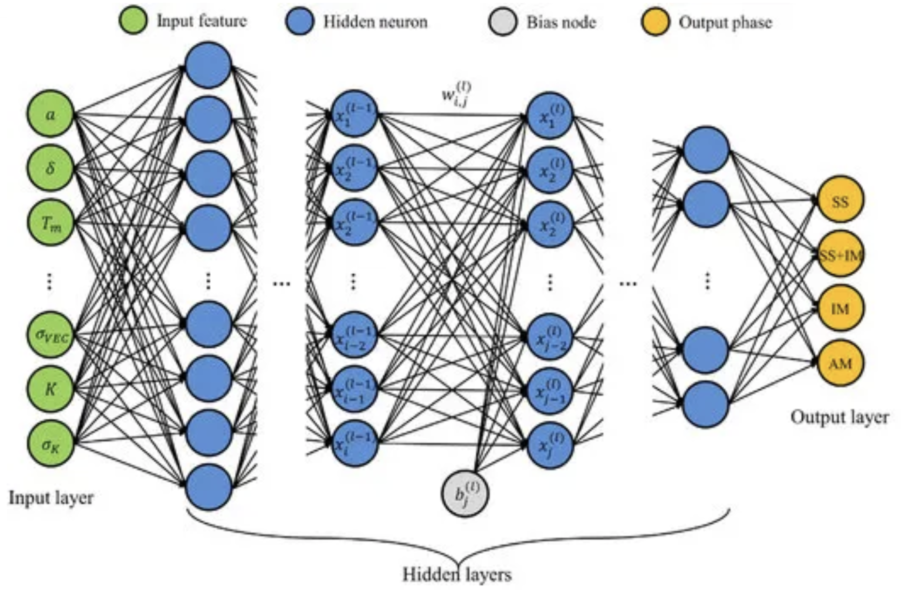

```{r xaringan-themer, include = FALSE}
library(xaringanthemer)
mono_light(
  base_color = "midnightblue",
  header_font_google = google_font("Josefin Sans"),
  text_font_google   = google_font("Montserrat", "500", "500i"),
  code_font_google   = google_font("Droid Mono"),
  link_color = "#8B1A1A", #firebrick4, "deepskyblue1"
  text_font_size = "28px"
)

```

# Welcome: Class format

Course web site: https://bios691-deep-learning-r-2025.netlify.app/

- [Q&A Google Doc](https://docs.google.com/document/d/1J6KF6Ok50QfOD3tS39yWqxdvLcFjdWHP78QiVjkrdRw/edit?usp=sharing), https://bit.ly/bios691  

You will get the most out of this class if you   
1. Attend class
2. Follow and complete code examples yourself
3. Review references and reading
4. Ask questions

---
## Welcome: Textbook

.pull-left[Book: **"Deep Learning with R"** introduces the world of deep learning using the powerful Keras library and its R language interface.

The book builds your understanding of deep learning through intuitive explanations and practical examples.   

Second edition.]

.pull-right[   
.small[ https://www.manning.com/books/deep-learning-with-r-second-edition ] ]

---
## Welcome: Textbook

.pull-left[Authors: François Chollet (the creator of Keras) with J. J. Allaire (the founder of RStudio and the author of the R interfaces to Keras and TensorFlow).

Video: "François Chollet: Keras, Deep Learning, and the Progress of AI | Lex Fridman Podcast #38", 2 h, https://youtu.be/Bo8MY4JpiXE

Video: "TensorFlow and Keras in R - Josh Gordon meets with J.J. Allaire (TensorFlow Meets)", 8 min, https://youtu.be/YrzE_N4bjDM]

.pull-right[   
.small[ https://www.manning.com/books/deep-learning-with-r-second-edition ] ]

 

---
## Additional resources

- "The Deep Learning textbook" by Ian Goodfellow, Yoshua Bengio and Aaron Courville, https://www.deeplearningbook.org

- "Deep Learning with Keras and TensorFlow in R Workflow" - RStudio Conference 2020 workshop by Brad Boehmke, https://github.com/rstudio-conf-2020/dl-keras-tf

- "[MIT Introduction to Deep Learning | 6.S191](https://www.youtube.com/watch?v=njKP3FqW3Sk&list=PLtBw6njQRU-rwp5__7C0oIVt26ZgjG9NI)" - MIT video course by Alexander Amini, Ava Soleimani, and guests. Dense and informative ~45min lectures covering various topics of deep learning. http://introtodeeplearning.com - course web site with slides, video, and other material

- "Machine learning and deep learning resources" - a collection of references for further studies, https://github.com/mdozmorov/MachineLearning_notes

<!--
## Final project

The objectives of this class include  
- Become proficient in selecting the correct types of deep learning models
- Implement deep neural networks using Keras/TensorFlow and R programming language
- Train and evaluate the performance of deep neural networks

To help you with this, you will solve one of the [Kaggle competitions](https://www.kaggle.com/competitions) based on topics/code learned in-class. See [Final project](../class/final_project) for more details

- Teams of two are encouraged
- Due date is 07/12/2020
- Ask questions by e-mail

.small[https://www.kaggle.com/competitions]
-->

---
## Artificial Intelligence and Deep Learning

- **Artificial Intelligence** - A process of machines **learning** the algorithms and rules to perform tasks, rather than simply carrying out computations defined by humans. Examples: Supervised/unsupervised learning, reinforcement learning, image/video recognition, speech/natural language processing, etc.

.center[]

.small[ https://ai.stackexchange.com/questions/15859/is-machine-learning-required-for-deep-learning ]

---
## Artificial Intelligence and Deep Learning

- **Machine Learning** - A subfield of AI in which a computer algorithm (a set of rules and procedures) is developed to learn and make predictions from data that is fed into the system. A machine learning system is trained rather than explicitly programmed. Examples: Linear/Logistic Regression, SVM, Random Forest, Clustering, PCA, etc.

.center[]

.small[ https://ai.stackexchange.com/questions/15859/is-machine-learning-required-for-deep-learning ]

---
## Artificial Intelligence and Deep Learning

- **Deep Learning** - A form of machine learning that uses many layers of computation to form what is described as a deep neural network, capable of learning from large amounts of complex, unstructured data.
- **Neural Networks** - Modeled after the brain in which algorithms process signals via interconnected nodes called artificial neurons.

.center[]

.small[ https://ai.stackexchange.com/questions/15859/is-machine-learning-required-for-deep-learning ]

---
## Machine vs. Deep Learning

- **Feature extraction** - transforming input data so it is amenable for classification. Automated by Deep Learning.
- **Feature selection** - selecting features most important for accurate classification. Automated by Machine and Deep Learning.

.center[]

.small[ https://www.analyticsvidhya.com/blog/2020/02/cnn-vs-rnn-vs-mlp-analyzing-3-types-of-neural-networks-in-deep-learning/ ]

---
## Deep learning history

.center[]

.small[https://leonardoaraujosantos.gitbooks.io/artificial-inteligence/chapter1.html]

---
## Image classification challenge

.center[]

.small[https://towardsdatascience.com/review-senet-squeeze-and-excitation-network-winner-of-ilsvrc-2017-image-classification-a887b98b2883]

---
## Deep learning applications

- Computer vision, image classification, image captioning

- Speech recognition, translation

- Text, natural-language processing, sentiment analysis

- Timeseries forecasting

- Image, text, speech/music generation, music-to-notes translation
  - Drawing to LaTeX symbol translation: http://detexify.kirelabs.org/classify.html

- Self-driving cars

---
## Essential Knowledge for Deep Learning

- Probability and Statistics

- Linear Algebra and Calculus

- Key Machine Learning Concepts

- Hardware (GPU preferred)

- Software (Keras preferred)

- Programming (Linux-based OS preferred, Python preferred)

.small[https://www.analyticsvidhya.com/blog/2020/03/deep-learning-5-things-to-know/]

---
## Probability and Statistics for Deep Learning

- **Descriptive Statistics** - Standard Deviation, Variance, Normal distribution, Central Limit Theorem.

- **Probability** - random variables, binomial distribution, Z-scores, significance level.

- **Linear models** - easily interpretable machine learning.

---
## Linear Algebra for Deep Learning

- **Scalars** and **vectors**
    - **Dot product** - the Dot product of two vectors returns a scalar value.
    - **Cross product** - the Cross product of two vectors returns another vector which is orthogonal (right-angled) to both.

.center[]

.small[ https://mdashf.org/2018/01/19/cross-and-dot-product-of-vectors/ ]

---
## Matrices and Matrix Operations

- **Scalar Multiplication** - multiply all matrix elements with the scalar.
- **Matrix Multiplication** - multiplying two matrices means calculating the dot product of the rows and columns and creating a new matrix with dimensions derived from the two input matrices.
- **Hadamard product** - element-wise product of the two vectors ( $\bigodot$ ).
- **Transpose of the matrix** - swap the rows and the columns in a matrix.
- **Inverse to the matrix** - an inverse of a matrix multiplied with the matrix gives an identity matrix.
.center[]
.small[ https://www.cuemath.com/algebra/matrix-operations/ ]

---
## Tensors

Tensors are a generalization of vectors and matrices to an arbitrary number of dimensions.

- A tensor that contains only one number is called a scalar (or scalar-tensor, or zero-dimensional tensor, or 0D tensor).

- A one-dimensional array of numbers is called a vector, or 1D tensor.

- A two-dimensional array of numbers is a matrix, or 2D tensor.

- An array of matrices makes a three-dimensional array of numbers, or 3D tensor.

---
## Tensors

A tensor is defined by three key attributes:

- **Number of axes (rank)** - For instance, a 3D tensor has three axes, and a matrix has two axes.

- **Shape** - This is an integer vector that describes how many dimensions the tensor has along each axis. A vector has a shape with a single element, such as (5). Think `dim()` function.

- **Data type** - This is the type of the data contained in the tensor; integer or double.

---
## Real-world tensors

- **Vector data** - 2D tensors of shape (samples, features).

- **Timeseries data or sequence data** - 3D tensors of shape (samples, timesteps, features).

- **Images** - 4D tensors of shape (samples, height, width, channels).

- **Video** - 5D tensors of shape (samples, frames, height, width, channels).

.center[]
.small[ https://blog.tensorflow.org/2023/01/using-tensorflow-for-deep-learning-on-video-data.html ]

---
## Tensor operations

.pull-left[
- Addition, multiplication

- Tensor transformation with functions

- Tensor reshaping

- Tensor dot<sup>1</sup>
]

.pull-right[]

.footnote[review Section "2.3. Tensor operations", p. 37]

---
## Calculus for Deep Learning

- **Derivatives** - derivatives measure the change in the output value when we change the input value.
- **Partial derivatives** - Partial derivative is when we consider only one variable, keep all the other variables as constant, and take the derivative with respect to the considered variable.
- **Chain rule** - helps when input variables are expressed as functions of other functions. If $y = f(u)$ and $u=g(x)$ are both differentiable, then $\frac{dy}{dx}=\frac{dy}{du}\frac{du}{dx}$
- **Gradient** - the gradient of the function $f(x)$ with respect to $x$ (an $n$-dimensional vector $[x_,x_2,...,x_n]^T$) is a vector of $n$ partial derivatives $\nabla_x f(x) = \left[\frac{\partial f(x)}{\partial x_1}, \frac{\partial f(x)}{\partial x_2},...,\frac{\partial f(x)}{\partial x_n} \right]^T$

.small[https://d2l.ai/chapter_preliminaries/calculus.html]

---
## Supervised Learning

- **Supervised Learning** - using training data (input variables) with the known target variable, find rules that give the relationship between the input and the target variables. These rules can then be applied to the unseen (test) data to predict the expected target variables for it. Examples: kNN, SVM, Linear Regression, etc.
    - **Regression** - predict numeric (continuous) outcome.
    - **Classification** - predict continuous (binary or multinomial) outcome.

- **Applications** - Text categorization, Face Detection, Signature recognition, Customer recommendation system, Spam detection, Weather forecasting, Predicting housing prices based on the prevailing market price, Stock price predictions, among others.

.small[https://www.analyticsvidhya.com/blog/2020/04/supervised-learning-unsupervised-learning/]

---
## Unsupervised Learning

- **Unsupervised Learning** - the target variable is unknown, so the goal is to cluster the data into groups, and we can identify the groups after we have clustered the data. Examples of unsupervised learning include k-means clustering, dimensionality reduction techniques, etc.
    - **Clustering** - organize unlabelled data into _similar_ groups.
    - **Anomaly detection** - identify rare events.

- **Applications** - Fraud detection, Malware detection, Identification of human errors during data entry, Conducting accurate basket analysis, etc.

.small[https://www.analyticsvidhya.com/blog/2020/04/supervised-learning-unsupervised-learning/]

---
## Semi-supervised learning

- Learning guided by the data itself.

- Labels generated from the input data.

- **Autoencoders** - learns data properties (labels) to reconstruct input data.

- The distinction from other learning types is not well-defined.

---
## Reinforcement Learning

- **Reinforcement Learning** - learning to make specific decisions based on past experience. An agent interacts with an environment over time, receives feedback as reward or punishment, and adjusts its action policy to maximize the reward for the next action.
    - 2015: Google's Deep Q algorithm wins Atari games.
    - 2015: Google's AlphaGo algorithm beats best human Go players.

.center[]

.small[https://www.wired.com/2015/02/google-ai-plays-atari-like-pros/  
https://www.wired.com/2017/05/googles-alphago-trounces-humans-also-gives-boost/  
https://github.com/p-christ/Deep-Reinforcement-Learning-Algorithms-with-PyTorch]

---
## Reinforcement Learning

.center[]

.small[https://simons.berkeley.edu/sites/default/files/docs/6453/201703xxsimons-representations-deep-rl.pdf]

---
## Transfer learning

- Train a large model on a huge dataset, and then use the final parameters on smaller datasets.

- Pretrained models significantly simplify and reduce time of training.

- Popular in computer vision ( **VGG-16**, **ResNet** ), NLP (**ChatGPT**, **BERT** )

.small[https://neurohive.io/en/popular-networks/vgg16/  
https://openai.com/chatgpt/  
https://builtin.com/artificial-intelligence/resnet-architecture  
https://towardsdatascience.com/bert-explained-state-of-the-art-language-model-for-nlp-f8b21a9b6270]

---

.center[]

.small[https://medium.com/tensorflow/mit-deep-learning-basics-introduction-and-overview-with-tensorflow-355bcd26baf0]

---
## Data preprocessing

- **Vectorization** - sample-specific data should be represented as a vector. The vector representation scheme should be consistent from sample to sample.

- **Normalization** - Make values small, typically within the 0-1 range. Make them homogeneous, relatively uniformly distributed throughout the range
    - In general, it isn’t safe to feed into a neural network data that takes relatively large values or data that are on different scales. Doing so can trigger large gradient updates that will prevent the network from converging.
    - Normalize **features** to have a mean of 0 and a standard deviation of 1.
    - Important: Normalize training data separately, then use these normalization constants to normalize validation and test sets.

---
## Training-test-validation sets

- **Training set** - data used to develop feature sets, train our algorithms, tune hyperparameters, compare models, and all of the other activities required to choose a final model.
- **Test set** - data used to estimate the final model’s performance.
- 70%/30% split is typical to separate the initial dataset into training and test sets.
.center[]

---
## Training-test-validation sets

- During training, some data leakage occurs - the model memorizes some properties of the test set that improve performance. Leads to overfitting.
- **Validation** - data used to improve the model. Needed to evaluate the model on never-before-seen data, to make the model generalizable and prevent overfitting.
- 60%/20%/20% is typical to split the data into three sets.
.center[]

---
## Training Epochs & Model Performance

* **Training epoch** is one complete pass through the entire training dataset, where the model processes each sample once and updates its weights to minimize the loss function.

* **Loss function** measures how far the model's predictions deviate from actual values. Lower loss generally indicates better model performance, but extremely low training loss may signal overfitting.

* **Learning rate** controls how much a model adjusts its parameters during each training step.

* **Model performance** is tracked across epochs - initially, both training and validation loss decrease as the model learns. When validation loss starts increasing while training loss continues to decrease, this indicates overfitting has begun.


---
## Machine/deep learning lifecycle

**Learning curves** plot training and validation metrics (loss, accuracy) against epochs, helping visualize model convergence and identify overfitting.

.center[]
* **Early stopping** is a technique that halts training when validation metrics stop improving, preventing overfitting.  
.small[ **Angermueller et al., “Deep Learning for Computational Biology.”** https://doi.org/10.15252/msb.20156651 ]

---
## Cross-validation

- **Cross-validation** - A common machine learning strategy wherein the dataset is split multiple times into training and validation sets. The average validation performance across the multiple splits is used to select the final model.

- k-fold cross-validation, leave-one-out cross-validation, bootstrapping.

.center[]

.small[https://bradleyboehmke.github.io/HOML/process.html]

---
## Bias variance trade-off

- **Bias** - the difference between the expected (or average) prediction of our model and the correct value which we are trying to predict.
- **Variance** - the variability of a model prediction for a given data point.

.center[]

.small[http://scott.fortmann-roe.com/docs/BiasVariance.html]

---
## Bias variance trade-off

- **Bias** - the difference between the expected (or average) prediction of our model and the correct value which we are trying to predict
- **Variance** - the variability of a model prediction for a given data point

.center[]

.small[http://scott.fortmann-roe.com/docs/BiasVariance.html]

---
## Underfitting and Overfitting

- **Underfitting and Overfitting** - too simple or too complex models.

.center[]

.small[https://medium.com/greyatom/what-is-underfitting-and-overfitting-in-machine-learning-and-how-to-deal-with-it-6803a989c76]

---
## The central goal of machine learning - data transformation

The "learning" part of machine learning is to find useful representations of the input data that get us closer to easily detect the expected output.

.center[]

The new coordinates are the new representation of the data making it easy to classify it. 

---
## The central goal of machine learning - data transformation

Layers in a deep neural networks are well-suited for finding useful data representations. They do input-to-target mapping via a deep sequence of simple data transformations that are learned by exposure to examples.

.center[]
.small[ https://blog.gopenai.com/decoding-the-architecture-determining-layers-and-neurons-in-deep-neural-networks-dnns-c2ac349989c2 ]

---
## Weights and biases

- The specification of what a layer does to its input data is stored in the layer's **weights**. Weights are parameters of a layer.
- **Bias** allows a layer to better fit the data. Think intercept in linear regression that ensures better fit as compared with forcing the regression line through zero.
.center[]
.small[ https://blog.gopenai.com/decoding-the-architecture-determining-layers-and-neurons-in-deep-neural-networks-dnns-c2ac349989c2 ]


---
## Architectures

Deep Learning encompasses a wide range of architectures, each suited for different tasks. The most popular architectures include:

- **Multilayer Perceptrons (MLP)**, also known as fully connected networks.
- **Convolutional Neural Networks (CNNs)**, primarily used for image and spatial data processing.
- **Recurrent Neural Networks (RNNs)**, including variants such as Long Short-Term Memory (LSTM) and Gated Recurrent Units (GRU), which are commonly applied to sequential data.
- **Generative Models**, such as Generative Adversarial Networks (GANs) and (Variational) Autoencoders (VAE), which are used for tasks like data generation and dimensionality reduction.
- **Transformers**, Used in natural language processing (NLP). Popularized by models like BERT, GPT, and increasingly in other domains like Vision Transformers (ViT).

.small[https://www.analyticsvidhya.com/blog/2020/02/cnn-vs-rnn-vs-mlp-analyzing-3-types-of-neural-networks-in-deep-learning/]

---
## Hardware

- **GPU**, Graphics Processing Unit - highly parallel computations, speeds up network training
    - NVIDIA K80, P4, P100 - starter GPUs, on the order of increased performance
    - NVIDIA GTX1060 and above - intermediate GPUs
    - NVIDIA V100 - advanced GPU, up to 47X speedup compared with CPU
    - NVIDIA H100 - cutting-edge GPU for AI, based on the Hopper architecture. Up to 6X performance increase over V100, support for FP8 precision, and specialized Tensor Cores, making it ideal for large-scale deep learning workloads and next-gen AI research.

- **TPU**, Tensor Processing Unit - designed for parallel tensor computations, faster and cheaper than GPUs.

.small[ https://developer.nvidia.com/blog/nvidia-hopper-architecture-in-depth/ ]

---
## Software

- **TensorFlow** - the most popular framework, developed by Google. Has an R interface.

- **Keras** - the front-end API to the most popular frameworks (Tensorflow, Torch, Jax). Much less and simpler code. Starting point for beginners.

- **PyTorch** - the distinct framework, highly customizable, used in research.

- **FastAI** - founded by Jeremy Howard, the former President and Chief Scientist at Kaggle. PyTorch-based well-tuned components for best performance. Free online courses.

.small[https://tensorflow.rstudio.com/, https://keras.rstudio.com/

https://www.analyticsvidhya.com/blog/2020/03/tensorflow-2-tutorial-deep-learning/]

---
## Software

.center[]

.small[https://towardsdatascience.com/deep-learning-framework-power-scores-2018-23607ddf297a]

---
## Providers

- **[Google Colab](https://colab.research.google.com/)** - free notebooks, supports R and Python kernels, integrated with GitHub and Google Drive, provides free entry-level GPU and TPU

- **[Google Cloud](https://cloud.google.com/products/ai/)** - powerful cloud computing, paid, easy to navigate interface and price plans. Preemptible (short-lived but affordable) virtual machines.

- **[AWS EC2](https://aws.amazon.com/ec2/)** - popular cloud computing platform, requires understanding of pricing options. $300 credit for starters.

- **[Kaggle](https://www.kaggle.com/)** - free Jupyter notebooks, with GPUs. Lots of community code.

- Other options: **Paperspace**, **vast.ai**, **Microsoft Azure**.

.small[https://www.analyticsvidhya.com/blog/2020/03/google-colab-machine-learning-deep-learning/

https://towardsdatascience.com/maximize-your-gpu-dollars-a9133f4e546a]

---
## How to think about deep learning

- The most surprising thing about deep learning is how simple it is.

- All you need is sufficiently large parametric models trained with gradient descent on sufficiently many examples.

- Each layer in a deep-learning model operates one simple geometric transformation on the data that goes through it.

- A key characteristic of this geometric transformation is that it must be differentiable, which is required in order for us to be able to learn its parameters via gradient descent. Intuitively, this means the geometric morphing from inputs to outputs must be smooth and continuous.

- As Richard Feynman once said about the universe, "It’s not complicated, it’s just a lot of it".

.small[Chapter 14.1.3]

---
## Deep learning breakthroughs

- Near-human image classification.
- Near-human speech recognition.
- Near-human handwriting transcription.
- Improved machine translation.
- Improved text-to-speech conversion.
- Digital assistants such as Google Now and Amazon Alexa.
- Near-human autonomous driving.
- Improved web searches and ads.
- Superhuman game playing (Go, StarCraft, Dota2).
- Breakthrough in medical research (protein structure prediction, image pathology diagnostics).
- Ability to answer natural-language questions.

---
## Future of deep learning (is bright)

- **Simplicity** - deep learning removes the need for feature engineering.

- **Scalability** - amenable to parallelization on GPUs and TPUs. Scalable to large datasets by training on batches of data.

- **Versatility and reusability** - any kind of unstructured data, and combinations of them, are amenable for deep learning. Models can be trained with additional data without restarting from scratch. Models can be reused for more complex tasks.
.center[]
.small[ https://www.nomidl.com/machine-learning/future-and-scope-of-machine-learning/ ]

