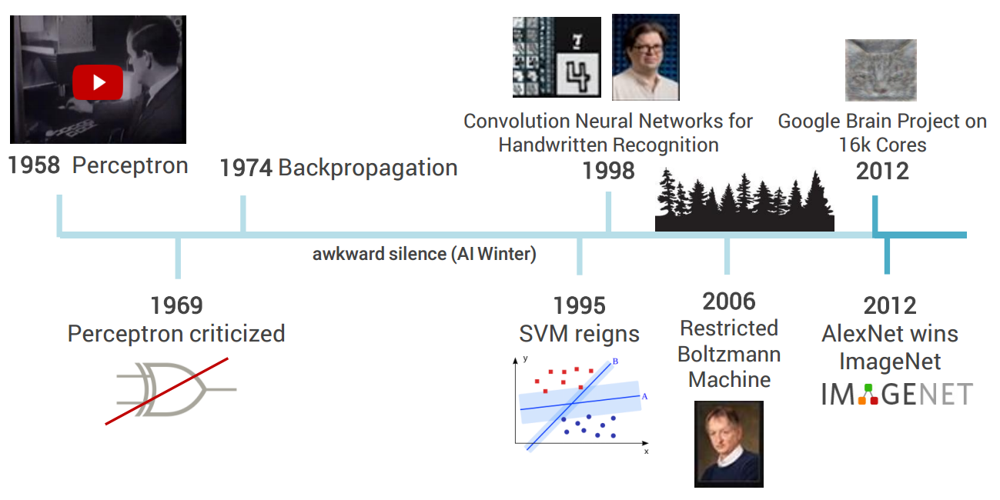
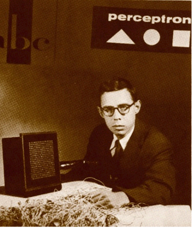
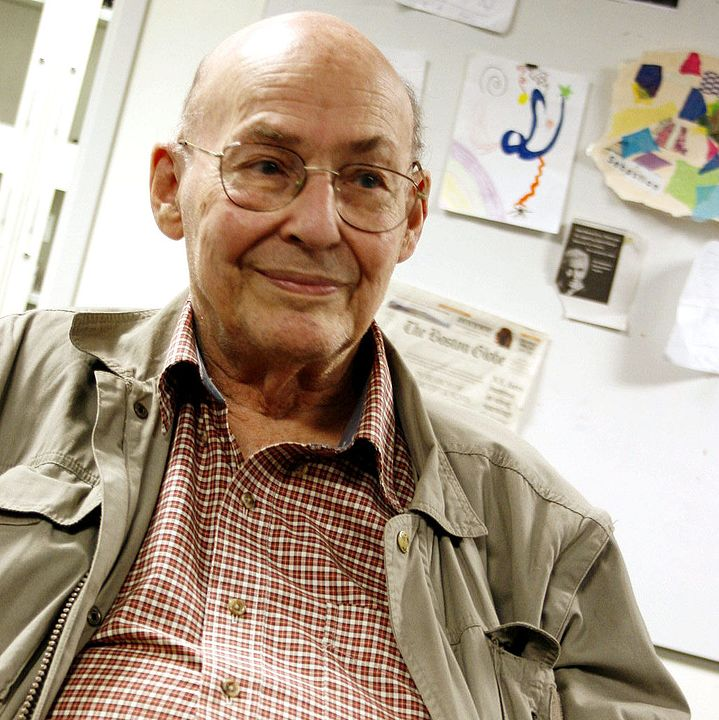
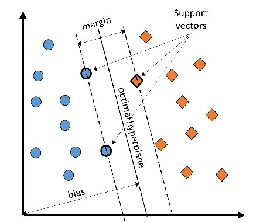
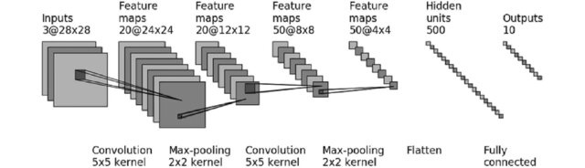
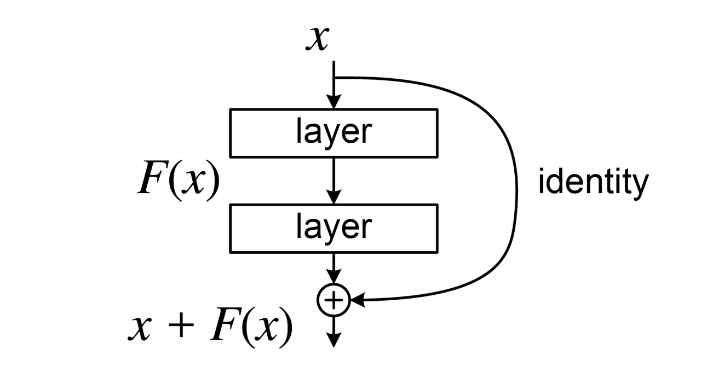
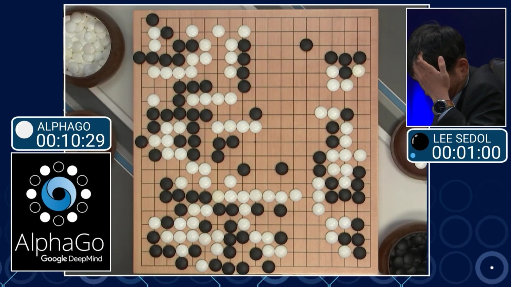
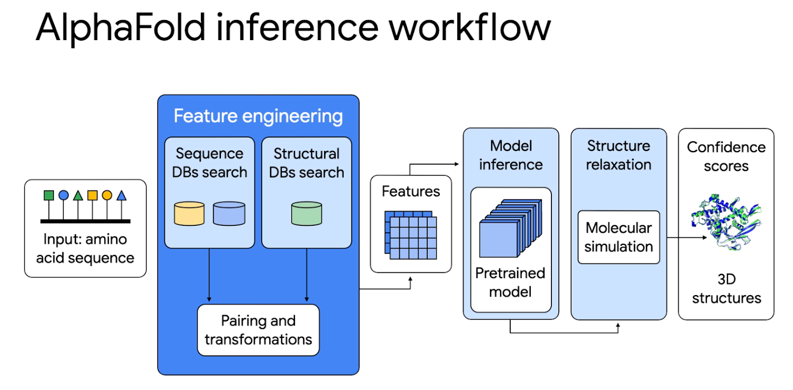
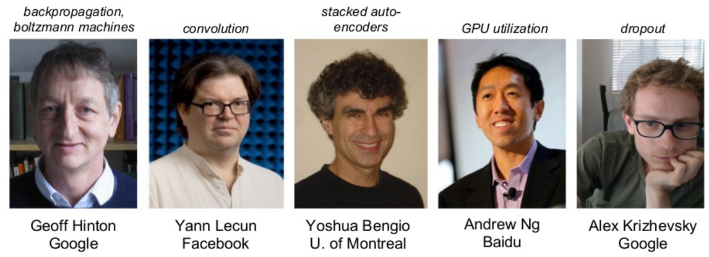

```{r xaringan-themer, include = FALSE}
library(xaringanthemer)
mono_light(
  base_color = "midnightblue",
  header_font_google = google_font("Josefin Sans"),
  text_font_google   = google_font("Montserrat", "500", "500i"),
  code_font_google   = google_font("Droid Mono"),
  link_color = "#8B1A1A", #firebrick4, "deepskyblue1"
  text_font_size = "28px"
)
```

<!-- .center[] -->

<!-- .small[  ] -->

## Deep learning history

.center[]              
.small[https://leonardoaraujosantos.gitbooks.io/artificial-inteligence/chapter1.html]

---
## Perceptron (1958)

The Perceptron, developed by Frank Rosenblatt, was one of the earliest neural networks. It modeled a simple neuron that could make binary decisions by learning from labeled data. The Perceptron was a pioneering step in machine learning, demonstrating that machines could learn to classify inputs through iterative training.

.center[]
.small[ https://towardsdatascience.com/what-the-hell-is-perceptron-626217814f53 ]

---
## Perceptron Criticized (1969)

In 1969, Marvin Minsky and Seymour Papert published the book "Perceptrons", which exposed the limitations of the single-layer Perceptron. They showed that the Perceptron could not solve not linearly separable problems, like the XOR problem. This criticism caused a decline in interest in neural networks for over a decade, often referred to as the AI Winter.

.pull-left[ .center[  ] ]
.pull-right[ .center[  ] ]
.small[ https://yuxi-liu-wired.github.io/essays/posts/perceptron-controversy/   
https://websites.umass.edu/comphon/category/learning/   
https://en.wikipedia.org/wiki/Marvin_Minsky ]

---
## Backpropagation (1986)

Interest in neural networks revived with the development of the Backpropagation algorithm, popularized by Geoffrey Hinton, David Rumelhart, and Ronald Williams. It enabled multilayer neural networks (also called Multilayer Perceptrons or MLPs) to effectively adjust weights across layers, allowing the networks to solve complex, non-linear problems. This breakthrough paved the way for modern deep learning.

.center[]

.small[ https://www.datacamp.com/tutorial/mastering-backpropagation ]

---
## Deep learning winter and revival

- Widespread belief that gradient descent would be unable to escape poor local minima during optimization, preventing neural networks from converging to a global acceptable solution

- During 1980s, 1990s, deep neural networks were largely abandoned

---
## Support Vector Machines (1990s)

In the early 1990s, Support Vector Machines (SVMs) emerged as a powerful tool for supervised learning. They became a popular alternative to neural networks, especially due to their effectiveness in high-dimensional spaces and limited data. Although SVMs dominated for a time, the resurgence of deep learning with backpropagation eventually overtook them.

.center[]
.small[ https://www.geeksforgeeks.org/separating-hyperplanes-in-svm/ ]

---
## Convolutional Neural Networks (1998)

In 1998, Yann LeCun introduced Convolutional Neural Networks (CNNs) with his LeNet-5 architecture, designed for handwritten digit recognition. CNNs utilized convolutional layers to automatically learn spatial hierarchies in data, making them particularly effective for tasks like image recognition. LeNet-5 was used for reading checks and became a milestone in practical applications of deep learning.

.center[]
.small[ https://www.researchgate.net/publication/369803371_On_the_Analyses_of_Medical_Images_Using_Traditional_Machine_Learning_Techniques_and_Convolutional_Neural_Networks ]

---
## Deep Belief Networks (2006)

Geoffrey Hinton and his team developed Deep Belief Networks (DBNs). DBNs use unsupervised learning to pre-train multiple layers of neurons. They use Restricted Boltzmann Machines (RBMs), generative stochastic neural networks that learn to model the probability distribution of the data. The DBM architecture paved the way for the modern deep learning revolution by allowing deeper architectures to be trained more efficiently. GPU technologies enabled further development.

.center[]
.small[ https://www.kaggle.com/code/residentmario/notes-on-deep-belief-networks ]
.small[ Hinton GE, Osindero S, Teh Y-W. "A fast learning algorithm for deep belief nets". Neural Comput. 2006. https://doi.org/10.1162/neco.2006.18.7.1527 ]

---
## ResNet (2015)

Residual Networks (ResNet), introduced by Kaiming He and his team, revolutionized deep learning by enabling extremely deep neural networks to be trained. The innovation was the concept of skip connections, which allow the model to bypass certain layers, solving the problem of vanishing gradients. ResNet achieved state-of-the-art performance in image classification, particularly in the ImageNet competition.

.center[]
.small[ https://en.wikipedia.org/wiki/Residual_neural_network ]

---
## Generative Adversarial Networks (2014)

Generative Adversarial Networks (GANs), introduced by Ian Goodfellow, marked a breakthrough in generative models. GANs consist of two neural networks: a generator and a discriminator. The generator tries to create realistic data, while the discriminator attempts to distinguish between real and generated data. This technique has been widely applied in image generation, style transfer, and even deepfake technology.

.center[]
.small[ https://developers.google.com/machine-learning/gan/gan_structure ]

---
## AlphaGo (2016)

AlphaGo, developed by Google's DeepMind, made headlines by defeating the world champion Go player in 2016. AlphaGo combines deep neural networks with reinforcement learning, specifically using deep Q-networks and Monte Carlo tree search. This was a landmark achievement in AI, as Go had been considered a game too complex for machines to master due to its vast number of possible moves.

.center[]
.small[ https://shellypalmer.com/2016/03/alphago-vs-not-fair-fight/ ]

---
## Transformers (2017)

The introduction of Transformers by Vaswani et al. in the paper "Attention Is All You Need" revolutionized natural language processing (NLP). Transformers eliminated the need for recurrent architectures (such as RNNs) by introducing a self-attention mechanism, which allows models to process sequences in parallel rather than step by step. This architecture is the foundation for models like BERT and GPT, which have achieved near-human performance in many NLP tasks.

.center[]
.small[ https://deeprevision.github.io/posts/001-transformer/ ]

---
## AlphaFold (2020)

AlphaFold, developed by DeepMind, solved one of biology’s grand challenges—protein structure prediction. AlphaFold uses deep learning to predict the 3D structures of proteins from their amino acid sequences with remarkable accuracy, revolutionizing bioinformatics and opening new possibilities for drug discovery and understanding diseases.

.center[]

.small[ https://cloud.google.com/blog/topics/developers-practitioners/boost-medical-discoveries-alphafold-vertex-ai ]

---
## Leaders of Deep Learning

.center[]
.small[
- [Heroes of Deep Learning, Interviews](https://www.youtube.com/playlist?list=PLfsVAYSMwsksjfpy8P2t_I52mugGeA5gR) by Andrew Ng

https://leonardoaraujosantos.gitbooks.io/artificial-inteligence/deep_learning.html]