```{r xaringan-themer, include = FALSE}
library(xaringanthemer)
mono_light(
  base_color = "midnightblue",
  header_font_google = google_font("Josefin Sans"),
  text_font_google   = google_font("Montserrat", "500", "500i"),
  code_font_google   = google_font("Droid Mono"),
  link_color = "#8B1A1A", #firebrick4, "deepskyblue1"
  text_font_size = "28px"
)
```

## Deep Learning Prerequisites

To build and train machine learning and deep learning models, the following key components are essential:

- **Input Data** - Numerical representation of the raw data samples, such as images represented by pixel values, text converted to word embeddings, or other feature representations.

- **Labeled Data (Expected Output)** - Ground-truth labels or annotations for the input data, which serve as the target the model is trying to predict. For example, image labels like "cat" or "dog" in an image classification task.

- **Evaluation Metrics** - Quantitative measures used to assess the model's performance, such as accuracy, precision, recall, or loss functions. These metrics provide feedback to guide model adjustments during the learning process.

---
## How deep learning learns

- **Hierarchical Learning** - Deep learning models learn layer-by-layer representations of the input data. Each layer captures increasingly abstract and complex patterns, starting from simple features (like edges in images) to high-level concepts (like object recognition).

- **Joint Learning of Layers** - Each layer's parameters are continuously updated based on feedback from both earlier and later layers, ensuring that all layers work together to improve the model’s overall accuracy.

- **End-to-End Learning** - Deep learning models learn directly from raw input to output predictions without the need for manual feature engineering, relying on data-driven learning to optimize performance.

- **Backpropagation** - A technique to adjust the layer's weights. The algorithm calculates the error at the output and propagates it back through the network, updating each weight to minimize the error.

---
## The beginning of Deep Learning

.pull-left[
- A generic Deep Learning architecture is made up of a combination of several layers of "neurons".
- The concept of a "neuron" was proposed in the 1950s with the well-known Rosenblatt "perceptron", inspired by brain function.
- The **multilayer perceptron (MLP)** is a fully-connected feedforward neural network containing at least one hidden layer.
]

.pull-right[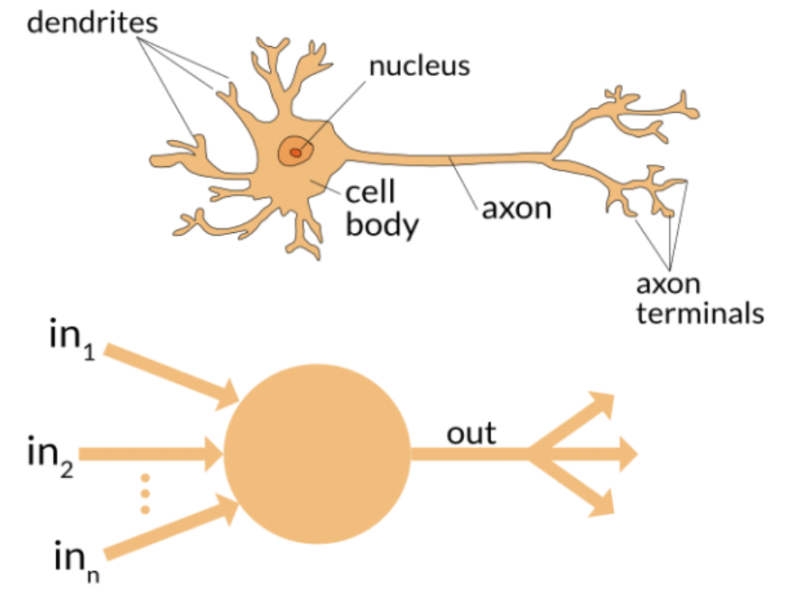]

.small[https://www.analyticsvidhya.com/blog/2020/01/fundamentals-deep-learning-activation-functions-when-to-use-them/

White, B.W.; Rosenblatt, F. [Principles of Neurodynamics: Perceptrons and the Theory of Brain Mechanisms](https://apps.dtic.mil/dtic/tr/fulltext/u2/256582.pdf). Am. J. Psychol. 1963]

---
## The Perceptron: Linear input-output relationships

.center[]

- Input: Take $x_1=0$, $x_2=1$, $x_3=1$ and setting a $threshold=0$

- If $x_1+x_2+x_3>0$, the output is 1 otherwise 0

- Output: calculated as 1

.small[ https://www.analyticsvidhya.com/blog/2020/07/neural-networks-from-scratch-in-python-and-r/  
http://neuralnetworksanddeeplearning.com/chap1.html ]

---
## The Perceptron: Adding weights to inputs

.pull-left[ 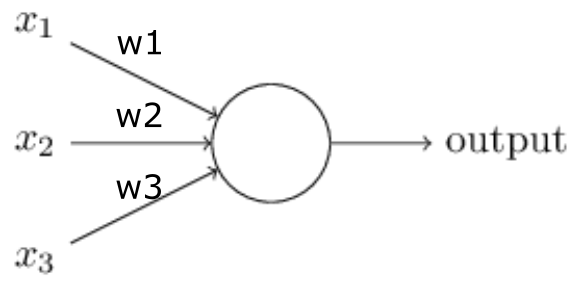 ]

.pull-right[ 

$\hat{y} = g(\sum_{i=1}^m x_iw_i)$

- $\hat{y}$ - the output  
- $\sum$ - the linear combination of inputs
- $g$ - a non-linear activation function  

]

- Weights give importance to an input. For example, you assign $w_1=2$, $w_2=3$ and $w_3=4$ to $x_1$, $x_2$ and $x_3$ respectively. These weights assign more importance to $x_3$.
- To compute the output, we will multiply input with respective weights and compare with threshold value as $w_1*x_1 + w_2*x_2 + w_3*x_3 > threshold$. 

.small[ https://www.analyticsvidhya.com/blog/2020/07/neural-networks-from-scratch-in-python-and-r/ ]

---
## The Perceptron: Adding bias

.pull-left[ 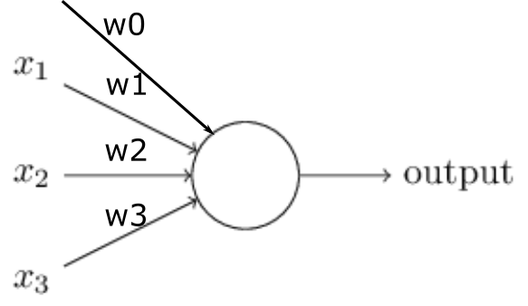 ]

.pull-right[

$\hat{y} = g(w_0 + \sum_{i=1}^m x_iw_i)$

- $w_0$ - bias term

$\hat{y} = g(w_0 + X^TW)$

]

- Bias adds flexibility to the perceptron by globally shifting the calculations and allowing the weights to be more precise.
- Think about a linear function $y=ax+b$, where $b$ is the bias. Without bias, the line will always go through the origin (0,0) and we get poorer fit.
- Input consists of multiple values $x_i$ and multiple weights $w_i$, but only one bias is added. For $i=3$, the linear representation of input will look like $w_1*x_1 + w_2*x_2 + w_3*x_3 + 1*b$.

.small[ https://www.analyticsvidhya.com/blog/2020/07/neural-networks-from-scratch-in-python-and-r/ ]

---
## Multi-layer neural network

.center[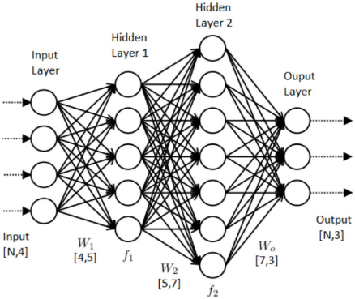]

- **Input** - a layer with $n$ neurons each taking input measures.
- **Processing information** - each neuron maps input to output via nonlinear transformations that include input data $x_i$, weights $w_i$, and biases $b$
- **Output** - Predicted probability of a characteristic of an input. 

.small[ https://www.datasciencecentral.com/profiles/blogs/how-to-configure-the-number-of-layers-and-nodes-in-a-neural ]

---
## Layers

- Deep learning models are composed of multiple layers, each performing specific transformations on the data.

- A Multi-Layer Perceptron (MLP) with more than 2 hidden layers qualifies as a deep model, capable of learning complex patterns.

---
## Commonly Used Layers

- Input Layers - The starting point of the model, where raw data (images, text, etc.) enters.

- Transformation Layers
   - **Fully Connected (Dense) Layer** - Each neuron is connected to every neuron in the previous layer. Common in MLPs for general-purpose tasks.
   - **Convolutional Layer (Conv Layer)** - Extracts spatial features by applying filters to local regions. Primarily used for image data.
   - **Pooling Layers (Max/Average)** - Reduces the dimensionality of feature maps while preserving important information (e.g., Max Pooling retains the largest value).

---
## Commonly Used Layers
- Normalization and Regularization Layers
   - **Dropout Layer** - Randomly drops a set percentage of neurons during training to prevent overfitting.
   - **Batch Normalization Layer** - Normalizes the output of a previous layer, stabilizing and speeding up training.

- Activation (Non-Linearity) Layers
   - **ReLU, Sigmoid, Tanh** - Apply non-linear transformations to enable the model to learn complex patterns.

- Output Layer
   - **Softmax Layer** - Converts raw model outputs into probabilities for classification tasks.

---
## Fitting the parameters using the training set

- Parameters of the neural network (weights and biases) are first _randomly initialized_.
    - For a given layer, initialize weights using Gaussian random variables with $\mu=0$ and $\sigma=1$.
    - Better to use standard deviation $1/\sqrt{n_{neurons}}$.
    - Uniform distribution, and its modifications, also used.

- Small random subsets, so-called batches, of input–target pairs of the training data set are iteratively used to make small updates on model parameters to minimize the loss function between the predicted values and the observed targets.

- This minimization is performed by using the gradient of the loss function computed using the backpropagation algorithm.

---
## Overflow and Underflow in Neural Networks

- **Finite Representation of Real Numbers** - Computers must represent an infinite range of real numbers using a limited number of bits. This constraint introduces approximation errors, which can propagate and accumulate across operations in a neural network.

- **Underflow** - Occurs when extremely small positive or negative numbers, close to zero, are rounded to zero. This is particularly problematic in computations involving probabilities or gradients in deep learning.

- **Overflow** - Happens when very large positive or negative numbers exceed the representational capacity of the system, causing them to be approximated as $\infty$ or $-\infty$. This can result in unstable training or model divergence.

<!-- - **Accumulation of Error** - Approximation errors are inevitable due to the limited precision of floating-point representations. Repeated operations on small or large numbers can exacerbate these errors, potentially affecting model performance. -->

---
## Activation function

Activation function takes the sum of weighted inputs as an argument and returns the output of the neuron

$$a=f(\sum_{i=0}^N w_ix_i)$$

where index 0 correspond to the bias term ( $x_0=b$, $w_0=1$ ).

---
## Activation function

Adds nonlinearity to the network calculations, allows for flexibility to capture complex nonlinear relationships.

- **Softmax** - applied over a vector $z=(z_1,...,z_K)\in R^K$ of length $K$ as $\sigma(z)_i=\frac{e^{z_i}}{\sum_{j=1}^K{e^{z_j}}}$
- **Sigmoid** - $f(x)=\frac{1}{1+e^{-x}}$
- **Tahn** - Hyperbolic tangent $tanh(x)=2*sigmoid(2x)-1$.
- **ReLU** - Rectified Linear Unit $f(x)=max(x, 0)$.

Other functions: binary step function, linear (i.e., identity) activation function, exponential and scaled exponential linear unit, softplus, softsign.

.small[ https://keras.io/activations/

https://www.analyticsvidhya.com/blog/2020/01/fundamentals-deep-learning-activation-functions-when-to-use-them/ ]

---
## Activation functions overview

.center[]

.small[ https://medium.com/@shrutijadon/survey-on-activation-functions-for-deep-learning-9689331ba092 ]

---
## Learning rules

- **Optimization** - update model parameters on the training data and check its performance on a new validation data to find the most optimal parameters for the best model performance.

.center[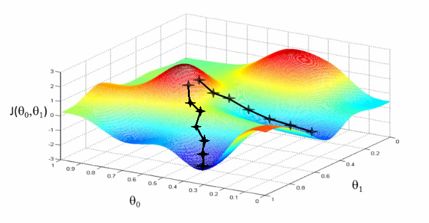]

.small[https://www.youtube.com/watch?v=5u4G23_OohI 

https://www.analyticsvidhya.com/blog/2017/03/introduction-to-gradient-descent-algorithm-along-its-variants/]

---
## Loss function

- **Loss function** - (aka objective, or cost function) metric to assess the predictive accuracy, the difference between true and predicted values. Needs to be minimized (or, maximized, metric-dependent).
    - **Regression loss functions** - mean squared error (MSE) $MSE=\frac{1}{n}\sum_{i=1}^n(Y_i - \hat{Y_i})^2$
    - **Binary classification loss functions** - Binary Cross-Entropy $-(y log(p) + (1-y) log(1-p))$
    - **Multi-class classification loss functions** - Multi-class Cross Entropy Loss $-\sum_{c=1}^My_{o,c} log(p_{o,c})$ ( $M$ - number of classes, $y$ - binary indicator if class label $c$ is the correct classification for observation $o$, $p$ - predicted probability observation $o$ is of class $c$ ), Kullback-Leibler Divergence Loss $\sum\hat{y}*log(\frac{\hat{y}}{y})$

.small[ https://ml-cheatsheet.readthedocs.io/en/latest/loss_functions.html ]

---
## Loss optimization

We want to find the network weights that achieve the lowest loss

$$W^* = \underset{W}{\arg\min} \frac{1}{n}\sum_{i=1}^n L(f(x^{(i)}; W), y^{(i)})$$
where $W=\{W^{(0)},W^{(1)},...\}$

---
## Gradient descent

- An optimization technique - finds a combination of weights for best model performance.

- **Full batch gradient descent** uses all the training data to update the weights.

- **Stochastic gradient descent** uses parts of the training data.

- Gradient descent requires calculation of gradient by differentiation of cost function. We can either use first-order differentiation or second-order differentiation.

.small[ https://www.analyticsvidhya.com/blog/2017/03/introduction-to-gradient-descent-algorithm-along-its-variants/  
Richards, Blake A. et al. “[A Deep Learning Framework for Neuroscience](https://doi.org/10.1038/s41593-019-0520-2).” Nature Neuroscience 2019 - Box 1, Learning and the credit assignment problem ]

---
## Gradient descent algorithm

- Initialize weights randomly $\sim N(0, \sigma^2)$

- Loop until convergence
    - Compute gradient, $\frac{\partial J(W)}{\partial W}$
    - Update weights, $W \leftarrow W - \eta \frac{\partial J(W)}{\partial W}$

- Return weights

where $\eta$ is a learning rate. Right selection is critical - too small may lead to local minima, too large may miss minima entirely. Adaptive implementations exist

---
## Gradient descent algorithms

.pull-left[

- Stochastic Gradient Descent (**SGD**)
- Stochastic Gradient Descent with momentum (Very popular)
- [Nesterov's accelerated gradient (NAG)](https://jlmelville.github.io/mize/nesterov.html)
- Adaptive gradient (**AdaGrad**)
- **Adam** (Very good because you need to take less care about learning rate)
- **RMSprop**
]

.pull-right[]

.small[ https://leonardoaraujosantos.gitbook.io/artificial-inteligence/machine_learning/supervised_learning/model_optimization ]

---
## Forward and backward propagation

- Forward propagation computes the output by passing the input data through the network.

- The estimated output is compared with the expected output - the error (loss function) is calculated.

- Backpropagation (the chain rule) propagates the loss back through the network and updates the weights to minimize the loss. Uses chain rule to recursively calculate gradients backward from the output.

- Each round of forward- and backpropagation is known as one training iteration or epoch.

.small[ Rumelhart, David E, Geoffrey E Hinton, and Ronald J Williams. “[Learning Representations by Back-Propagating Errors,](https://www.nature.com/articles/323533a0)” 1986 ]

---
## Forward propagation

.center[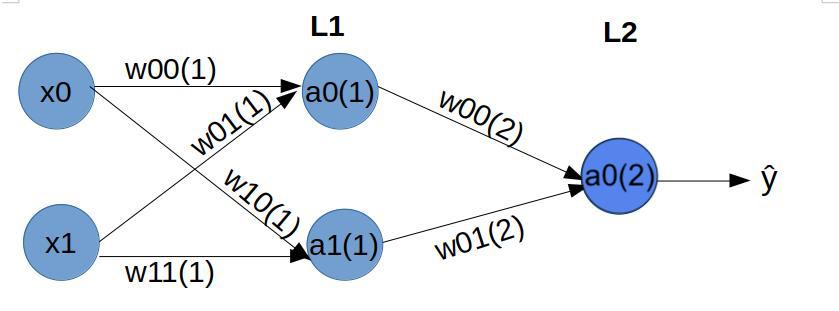]

Assuming sigmoid activation function $\sigma(f)$, at Layer L1, we have:

$$a_0^1 = \sigma{([w_{00}^1 \cdot x_0 + b_{00}^1] + [w_{01}^1 \cdot x_1 + b_{01}^1])}$$

$$a_1^1 = \sigma{([w_{10}^1 \cdot x_0 + b_{10}^1] + [w_{11}^1 \cdot x_1 + b_{11}^1])}$$

.small[https://www.analyticsvidhya.com/blog/2020/04/comprehensive-popular-deep-learning-interview-questions-answers/]

---
## Forward propagation

.center[]

At Layer L2, we have:

$$\hat{y} = \sigma{([w_{00}^2 \cdot a_0^1 + b_{00}^2] + [w_{01}^2 \cdot a_1^1 + b_{01}^2])}$$

.small[https://www.analyticsvidhya.com/blog/2020/04/comprehensive-popular-deep-learning-interview-questions-answers/]

---
## Backpropagation

**Back-propagation** - A common method to train neural networks by updating its parameters (i.e., weights) by using the derivative of the network’s performance with respect to the parameters. A technique to calculate gradient through the chain of functions

.center[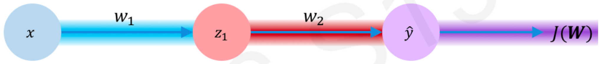]

$$\frac{\partial J(W)}{\partial w_1} = \frac{\partial J(W)}{\partial \hat{y}} * \frac{\partial \hat{y}}{\partial z_1} *  \frac{\partial z_1}{\partial w_1}$$


.small[ Review https://ml-cheatsheet.readthedocs.io/en/latest/backpropagation.html

Rumelhart, David E, Geoffrey E Hinton, and Ronald J Williams. “[Learning Representations by Back-Propagating Errors](https://www.nature.com/articles/323533a0.pdf)”, 1986, 4. ]

<!--
## Backpropagation

.pull-left[]

.pull-right[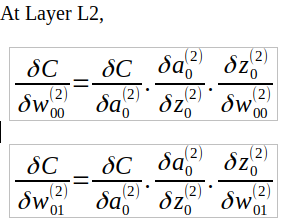]

.small[https://www.analyticsvidhya.com/blog/2020/04/comprehensive-popular-deep-learning-interview-questions-answers/]

## Backpropagation

.pull-left[]

.pull-right[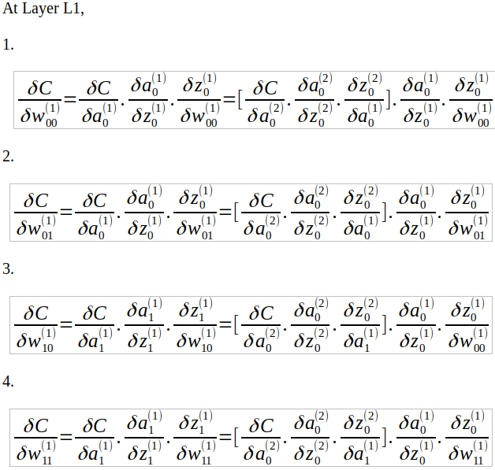]

.small[https://www.analyticsvidhya.com/blog/2020/04/comprehensive-popular-deep-learning-interview-questions-answers/]
-->


---
## Backpropagation Explained

A series of 10-15 min videos by [deeplizard](https://deeplizard.com/)

- [Part 1 - The Intuition](https://deeplizard.com/learn/video/XE3krf3CQls)
- [Part 2 - The Mathematical Notation](https://deeplizard.com/learn/video/2mSysRx-1c0)
- [Part 3 - Mathematical Observations](https://deeplizard.com/learn/video/G5b4jRBKNxw) and the chain rule
- [Part 4 - Calculating The Gradient](https://deeplizard.com/learn/video/Zr5viAZGndE), derivative of the loss function with respect to the weights
- [Part 5 - What Puts The "Back" In Backprop?](https://deeplizard.com/learn/video/xClK__CqZnQ)

Analytics Vidhya tutorial: Step-by-step forward and backpropagation, implemented in R and Python: https://www.analyticsvidhya.com/blog/2020/07/neural-networks-from-scratch-in-python-and-r/

---
## Vanishing gradient

- Typical deep NNs suffer from the problem of vanishing or exploding gradients.
    - The gradient descent tries to minimize the error by taking small steps towards the minimum value. These steps are used to update the weights and biases in a neural network
    - On the course of backpropagation, the steps may become too small, resulting in negligible updates to weights and bias terms. Thus, a network will be trained with nearly unchanging weights. This is the **vanishing gradient** problem
    - Weights of early layers (latest to be updated) suffer the most

.small[ https://en.wikipedia.org/wiki/Vanishing_gradient_problem  
[Vanishing & Exploding Gradient Explained | A Problem Resulting From Backpropagation](https://deeplizard.com/learn/video/qO_NLVjD6zE)  
https://www.analyticsvidhya.com/blog/2020/04/comprehensive-popular-deep-learning-interview-questions-answers/ ]

---
## Exploding gradient

- Typical deep NNs suffer from the problem of vanishing or exploding gradients.
    - The gradient descent tries to minimize the error by taking small steps towards the minimum value. These steps are used to update the weights and biases in a neural network
    - The steps may become too large, resulting in large updates to weights and bias terms and potential numerical overflow. This is the **exploding gradient** problem
    - Various solutions exist, typically by propagating a feedback signal from previous layers (residual connections)

.small[ https://en.wikipedia.org/wiki/Vanishing_gradient_problem  
[Vanishing & Exploding Gradient Explained | A Problem Resulting From Backpropagation](https://deeplizard.com/learn/video/qO_NLVjD6zE)
https://www.analyticsvidhya.com/blog/2020/04/comprehensive-popular-deep-learning-interview-questions-answers/ ]

---
## Neural Network summary

.center[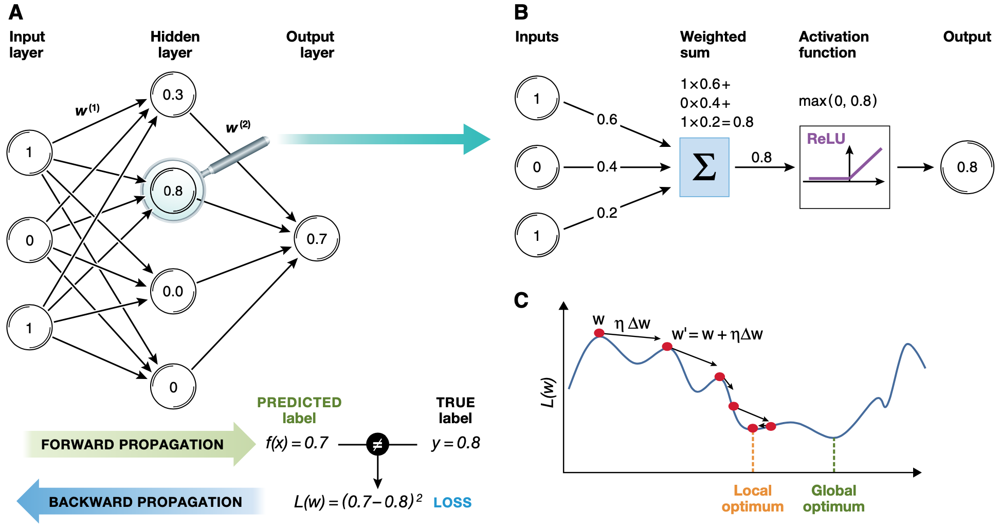]

.small[ Angermueller et al., “[Deep Learning for Computational Biology](https://doi.org/10.15252/msb.20156651).” ]

---
## The Neural Network Zoo

.center[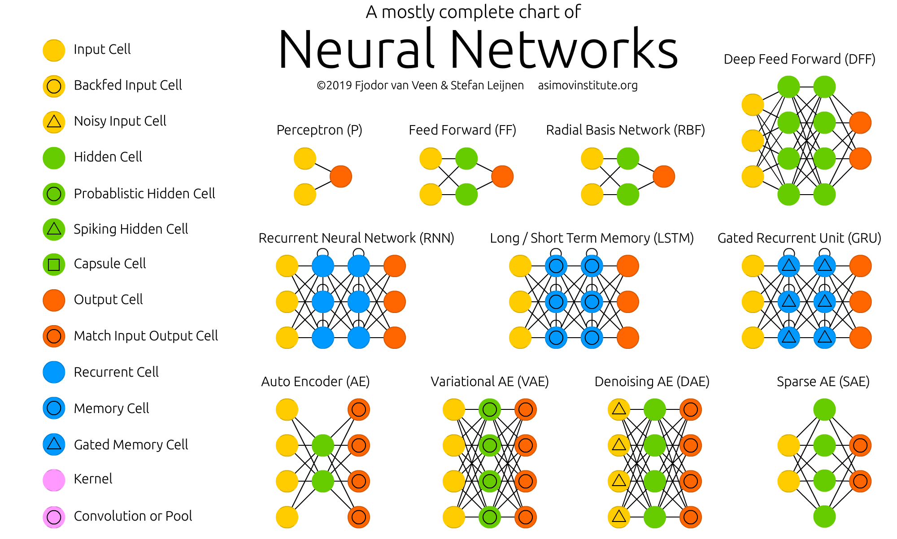]

.small[ Review the complete infographics at https://www.asimovinstitute.org/neural-network-zoo/ ]

