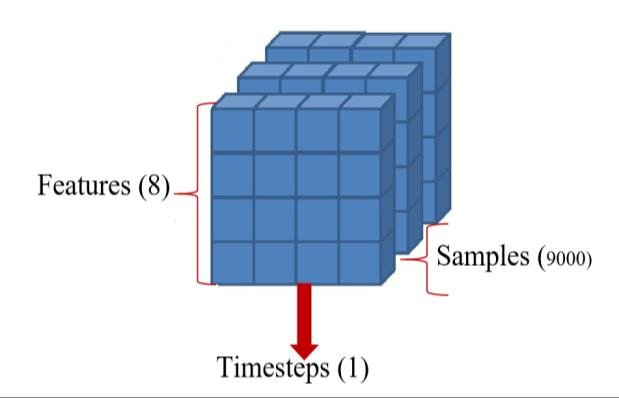
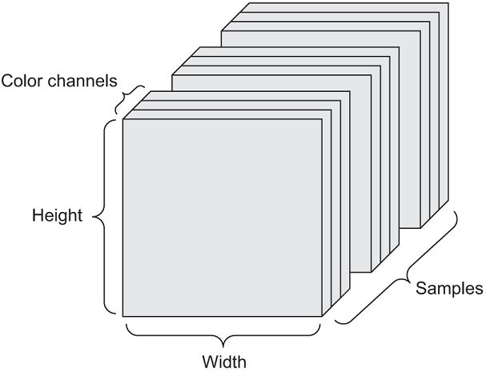

```{r xaringan-themer, include = FALSE}
library(xaringanthemer)
mono_light(
  base_color = "midnightblue",
  header_font_google = google_font("Josefin Sans"),
  text_font_google   = google_font("Montserrat", "500", "500i"),
  code_font_google   = google_font("Droid Mono"),
  link_color = "#8B1A1A", #firebrick4, "deepskyblue1"
  text_font_size = "28px"
)
```

## Data representation in R

Scalars (0D), Vectors (1D), Matrices (2D), Higher-Dimensional arrays

```{r}
pi
month.abb
head(mtcars)
```

---
## Data Representations for Neural Networks

- Neural networks process and learn from data in the form of tensors.

- Tensors have dimensions: Scalars (0D), Vectors (1D), Matrices (2D), Higher-Dimensional Tensors

- Key Attributes of Tensors
  - **Rank (Order)** - Number of axes or dimensions (e.g., scalar = 0D, vector = 1D, matrix = 2D).
  - **Data Type (dtype)** - Type of data contained, e.g., float32, int32, character.

<!--
## Vectors (1D Tensors)

- **Vector** is a 1-dimensional tensor (1D tensor), representing a sequence of values. 
   - Example - A list of temperatures over a week, e.g., [25.3, 24.8, 26.1, 23.4].

```{r}
month.abb
```

## Matrices (2D Tensors)

- **Matrix** is a 2-dimensional tensor (2D tensor), representing a table of numbers, organized in rows and columns.
   - Example: A grayscale image where each pixel intensity is stored in a 2D matrix, e.g., 28x28 pixel image.

```{r}
head(mtcars)
```

## 3D Tensors and Higher-Dimensional Tensors

- **Tensors** can extend to 3D and higher dimensions. These tensors are used to represent more complex data structures.
   - Example: 3D tensor - A color image with RGB channels, e.g., (height, width, channels) = (28, 28, 3).
   - Example: 4D tensor - A batch of images, e.g., (batch_size, height, width, channels) = (32, 28, 28, 3).

## Real-World Examples of Data Tensors

- Vector Data: Examples include tabular data (e.g., financial data), represented as a 2D tensor of shape (samples, features).

- Time Series Data (Sequence Data): Stock prices, heartbeats, or weather patterns are sequences of values over time, represented as 3D tensors (samples, timesteps, features).

- Image Data: Grayscale or color images stored as 3D tensors (height, width, channels).

- Video Data: Videos represented as 5D tensors (samples, frames, height, width, channels).
-->

---
## Vector Data (2D tensor)

- Definition: Each sample in vector data (data point) is represented as a 1D tensor (vector).

- Shape: (samples, features) where samples are the rows and features are the columns.

- Example: A dataset of patient records where each patient's features (age, height, weight, blood pressure, etc.) form a vector (patient x feature).

- Another example: a collection of news articles represented by the counts of words from a dictionary of 20,000 words (news articles x 20,000 words).

---
## Timeseries Data or Sequence Data (3D tensor)

- Definition: Timeseries or sequential data is represented as a 3D tensor.

- Shape: (samples, timesteps, features) where timesteps represent the length of the sequence. The timestep axis is always the second.

- Example: Financial stock prices over time, ECG readings, or language sequences (e.g., word embeddings).

.center[]
.small[ http://dx.doi.org/10.1016/j.mlwa.2020.100013 ]

---
## Image Data (4D tensor)

- Definition: Image data is typically represented as a 3D tensor.

- Shape: For a batch of 32 color images, the shape would be (32, height, width, 3).

- Example: A grayscale image is represented as (height, width, 1) and a color image as (height, width, 3).

.center[]
.small[ https://livebook.manning.com/concept/deep-learning/shape ]


---
## Video Data (5D tensor)

- Definition: Video data adds another dimension for time (frames) and is represented as a 5D tensor.

- Shape: For a batch of 10 videos, each with 60 frames, the shape is (10, 60, 720, 1280, 3).

- Example: A video file with 60 frames of 720p resolution (720, 1280) in RGB color would be (samples, frames, height, width, 3).

---
## Manipulating Tensors in R

You can manipulate tensors using libraries like TensorFlow for R.

```{r}
tensor_example <- array(1:24, dim = c(3, 4, 2))
print(tensor_example)
```

Reshaping a tensor column-wise

```{r}
# order	- The order in which elements of x should be read during the rearrangement. 
# "C" means elements should be read in row-major order; 
# "F" means elements should be read in column-major order.
tensorflow::array_reshape(tensor_example, dim = c(3, 8), order = c("F"))
```

---
## Data Batches

- Large amount of training data raises a question how to process it efficiently.

- Neural networks process data in batches for efficiency and optimization during training.

- Instead of processing 1 image at a time, a model might process 128 images simultaneously, creating a 4D tensor of shape (128, 28, 28, 3).

- Advantages - Reduces memory usage and speeds up training through mini-batch gradient descent.

