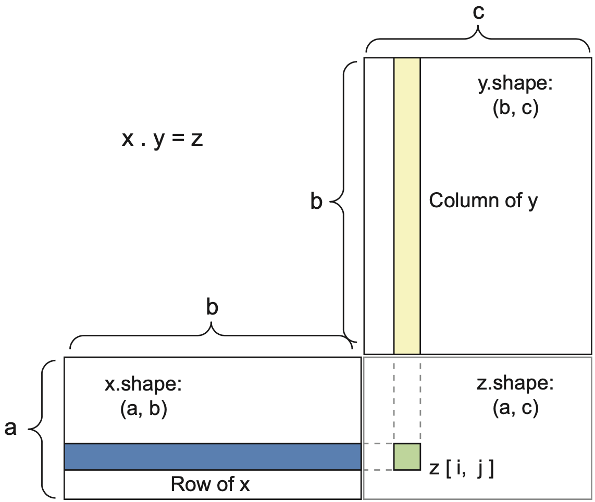
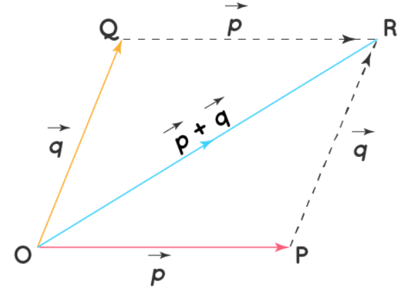
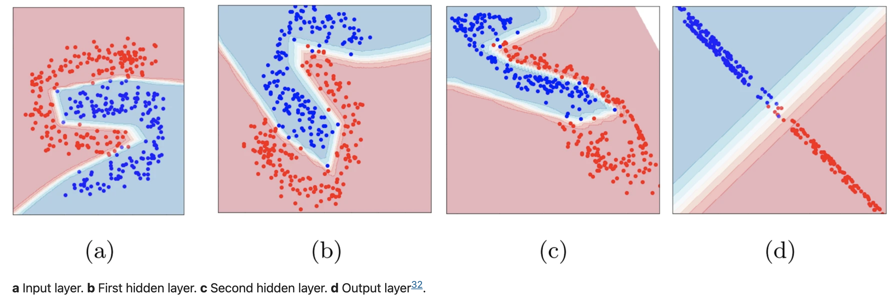

```{r xaringan-themer, include = FALSE}
library(xaringanthemer)
mono_light(
  base_color = "midnightblue",
  header_font_google = google_font("Josefin Sans"),
  text_font_google   = google_font("Montserrat", "500", "500i"),
  code_font_google   = google_font("Droid Mono"),
  link_color = "#8B1A1A", #firebrick4, "deepskyblue1"
  text_font_size = "28px"
)
```

## Tensor operations in Layers

- A layer can be represented as a function that takes a tensor as an input and return another tensor, a new representation for the input tensor. 

- Functions transforming the data are nonlinear, e.g. rectified linear unit (ReLU) $\text{ReLU}(x) = \max(0, x)$, SoftMax ${Softmax}(x_i) = \frac{e^{x_i}}{\sum_{j=1}^{n} e^{x_j}}$.

- Adding weights and biases, we have $output = ReLU(dot(W, input) + b)$
  - A dot product between the input tensor and a tensor of weights
  - An addition between the resulting tensor and a tensor of biases
  - A ReLU operation

---
## Element-wise Operations

- Operations applied to each element of a tensor.

```{r}
# Create two matrices (2x2 for simplicity)
tensor1 <- matrix(c(1, 2, 3, 4), nrow=2, ncol=2)
tensor2 <- matrix(c(5, 6, 7, 8), nrow=2, ncol=2)

# Initialize a result matrix with the same dimensions
result <- matrix(0, nrow=2, ncol=2)

# Perform element-wise multiplication using a for loop
for (i in 1:nrow(tensor1)) {
  for (j in 1:ncol(tensor1)) {
    result[i, j] <- tensor1[i, j] * tensor2[i, j]
  }
}

# Print the result
print(result)
```

---
## Element-wise Operations

- Operations applied to each element of a tensor.

```{r}
# Load the required library
library(tensorflow)

# Create two tensors (2x2 matrix for simplicity)
tensor1 <- tf$constant(matrix(c(1, 2, 3, 4), nrow=2, ncol=2), dtype="float32")
tensor2 <- tf$constant(matrix(c(5, 6, 7, 8), nrow=2, ncol=2), dtype="float32")

# Perform element-wise multiplication
result <- tf$math$multiply(tensor1, tensor2)

# Print the result
result$numpy()
```

---
## Dot-product operation

- `*` operator does element-wise multiplication. `%*%` operator does the dot product (`x . y` in math notation), sum of the products of row and column elements.
- The number of columns in the first matrix must match the number of rows in the second.
- Dot product of tensors with more than one dimension is not symmetric.

.center[]

---
## Tensor Reshaping

- Changing the shape (dimensions) of tensors without modifying the data.
- Needed to prepare inputs for layers in neural networks.
Reshape between different operations (e.g., convnets to dense layers).
```{r}
tensor <- matrix(1:8, nrow=2)
# Flatten a tensor into a 1D tensor
reshaped <- as.vector(tensor)
array_reshape(tensor, dim = c(1, 8))
# Reshaping into higher dimension tensor
array_reshape(tensor, dim = c(2, 2, 2))
```

---
## Geometric Interpretation of Tensor Operations

- Tensors as Geometric Objects - Vectors, matrices, and higher-dimensional tensors have geometric meanings.
- Element-wise operations - scaling/stretching.
- Dot products: projection or similarity measures.
- Tensor reshaping: dimensional transformations.
.center[]
.small[ https://www.cuemath.com/geometry/addition-of-vectors/ ]

---
## Geometric Interpretation of the Dot Product

- The dot product of two vectors results in a scalar.

- It's calculated as the sum of the products of corresponding entries.

- Geometrically, it relates to the angle between the vectors:
  - If the vectors are orthogonal (perpendicular), their dot product is 0.
  - A larger dot product indicates a smaller angle between the vectors.

---
## Geometric Interpretation of Deep Learning

- Neural Networks as Geometric Transformations. Each layer transforms data geometrically.
- Non-linear activations distort the geometry to enhance learning capacity.
- Optimization (e.g., SGD) guides the geometric shape toward a solution.
.center[]
.small[ Manifold-based approach for neural network robustness analysis  
https://doi.org/10.1038/s44172-024-00263-8 ]

