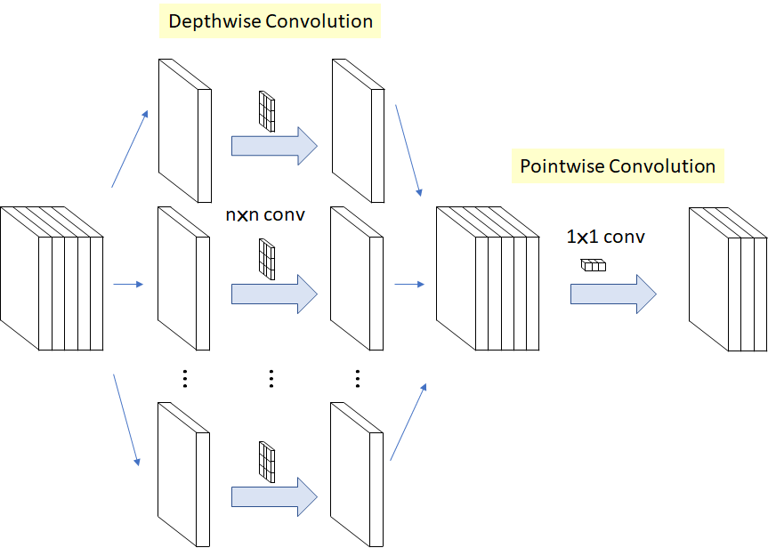

```{r xaringan-themer, include = FALSE}
library(xaringanthemer)
mono_light(
  base_color = "midnightblue",
  header_font_google = google_font("Josefin Sans"),
  text_font_google   = google_font("Montserrat", "500", "500i"),
  code_font_google   = google_font("Droid Mono"),
  link_color = "#8B1A1A", #firebrick4, "deepskyblue1"
  text_font_size = "28px"
)
```

<!-- .center[] -->

<!-- .small[  ] -->

## Convolutional Neural Network (Convnet, CNN)

* A type of deep learning model used almost universally in computer vision applications. 

* Convnets are particularly effective for image-classification problems, especially those with small training datasets.

* Other application areas: Autonomous driving, Robotics, AI-assisted medical diagnosis, Autonomous retail checkout systems, Autonomous farming. 

* Web applications using CNNs: Google Photos, Google image search, YouTube, Video filters in camera apps, OCR (Optical Character Recognition) software.

## Computer vision tasks

*   **Image classification** - Assigning one or more labels to an image. It may be single-label (image in only one category) or multi-label (tagging all categories an image belongs to).

*   **Image segmentation** - Partitioning an image into different areas, each representing a category.

*   **Object detection** - Drawing rectangles (bounding boxes) around objects of interest in an image and associating each rectangle with a class.

---
## Image segmentation

*   **Semantic segmentation** - Each pixel is independently classified into a semantic category. If there are two cats in the image, the corresponding pixels are all mapped to the same generic “cat” category.

*   **Instance segmentation** - Classifying image pixels by category and parsing out individual object instances. In an image with two cats, instance segmentation would treat “cat 1” and “cat 2” as two separate classes of pixels.

*   **Segmentation mask** - The image-segmentation equivalent of a label. It’s an image the same size as the input image, with a single color channel where each integer value corresponds to the class of the corresponding pixel in the input image.

---
## Convolution Operation

*   **Filter**: Filters **encode specific aspects of the input data**. They are 2D windows for extracting local patterns from the original images. Their typical size is 3 × 3 or 5 × 5. At a high level, a single filter could encode the concept "presence of a face in the input," for instance.

*   **Kernel**: A learned weight matrix used in the convolution operation. The same kernel is reused across every patch of the input feature map.

---
## Convolution Operation

.pull-left[**Convolution** is a mathematical operation that does the integral of the product of two functions (signals), with one of the signals flipped. Here, we convolve two signals $f(t)$ and $g(t)$.

.small[ https://leonardoaraujosantos.gitbook.io/artificial-inteligence/machine_learning/deep_learning/convolution ] ]
.pull-right[ .center[] ]

---
## Convolution Operation

*   **Convolution Operation**: The fundamental operation in convnets where local patterns are learned from small 2D windows of the input. This involves extracting patches from the input feature map and applying the same transformation to all patches, producing an output feature map.
  * This operation involves a tensor product with the convolution kernel.

* **Feature Map**: A rank 3 tensor with two spatial axes (height and width) and a depth axis (channels). Each dimension in the depth axis represents a feature or filter, and the rank 2 tensor output[, , n] is the 2D spatial map of the response of this filter over the input.

---
## Convolution

* **A convolution slides a window over the 3D input feature map, extracting a 3D patch of features at each location.** This patch is transformed into a 1D vector using a learned weight matrix (the convolution kernel). These vectors are then reassembled into the 3D output feature map.

.center[]

.small[ https://leonardoaraujosantos.gitbook.io/artificial-inteligence/machine_learning/deep_learning/convolutional_neural_networks ]

---
## Padding and strides

.pull-left[
* **Border Effects**: The output width and height may differ from the input due to border effects, which can be countered by padding the input feature map.

*   **Padding**: Adding rows and columns to the input feature map to control border effects and ensure the output feature map has the desired spatial dimensions. Types of padding include "valid" (no padding) and "same" (padding to maintain the same input and output dimensions).

*   **Strides**: The distance between two successive windows during a convolution. Strides greater than 1 downsample the feature map.
]
.pull-right[
.center[]
]

---
## Padding and strides

.pull-left[
* **Border Effects**: The output width and height may differ from the input due to border effects, which can be countered by padding the input feature map.

*   **Strides**: The distance between two successive windows during a convolution. Strides greater than 1 downsample the feature map.
]
.pull-right[
.center[]
]

---
## Max-pooling

**Max pooling** is a downsampling operation used in convolutional neural networks (convnets) to **reduce the size of feature maps**. It involves **extracting windows from the input feature maps and outputting the max value of each channel**.

*   **Purpose**: Aggressively downsample feature maps.
    *   Reduce the number of feature-map coefficients to process.
    *   Induce spatial-filter hierarchies by making successive convolution layers look at increasingly large windows.

---
## Max-pooling

*   It is conceptually similar to convolution, but instead of transforming local patches via a learned linear transformation (the convolution kernel), they’re transformed via a hardcoded max tensor operation.

*   Max pooling is usually done with **2 × 2 windows and stride 2**, to downsample the feature maps by a factor of 2.

*   In a convnet architecture, `layer_max_pooling_2d()` layers are alternated with `layer_conv_2d()` layers.

*   Max pooling tends to work better than alternative solutions such as strides or average pooling.

---
## The convolutional layer
.center[]

.center[]
.small[https://www.superannotate.com/blog/guide-to-convolutional-neural-networks]

---
## Transposed convolution

* **Conv2DTranspose**, is a type of layer that **learns to upsample feature maps**, serving as an **inverse operation to a regular convolution layer**.

*   **Image Segmentation**: In image segmentation, transposed convolutions are used to **upsample feature maps** to match the size of the target masks. Because image segmentation involves assigning a class to each pixel, it is necessary to return to the original image size after a series of downsampling convolutions.

*   **Model Architecture**: In image segmentation, the first half of the model consists of regular `Conv2D` layers (downsampling), and the second half consists of `Conv2DTranspose` layers (upsampling).

---
## Depthwise separable convolution

A layer that can be used as a drop-in replacement for a regular `layer_conv_2d()` layer to make a model smaller and leaner while improving performance.

* It performs a **spatial convolution on each channel of its input independently**, before mixing output channels via a **pointwise convolution (a 1 × 1 convolution)**.

* This is equivalent to separating the learning of spatial features and the learning of channel-wise features.

* Depthwise separable convolution relies on the assumption that **spatial locations in intermediate activations are highly correlated, but different channels are highly independent**. Because this is generally true for image representations learned by deep neural networks, it serves as a useful prior.

---
## Depth-wise separable convolution layers

.pull-left[
- Implemented as `layer_separable_conv_2d()`.

- Performs a spatial convolution on each channel of its input, independently, before mixing output channels via a pointwise convolution (a $1 \times 1$ convolution).

- It requires significantly fewer parameters and involves fewer computations, thus resulting in smaller, speedier models.
]

.pull-right[]

.small[https://towardsdatascience.com/review-xception-with-depthwise-separable-convolution-better-than-inception-v3-image-dc967dd42568]

---
## MNIST

The MNIST digit classification task can be considered the "Hello World" of computer vision using Convolutional Neural Networks (CNNs).

*   **Basic Convnet Structure.** It involves stacking `layer_conv_2d()` and `layer_max_pooling_2d()` layers. The input tensors are of shape (image\_height, image\_width, image\_channels), excluding the batch dimension. For MNIST images, this is configured to (28, 28, 1).

*   **High Accuracy** A basic convnet can achieve a test accuracy of 99.1% on the MNIST dataset, substantially outperforming a densely connected model. The densely connected model can reach a test accuracy of 97.8%, so using the basic convnet decreased the error rate by about 60%.

---
## Image datasets

*   **ImageNet**: This is a large dataset of **1.4 million labeled images with 1,000 different classes**. It is often used for pre-training models for computer vision tasks. The classes in ImageNet are mostly animals and everyday objects. Many pre-trained models have been trained on the ImageNet dataset.

*   **Dogs vs. Cats**: This dataset contains **25,000 images of dogs and cats**. It is used as a practical example for image classification with small datasets. A smaller subset of this dataset, containing 2,000 training images, 1,000 validation images, and 2,000 test images, is also used for demonstration purposes. 

*   **Oxford-IIIT Pets dataset**: This dataset contains **7,390 pictures of various breeds of cats and dogs, together with foreground-background segmentation masks for each picture**. It is used as an example for image segmentation.

---
## Data Preprocessing for ConvNets

* Images stored as JPEG files need to be preprocessed into floating-point tensors before being fed into the model. 

* Additional steps include image resizing, normalizing pixel intensity to a common scale, data augmentation (optional).

* Keras provides the `image_dataset_from_directory()` utility to read image files, shuffle them, decode them to tensors, resize them, and pack them into batches.

---
## Data Augmentation

*   **Data Augmentation**: A technique to generate more training data from existing samples by applying random transformations that yield believable-looking images. This helps mitigate overfitting by exposing the model to more aspects of the data.

*   By increasing the diversity of the training data, the model is exposed to more aspects of the data distribution, improving its ability to generalize.

*   **Random Transformations**: Horizontal flipping, Rotation, Zooming

---
## tfdatasets R package

`tfdatasets` is a package that can be used to create efficient input pipelines. Its core object type is the **TF Dataset**. They are typically used to **produce batches of input data and labels** and can be passed directly to the `fit()` method of a Keras model.

*   TF Dataset is an **iterable**: you can call `as_iterator()` on it to produce an iterator, and then repeatedly call `iter_next()` on the iterator to generate sequences of data.

*   TF Dataset iterator yields Tensorflow Tensors by default.

*   In some situations, you may prefer if the iterator yields batches of R arrays instead; in that situation, you can call `as_array_iterator()` instead of `as_iterator()`.

---
## Batch normalization

A technique that **normalizes the activations of a layer**. It helps models train faster and allows for deeper networks.

*   During training, it uses the mean and variance of the current batch of data to normalize samples.

*   During inference, it uses an exponential moving average of the batchwise mean and variance of the data seen during training.

*   **Why it helps:** Batch normalization appears to primarily aid in gradient propagation, which allows for deeper networks. 

*   **Bias Vector:** Because the normalization step centers the layer’s output on zero, the bias vector is no longer needed.

*   **Activation Placement**: Typically placed after the batch normalization layer to maximize the ReLU's utilization. 

---
## Residual connections

*   **Residual Connections:** This technique addresses the **vanishing gradient problem** encountered in deep networks. By adding the input of a layer or block back to its output, information can bypass potentially destructive or noisy transformations, ensuring gradient information from earlier layers propagates effectively. This allows for the training of much deeper networks.

.center[]

.small[ https://cdanielaam.medium.com/understanding-residual-connections-in-neural-networks-866b94f13a22 ]

---
## Pretrained model

A **pretrained model** is a model that has been **previously trained on a large dataset**, typically for a large-scale image classification task. The spatial hierarchy of features learned by the pretrained model can act as a generic model of the visual world.

*   **Advantage for Small Datasets**: Using a pre-trained model is a common and effective approach to deep learning on small image datasets.

*   **Feature Reusability**: The features learned by the pretrained model can be useful for different computer vision problems, even if the new problems involve completely different classes than those of the original task.

*   **Feature Extraction**: Pretrained models can be used for feature extraction, where the representations learned by the model are used to extract interesting features from new samples. These features are then run through a new classifier, which is trained from scratch.

---
## Pretrained model

*   **Convolutional Base**: The initial series of convolution and pooling layers in a convnet used for feature extraction.

*   **Availability**: Many pretrained models (usually trained on the ImageNet dataset) come prepackaged with Keras as functions with the prefix `application_`. 

* Some most popular image-classification models available as part of the Keras applications include VGG, Xception, ResNet, MobileNet, EfficientNet, and DenseNet. They are trained on ImageNet.

---
## Freezing weights

Prevent the weights of specific layers from being updated during training = preserve the knowledge learned by the pre-trained model.

*   When using a pre-trained convolutional base for feature extraction, the base is frozen to prevent its representations from being modified during training.

*   Layers or models can be frozen by`freeze_weights()` or the user can set `layer$trainable <- FALSE`.

*   **Fine-Tuning**: Unfreezing a few of the top layers of a frozen model base used for feature extraction and jointly training both the newly added part of the model and these top layers. This adjusts the more abstract representations to be more relevant for the problem at hand.

---
## Pretrained models

.small[
| Model       | Year | Architecture | Parameters | Accuracy | Speed & Efficiency | Key Strengths | Best Use Cases |
|------------|------|--------------|------------|----------|--------------------|--------------|--------------|
| **VGG**    | 2014 | Deep CNN (stacked 3×3 conv layers) | **138M** (VGG16) | Moderate | **Slow, heavy** | Simple, widely used, good baseline | Good for feature extraction, but outdated |
| **Xception** | 2017 | **Depthwise Separable Convolutions** | 22M | **Higher than VGG, similar to ResNet** | Faster than VGG, ResNet | Efficient feature extraction, lightweight | Image classification, transfer learning |
| **ResNet** | 2015 | **Residual Learning (Skip Connections)** | **~25M (ResNet50)** | **High** | **Faster than VGG, deeper networks possible** | Prevents vanishing gradients, deeper networks train well | Large-scale image recognition, object detection |
| **MobileNet** | 2017 | **Depthwise Separable Convolutions, Lightweight** | **4.2M (MobileNetV2)** | Slightly lower than ResNet | **Very fast, low memory** | Works on mobile & embedded devices | Mobile applications, edge computing |
| **EfficientNet** | 2019 | **Compound Scaling (Depth, Width, Resolution)** | **5.3M (EfficientNetB0)** | **State-of-the-art accuracy** | **High accuracy with fewer parameters** | Best efficiency-to-accuracy tradeoff | High-performance tasks with limited resources |
| **DenseNet** | 2017 | **Dense Connectivity (Feature Reuse)** | **~8M (DenseNet121)** | **Higher than ResNet (for same depth)** | **Moderate, slightly slower** | Feature reuse improves efficiency | Medical imaging, feature-rich datasets |
]

---
## Pretrained models

.small[
| Model       | Year | Architecture | Parameters | Accuracy | Speed & Efficiency | Key Strengths | Best Use Cases |
|------------|------|--------------|------------|----------|--------------------|--------------|--------------|
| **EfficientNet** | 2019 | **Compound Scaling (Depth, Width, Resolution)** | **5.3M (EfficientNetB0)** | **State-of-the-art accuracy** | **High accuracy with fewer parameters** | Best efficiency-to-accuracy tradeoff | High-performance tasks with limited resources |
| **DenseNet** | 2017 | **Dense Connectivity (Feature Reuse)** | **~8M (DenseNet121)** | **Higher than ResNet (for same depth)** | **Moderate, slightly slower** | Feature reuse improves efficiency | Medical imaging, feature-rich datasets |
]

- Best for Transfer Learning: EfficientNet, Xception, ResNet
- Best for Mobile/Embedded Devices: MobileNet
- Best for Large Datasets & Deep Networks: ResNet, EfficientNet
- Best for Feature-Rich Tasks: DenseNet
- EfficientNet and ResNet tend to be the **best all-around choices** 🚀

---
## Visualizing what ConvNets learn

*   **Visualizing intermediate convnet outputs (intermediate activations)**. This is useful for understanding how successive convnet layers transform their input and for getting a first idea of the meaning of individual convnet filters.
    *   To do so, a Keras model can be created that takes batches of images as input and outputs the activations of all convolution and pooling layers.
    *   The first layer acts as a collection of various edge detectors. At that stage, the activations retain almost all of the information present in the initial picture.
    *   As you go deeper, the activations become increasingly abstract and less visually interpretable. They begin to encode higher-level concepts such as "cat ear" and "cat eye". Deeper presentations carry increasingly less information about the visual contents of the image and increasingly more information related to the class of the image.

---
## Visualizing what ConvNets learn

*   **Visualizing convnet filters**. This is useful for understanding precisely what visual pattern or concept each filter in a convnet is receptive to.
    *   This can be done with gradient ascent in input space: applying gradient descent to the value of the input image of a convnet so as to maximize the response of a specific filter, starting from a blank input image. The resulting input image will be one that the chosen filter is maximally responsive to.
    *   A loss function is built that maximizes the value of a given filter in a given convolution layer, and then stochastic gradient descent is used to adjust the values of the input image to maximize this activation.
    *   The filters from the first layers in the model encode simple directional edges and colors (or colored edges, in some cases).
    *   The filters from layers a bit further up the stack encode simple textures made from combinations of edges and colors.
    *   The filters in higher layers begin to resemble textures found in natural images: feathers, eyes, leaves, and so on.

---
## Visualizing what ConvNets learn

*   **Visualizing heatmaps of class activation in an image**. This is useful for understanding which parts of an image were identified as belonging to a given class, thus allowing you to localize objects in images.
    *   This general category of techniques is called class activation map (CAM) visualization and consists of producing heatmaps of class activation over input images.
    *   A class activation heatmap is a 2D grid of scores associated with a specific output class, computed for every location in any input image, indicating how important each location is with respect to the class under consideration.
    *   A spatial map of "how intensely the input image activates different channels" is weighted by "how important each channel is with regard to the class," resulting in a spatial map of "how intensely the input image activates the class".

---
## Project summary

| ID   | Performance |
|------|------------|
| DSN  | Sequential model, 10 epochs: accuracy: 0.7547 - loss: 1.2430 (validation accuracy close to 0.8) <br> EfficientNet unfrozen, after 20 epochs: accuracy: 0.4717 - loss: 1.7735 |
| JJRM | MobileNet unfrozen, 10 epochs: accuracy: 0.7434 - loss: 1.2864 |
| BK   | Sequential model, 10 epochs: validation accuracy close to 0.8 (not evaluated on unseen data) |
| WB   | (No data provided) |

