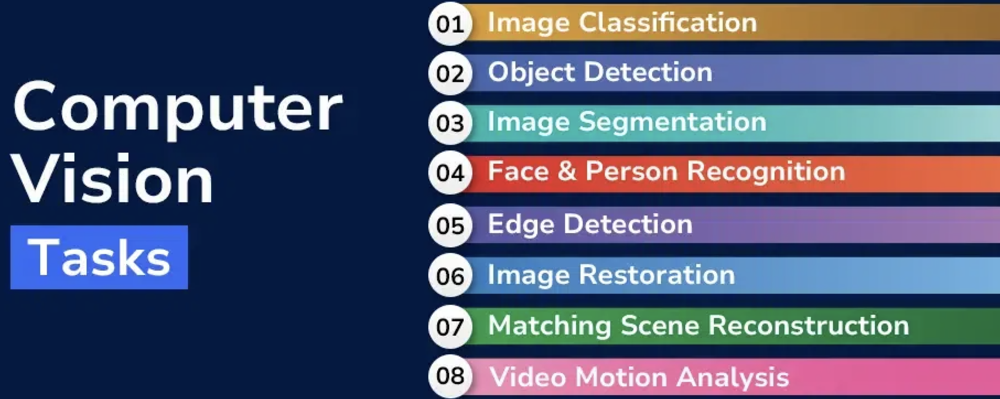
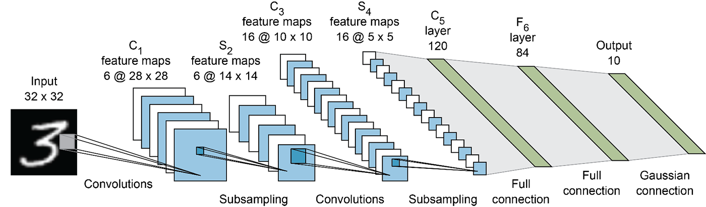
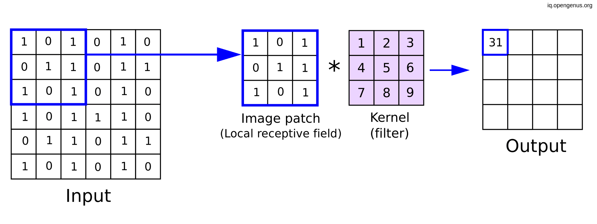
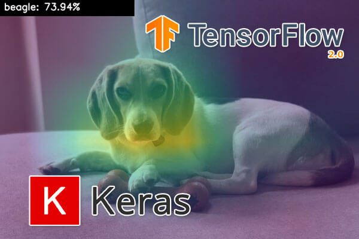

```{r xaringan-themer, include = FALSE}
library(xaringanthemer)
mono_light(
  base_color = "midnightblue",
  header_font_google = google_font("Josefin Sans"),
  text_font_google   = google_font("Montserrat", "500", "500i"),
  code_font_google   = google_font("Droid Mono"),
  link_color = "#8B1A1A", #firebrick4, "deepskyblue1"
  text_font_size = "28px"
)
```

<!-- .center[] -->

<!-- .small[  ] -->

## Essential Computer Vision Tasks

.center[]

.small[ https://www.geeksforgeeks.org/computer-vision-tasks/ ]

---
## Image classification

*   **Image classification:**  Assigning one or more labels to an image. Examples: distinguishing cat images from dog images, or tagging images with relevant keywords like "beach," "sunset," and "dog" in Google Photos.
  * **Single-Label Classification:** Each image is assigned to one single category, where the goal is to predict one label per image (e.g., cats vs. dogs)
  * **Multi-Label Classification:** Multiple-Label classification involves assigning multiple labels to an image which has multiple objects.
  
.center[]

.small[ https://luozm.github.io/cv-tasks ]
  
---
## Image segmentation

*   **Image segmentation:** Partitioning an image into distinct areas, each representing a different category. Example: separating a person from the background in a video call to apply a virtual background.
  * **Semantic Segmentation:** Assigning a class label to each individual pixel in an image. The output is a 'segmentation map' where each pixel's color represents its class.
  * **Instance Segmentation:** Identifying and delineating each individual instance of those objects.

.center[]

.small[ https://luozm.github.io/cv-tasks ]

---  
## Object detection

*   **Object detection:** Drawing bounding boxes around objects in an image and labeling each box with a class. Example: a self-driving car identifying pedestrians, cars, and traffic signs.
  * **Object Localization:** Use bounding box to mark the object locations in an image or tracking a moving object in a video.
  * **Object Classification:** Putting each object into a pre-defined category like 'human', 'car', or 'animal'.

.center[]

.small[ https://luozm.github.io/cv-tasks ]

---
## Modern convnet architecture patterns

*   **Modularity, Hierarchy, and Reuse (MHR):**  This fundamental principle involves structuring a system into reusable modules arranged in a hierarchy. In the context of convnets, this translates to building models with blocks of layers, repeated groups of layers, and pyramid-like structures with increasing filter counts and decreasing feature map sizes.

.center[]

.small[ https://www.geeksforgeeks.org/vgg-16-cnn-model/ ]

---
## The convolutional layer
.center[]

.center[]
.small[https://www.superannotate.com/blog/guide-to-convolutional-neural-networks]

---
## Residual connections

*   **Residual Connections:** This technique addresses the **vanishing gradient problem** encountered in deep networks. By adding the input of a layer or block back to its output, information can bypass potentially destructive or noisy transformations, ensuring gradient information from earlier layers propagates effectively. This allows for the training of much deeper networks.

.center[]

.small[ https://cdanielaam.medium.com/understanding-residual-connections-in-neural-networks-866b94f13a22 ]

---
## Batch normalization

*   **Batch Normalization:** This technique normalizes intermediate activations during training, helping with gradient propagation and potentially enabling deeper networks. It uses the mean and variance of the current batch to normalize data during training and relies on an exponential moving average of these statistics during inference.

.center[]

.small[ https://towardsdatascience.com/batch-norm-explained-visually-how-it-works-and-why-neural-networks-need-it-b18919692739 ]

---
## Depthwise Separable Convolutions

*   **Depthwise Separable Convolutions:** This approach separates the learning of spatial and channel-wise features, reducing the number of parameters and computations compared to regular convolutions. This results in smaller models that converge faster, generalize better, and are less prone to overfitting. 
  *   **Xception**, a high-performing convnet architecture available in Keras, utilizes depthwise separable convolutions extensively.

.center[]
.small[ https://towardsdatascience.com/review-xception-with-depthwise-separable-convolution-better-than-inception-v3-image-dc967dd42568 ]

---
## Techniques for Interpreting ConvNet Decisions

While deep learning models are often seen as "black boxes," convnets offer several techniques for visualizing and understanding their decisions.  **Three key methods** for interpreting what convnets learn:

- **Visualizing intermediate convnet outputs (intermediate activations)**
- **Visualizing convnet filters**
- **Visualizing heatmaps of class activation in an image**

---
## Visualizing intermediate convnet outputs (intermediate activations)

*   Displaying how the input is transformed by successive layers and gain insights into the meaning of individual filters within the network.

*   As you go deeper into the network, activations become more abstract and less visually interpretable. They transition from encoding low-level features like edges to higher-level concepts like "cat ear" or "cat eye." This signifies a shift towards more specific and abstract representations.
    
---
## Visualizing intermediate convnet outputs (intermediate activations)

.center[]

.small[ https://www.geeksforgeeks.org/visualizing-representations-of-outputs-activations-of-each-cnn-layer/ ]

---
## Visualizing convnet filters

*   This technique aims to understand the specific visual patterns or concepts that each filter in a convnet is designed to detect.

*   It leverages **gradient ascent in input space** to generate an image that maximally activates a chosen filter. Starting with a blank input image, the process adjusts the image's pixel values to maximize the filter's response.

*   Visualizations of filters at different depths of the Xception model reveal a hierarchical learning process, with early layers detecting basic features like edges and colors, while deeper layers recognize complex textures and object parts.

---
## Visualizing convnet filters

.center[]

.small[ https://stackoverflow.com/questions/38450104/how-to-visualize-filters-after-the-1st-layer-trained-by-cnns ]

---
## Visualizing heatmaps of class activation in an image

*   This technique helps understand which parts of an image contributed most significantly to the model's classification decision.

*   This method is particularly useful for debugging misclassifications and gaining insights into the model's decision-making process. 

*   **Class activation map (CAM) visualization**, **Grad-CAM**, weighs each channel in the output feature map of a convolution layer by the gradient of the target class with respect to that channel. This effectively highlights the regions in the image that are most strongly associated with the chosen class.

---
## Visualizing heatmaps of class activation in an image

.center[]

.small[ https://pyimagesearch.com/2020/03/09/grad-cam-visualize-class-activation-maps-with-keras-tensorflow-and-deep-learning/ ]
