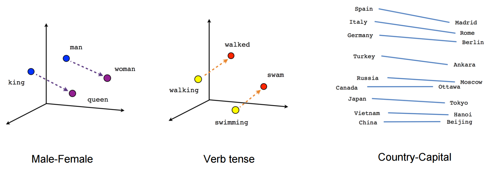

```{r xaringan-themer, include = FALSE}
library(xaringanthemer)
mono_light(
  base_color = "midnightblue",
  header_font_google = google_font("Josefin Sans"),
  text_font_google   = google_font("Montserrat", "500", "500i"),
  code_font_google   = google_font("Droid Mono"),
  link_color = "#8B1A1A", #firebrick4, "deepskyblue1"
  text_font_size = "28px"
)
```

<!-- .center[] -->

<!-- .small[  ] -->

## Introduction to NLP and Text Analysis

**Natural Language Processing (NLP):** The intersection of linguistics and computer science, focused on enabling machines to understand, interpret, and generate human language.  

- **Text Classification:**  Categorize text into predefined categories, e.g., Spam detection, sentiment analysis.  

- **Text Generation:**  Generate coherent text based on input, e.g., Chatbots, autocomplete features.  

- **Machine Translation:** Convert text from one language to another, e.g., English → French translation.

- **Sentiment analysis:** Classifying the sentiment of tweets or movie reviews as positive or negative.

- **Summarization:** Generate concise summaries of lengthy documents.

---
## Challenges in Text Analysis

- **Ambiguity:**  
  - Lexical: One word, multiple meanings (e.g., "bat" as an animal or sports gear).  
  - Syntactic: Different interpretations due to structure (e.g., "Visiting relatives can be annoying").  

- **Context Sensitivity:** Language meaning changes with context (e.g., "cool" can mean temperature or approval).  

- **Dynamic Vocabulary:** Constantly evolving (e.g., slang, neologisms).  

- **Noise in Data:** Typos, abbreviations, and informal language in real-world datasets.  

---
##  NLP Evolution

- **Pre-1990s:** Rule-based approaches (handcrafted linguistic rules). Chatbots like ELIZA (1966) – Used pattern matching and scripted responses.

- **1990s–2010s:** Statistical models (logistic regression, decision trees, Hidden Markov Models, SVMs). Need extensive feature engineering, struggled with complex language tasks (e.g., context and sentiment). 

.center[]
.small[ https://blog.dataiku.com/nlp-metamorphosis ]

---
##  NLP Evolution

- **2015 Onwards:** Recurrent neural networks (RNNs) and LSTM. State-of-the-art performance in tasks like language modeling and speech recognition.

- **2017–Present:** Transformer architectures dominate NLP.  
  - Key Models: BERT (2018), Contextual embeddings for bidirectional text representation; GPT Series (2018+), Large-scale autoregressive language models; T5, BART, RoBERTa: Specialized transformers for translation, summarization, etc.
  - Advantages: Parallel processing → Faster training on large datasets. Scales efficiently with data and compute power. Excels in language understanding, question answering, and text generation.

---
## Text preparation

- Vectorizing text is the process of transforming text into numeric tensors.

- Tokenization is breaking text into tokens (words, characters, or n-grams).
    - One-hot encoding
    - Word embedding

- Vocabulary - the set of unique tokens in the corpus


.small[https://www.analyticsvidhya.com/blog/2020/05/what-is-tokenization-nlp/]

---
## Text Standardization in NLP

- Text standardization needed for consistency in training data. Remove punctuation, make text lower case, and other preprocessing using **`layer_text_vectorization()`** in Keras.  
  *   Aims to **erase encoding differences** that you don’t want your model to deal with.
  *   Makes text **easier to process** for machine learning applications.

*   Raw text can have variations that a machine learning model might misinterpret.
    *   Different capitalization ("i" vs. "I")
    *   Different representations of similar words ("Mexico" vs. "México")
    *   Different punctuation ("isnt" vs. "isn’t")
*   Standardization **reduces the amount of training data required**.
*   It **improves generalization** by helping the model recognize that different forms of a word have the same meaning.

---
## Common Techniques

*   **Case Conversion**: Converting all text to lowercase.
    *   Example: "Hello World" becomes "hello world".
*   **Punctuation Removal**: Removing punctuation characters.
    *   Example: "Isn't it great?" becomes "isnt it great".
*   **Special Character Conversion**: Converting special characters to a standard form.
    *   Example: "é" becomes "e", "æ" becomes "ae".
*   **Stemming (Less Common)**: Converting variations of a term to a single representation.
    *   Example: "staring" and "stared" become "[stare]".

- Implemented using `layer_text_vectorization()` in Keras.

---
## Text Splitting (Tokenization) in NLP

- Word Tokenization is the most commonly used tokenization algorithm. It splits a piece of text into individual units called tokens.

- Tokenization is essential for **converting text into a numerical format that models can understand**.

- Depending upon delimiters, different word-level tokens are formed.

- Typically the top K frequent words are used, and the rare words are replaced with a "UNK" token (placeholder for unknown).

- Drawbacks - the vocabulary of tokens can become very large, the structure of individual words in not captured.

---
## Different Approaches:

- **Word-Level Tokenization**
  - Tokens are space-separated (or punctuation-separated) substrings.
  - A variant is to further split words into subwords (e.g., "staring" as "star+ing").

* **N-grams – Preserving Word Order Locally:** Groups of **N consecutive words**.
  - Tokens are groups of N consecutive words (e.g., "the cat" as a 2-gram).
    - **Bigrams:** [“the cat”, “cat sat”, “sat on”]  
    - **Trigrams:** [“the cat sat”, “cat sat on”]  
  - **Advantages:** Retains partial word order. Improves performance for tasks like sentiment analysis or topic modeling.
  - **Limitations:** Larger N-grams increase complexity and dimensionality.

---
## Character Tokenization

- Character Tokenization splits a piece of text into a set of characters.

- Preserves the information of the word.

- Limits the size of the vocabulary.

- Drawbacks - the relationship between the characters to form meaningful words can be challenging to learn.

- A compromise is to use Subword Tokenization that splits the piece of text into subwords (or n-gram characters).

.small[https://www.analyticsvidhya.com/blog/2020/05/what-is-tokenization-nlp/]

---
## Vocabulary Indexing in NLP

- Vocabulary Indexing - The process of **encoding each token into a numerical representation**

- **Out-of-Vocabulary (OOV) Tokens** - typically indexed by 1. When decoding, the OOV index is replaced with a token like "[UNK]".
- **Mask Token** - typically indexed by 0, used to pad sequences to a uniform length.

- Vocabulary Size Considerations - Restrict the vocabulary to the top 20,000 or 30,000 most common words.

---
## One-hot encoding

One-hot encoding is a method used in NLP to convert **categorical data** (words or tokens) into **numerical vectors** that can be used as input for machine learning models.
.center[]
.small[
* A fundamental assumption in one-hot encoding that the different tokens are all independent from each other, which is not correct.
*   One-hot vectors are all orthogonal, which is not ideal for words that typically form a structured space and share information with each other.
*   High-dimensional. For example, word one-hot-encoding generally leads to vectors that are 20,000-dimensional or greater.  
https://www.kaggle.com/dansbecker/using-categorical-data-with-one-hot-encoding]


---
## Bag-of-Words

**Bag-of-Words (BoW):** Represents text as an unordered collection (or "bag") of individual words, ignoring word order. It captures only word presence or frequency.  

- **Advantages:**  
  - Simple and computationally efficient.  
  - Effective for text classification tasks like spam detection.  

- **Limitations:**  
  - Ignores word order and syntactic structure.  
  - Cannot distinguish between sentences with different meanings, such as *“The cat chased the dog”* vs. *“The dog chased the cat.”*  

---
## `layer_text_vectorization()`

* Transforms raw text into numerical tensors.
    *   Text Standardization: Converts text to lowercase and removes punctuation.
    *   Tokenization: Splits text on whitespace.

* **Vocabulary Indexing**:
    *   The `adapt()` method is used to index the vocabulary of a text corpus.
    *   Can be called with a TF Dataset object that yields strings or with an R character vector.
    *   The computed vocabulary can be retrieved using `get_vocabulary()`.
    *   The first two entries in the vocabulary are the mask token (index 0) and the OOV (out-of-vocabulary) token (index 1).
    *   Entries in the vocabulary list are sorted by frequency.

---
## `layer_text_vectorization()`

*   **Output Modes**
    *   `"int"`: returns sequences of words encoded as integer indices.
    *   `"multi_hot"`: encodes the output tokens as multi-hot binary vectors.
    *   `"count"`: returns token counts.
    *   `"tf_idf"`: returns TF-IDF outputs.

```{r eval=FALSE}
# Can be placed in a TF Dataset pipeline for asynchronous preprocessing on the CPU
int_sequence_dataset <- string_dataset %>% dataset_map(text_vectorization,
 num_parallel_calls = 4)

# Can be included as a layer in a Keras model
text_input <- layer_input(shape = shape(), dtype = "string")
vectorized_text <- text_vectorization(text_input)
embedded_input <- vectorized_text %>% layer_embedding(...)
output <- embedded_input %>% ...
model <- keras_model(text_input, output)
```

---
## TF-IDF Normalization

*   Most common words are not always informative (e.g., "the", "a", "is", "are").

*   Rare words that appear frequently in a specific document may emphasize the document's unique content.

*   TF-IDF (Term Frequency, Inverse Document Frequency) is a normalization scheme used to evaluate the importance of a word in a document relative to a collection (or corpus).

*   It enhances distinctive terms and downweights frequent but less informative words.

    *   Vectorized sentences consist almost entirely of zeros, a property called "sparsity" that reduces compute load and the risk of overfitting.
    *   Normalization schemes should be divide-only to preserve sparsity.

---
## TF-IDF Normalization

1.  **Term Frequency (TF)**: Measures how often a term appears in a document.
    *   **The more a given term appears in a document, the more important that term is for understanding what the document is about**.

    $$TF(t) = \frac{\text{Number of times } t \text{ appears in a document}}{\text{Total words in the document}}$$

---
## TF-IDF Normalization

2.  **Inverse Document Frequency (IDF)**: Reduces the weight of terms that appear in many documents.
    *   **Terms that appear in almost every document aren’t particularly informative, while terms that appear only in a small subset of all texts are very distinctive and, thus, important**.
    *   N = Total number of documents

    $$IDF(t) = \log \left(\frac{N}{1 + \text{Number of documents containing } t} \right)$$

---
## TF-IDF Normalization

3.  **TF-IDF Score**:

    $$TF-IDF(t) = TF(t) \times IDF(t)$$

*   It would be typical to see a one-percentage-point increase when using TF-IDF compared to plain binary encoding for many text-classification datasets.


---
## Word embedding

- Vectors obtained through one-hot encoding are binary, sparse (~99\% zeros), and very high-dimensional (same dimensionality as the number of words in the vocabulary, e.g., 20,000). Words are independent.

- Word embeddings are low-dimensional floating-point vectors (that is, dense vectors, of 100-1,000 dimensions).
  - Floating-point vectors capture rich semantic meaning.
  - Relationships between words are encoded as distances or angles in the vector space.
  
- A word embedding is a learned representation for text where words with the same meaning have a similar representation.

---
## Cosine Similarity Between Words  

- Computes the cosine of the angle between two word vectors.  
  - Ranges from **-1 (opposite meanings)** to **1 (identical meanings)**.  

$$  \text{cosine similarity} = \frac{\mathbf{A} \cdot \mathbf{B}}{\|\mathbf{A}\| \|\mathbf{B}\|}$$
where $\mathbf{A} \cdot \mathbf{B}$ is the dot product of the two vectors, and 
$\|\mathbf{A}\|$ and $\|\mathbf{B}\|$ are their magnitudes (norms), e.g.,
$\|\mathbf{A}\| = \sqrt{\sum_{i=1}^{n} A_i^2}$

- Captures **semantic similarity** between words.  
- Works well in **high-dimensional spaces** like word embeddings.  

---
## Embedding layer - de novo learning

- Embedding layer is a word embedding that is learned jointly with a neural network model on a specific natural language processing task, such as language modeling or document classification.

- Instead of simple but huge and sparse one-hot-encoding vectors, we can use an embedding matrix of lower dimensionality (30-50 dimensions).

.small[https://www.tensorflow.org/tutorials/text/word_embeddings

https://machinelearningmastery.com/what-are-word-embeddings/]

---
## Embedding layer - de novo learning

- Initially, the weights for the embedding are randomly initialized. During training, they are gradually adjusted via backpropagation.

- Once trained, the learned word embeddings will roughly encode similarities between words (as they were learned for the specific problem your model is trained on). This word embedding structure can be used by the downstream model.

.small[https://www.tensorflow.org/tutorials/text/word_embeddings

https://machinelearningmastery.com/what-are-word-embeddings/]

---
## Embedding layer

The embedding matrix captures similarity among words in a multi-dimensional space. It can be visualized using dimensionality reduction techniques like t-SNE

.center[]

.small[ https://machinelearningmastery.com/what-are-word-embeddings/ ]

---
## Word2Vec

- Word2Vec is a statistical method for efficiently learning a standalone word embedding from a text corpus

- It was developed by Tomas Mikolov, et al. at Google in 2013 as a response to make the neural-network-based training of the embedding more efficient, and since then has become the de facto standard for developing pre-trained word embedding

- Word vectors formed so that if we do a dot product between two different vectors, the result will tell us how similar two words are

- Such vectors capture the context of words (skip-gram and continuous bag of words methods)

.small[https://code.google.com/archive/p/word2vec/]

---
## Word2Vec

- Continuous Bag-of-Words, or CBOW model. Learns the embedding by predicting the current word based on its context.

- Continuous Skip-Gram Model. Learns by predicting the surrounding words given a current word.

.center[]

.small[ https://machinelearningmastery.com/what-are-word-embeddings/ ]

---
## Embedding Projector

.center[]

.small[ https://projector.tensorflow.org/ ]

---
## Continuous Bag of Words

Co-ocurrence matrices (count based method)

.center[]

Dimensionality can be reduced using SVD ( singular value decomposition). We then use the result of SVD as our word vectors.

.small[https://leonardoaraujosantos.gitbook.io/artificial-inteligence/artificial_intelligence/natural-language-processing/word2vec]

---
## GloVe

- Global Vectors for Word Representation (GloVe) is an unsupervised learning algorithm for obtaining vector representations for words.
- An extension to Word2Vec for efficiently learning word vectors using matrix factorization techniques such as Latent Semantic Analysis (LSA), developed by Pennington, et al. at Stanford.

- Training is performed on aggregated global word-word co-occurrence statistics from a corpus, and the resulting representations showcase interesting linear substructures of the word vector space.

.small[https://nlp.stanford.edu/projects/glove/]

---
## GloVe

- Instead of SVD, the goal is to minimize a new loss function $J(\Theta)$ between $u$ and $v$ word vectors

$$J(\Theta) = \frac{1}{2} \sum_{i,j=1}^W f(P_{ij})(u_i^Tv_j -logP_{i,j})^2$$
$P$ is the co-occurence matrix.

- The training objective of GloVe is to learn word vectors such that their dot product equals the logarithm of the words’ probability of co-occurrence.

.small[https://nlp.stanford.edu/projects/glove/  
https://leonardoaraujosantos.gitbook.io/artificial-inteligence/artificial_intelligence/natural-language-processing/word2vec]

---
## Reusing Embeddings  

* **Why reuse embeddings?**  
  - Avoids training embeddings from scratch.  
  - Saves computational resources.  
  - Leverages knowledge from large-scale text corpora.  

- **Pre-trained word embeddings** are commonly available for free under permissive licenses, allowing reuse in academic and commercial projects. **word2vec** and **GloVe** are the typical examples.


---
## Two Approaches to Using Pre-trained Embeddings  

1. **Static Embeddings**  
   - The embedding remains unchanged during training.  
   - Suitable when the pre-trained embedding already aligns well with the task.  

2. **Updated Embeddings**  
   - The embedding is initialized with pre-trained values but gets updated during model training.  
   - Useful when fine-tuning is needed for task-specific improvements.  


