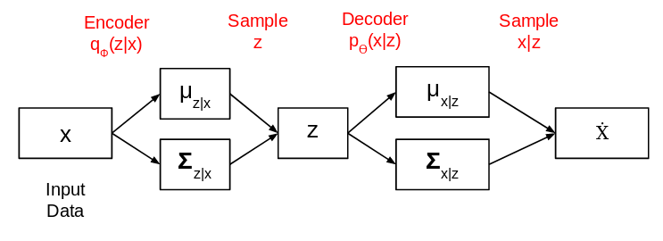

```{r xaringan-themer, include = FALSE}
library(xaringanthemer)
mono_light(
  base_color = "midnightblue",
  header_font_google = google_font("Josefin Sans"),
  text_font_google   = google_font("Montserrat", "500", "500i"),
  code_font_google   = google_font("Droid Mono"),
  link_color = "#8B1A1A", #firebrick4, "deepskyblue1"
  text_font_size = "28px"
)
```

## Generative adversarial networks (GANs)

> The most important [recent development], in my opinion, is adversarial training (also called GAN for Generative Adversarial Networks). This is an idea that was originally proposed by Ian Goodfellow when he was a student with Yoshua Bengio at the University of Montreal (he since moved to Google Brain and recently to OpenAI).

> This, and the variations that are now being proposed, is the most interesting idea in the last 10 years in ML, in my opinion.

.right[Yann LeCun]

.small[https://danieltakeshi.github.io/2017/03/05/understanding-generative-adversarial-networks/]

---
## Sequence data generation

*   The universal method for generating sequence data in deep learning involves **training a model** (typically a **Transformer or an RNN**) to **predict the next token or the next few tokens in a sequence**.

*   The model uses the **previous tokens as input** for this prediction. For example, given "the cat is on the," the model is trained to predict "mat".

*   Tokens are usually **words or characters**, especially when dealing with text data.

---
## Sequence data generation

*   A network capable of modeling the probability of the next token given the preceding ones is called a **language model**.

*   A language model **captures the latent space of language** and its **statistical structure**.

*   Once a language model is trained, you can **sample from it to generate new sequences**.

*   This involves **feeding the model an initial string of text** (known as **conditioning data**).

---
## Sequence data generation

*   The model is then asked to **generate the next character or word** (or even several tokens at once).

*   The **generated output is added back to the input data**, and this process is **repeated multiple times**.

*   This iterative loop allows for the generation of sequences of **arbitrary length** that reflect the **structure of the training data**, often resembling human-written sentences.

.center[]

---
## Sequence data generation

The **sampling strategy** for choosing the next token is crucial.

*   A naive approach is **greedy sampling**, where the most likely next character is always chosen, but this often leads to repetitive and predictable strings.

*   A more interesting method is **stochastic sampling**, which introduces randomness by sampling from the probability distribution for the next character.

---
## Sequence data generation

A parameter called the **softmax temperature** can be used to control the amount of stochasticity (randomness) in the sampling process.

*   **Higher temperatures** lead to more surprising and unstructured generated data due to sampling from distributions with higher entropy.

*   **Lower temperatures** result in less randomness and more predictable generated data from distributions with lower entropy.

---
## LSTMs as Generative Networks

- LSTMs trained on collections of text can be run to generate text - predict the next token(s) given previous tokens.

- LSTMs are better for structured, sequential tasks, e.g., text; GANs excel in image synthesis.

- **Text/Code Generation:** Story writing, chatbot responses, AI-assisted programming.
- **Music Generation:** Composing melodies, generating polyphonic music.
- **Image Captioning:** Generating textual descriptions from images.

---
## A brief history of generative deep learning for sequence generation

*   The **LSTM algorithm**, which enabled successful sequence data generation with recurrent networks, was developed in **1997**.

*   Early on, the LSTM algorithm was used to **generate text character by character**.

*   In **2002**, **Douglas Eck** applied **LSTM to music generation** for the first time, showing promising results.

---
## A brief history of generative deep learning for sequence generation

*   In the late 2000s and early 2010s, **Alex Graves** did important pioneering work using recurrent networks for sequence data generation, notably his **2013 work on generating human-like handwriting** using recurrent mixture density networks.

*   Between **2015 and 2017**, recurrent neural networks were successfully used for various generative tasks including **text and dialogue generation, music generation, and speech synthesis**.

---
## A brief history of generative deep learning for sequence generation

*   Around **2017–2018**, the **Transformer architecture** began to replace recurrent neural networks for generative sequence models, particularly for **language modeling (word-level text generation)**.  

*   A well-known example of a generative Transformer is **GPT-3**, a large language model trained by OpenAI, which gained attention in **2020** for its ability to generate plausible-sounding text on almost any topic.  

*   **GPT-4 (2023, OpenAI)** – An improved version of GPT-3, demonstrating stronger reasoning, factual accuracy, and multimodal capabilities (accepting text and image inputs).  

---
## Latest Advances in Large Language Models (LLMs)

*   **Gemini 1.5 (2024, Google DeepMind)** – A multimodal LLM with **longer context memory** (up to 1 million tokens), significantly improving code and document understanding.  

*   **Claude 3 (2024, Anthropic)** – Focused on safety and interpretability, Claude 3 exhibits near-GPT-4 performance while being more efficient.  

*   **Mistral & Mixtral (2023, Mistral AI)** – Open-weight LLMs with **efficient mixture-of-experts (MoE)** architectures, balancing accuracy and inference speed.  

*   **Llama 3 (2024, Meta AI)** – The next generation of Meta’s **open-source** language models, designed for improved efficiency and multilingual support. 

---
## A Transformer-based sequence-to-sequence model

*   We will train a model to **predict a probability distribution over the next word in a sentence**, given a number of initial words.

*   The model takes as **input a sequence of N words** (indexed from 1 to N).

*   The model aims to **predict the sequence offset by one** (from 2 to N+1).

*   We employ **causal masking** to ensure that when predicting the word at position `i + 1`, the model only uses words from position 1 to `i`.
    *   This allows the model to be trained to solve **N mostly overlapping but different problems**: predicting the next word given a sequence of 1 to N prior words.
    *   This also enables the model to **start predicting with fewer than N words** at generation time.

---
## Plain Next-Word Prediction

Imagine training a model where, for a fixed sequence length (let's say 4 words), you present it with a sequence and ask it to predict the very next word.

*   Input: "the cat sat on" - Target: "the" (next word)
*   Input: "cat sat on the" - Target: "mat" (next word)

The model learns to predict the single word immediately following a fixed-length input. Limitations:

*   The model is only trained to make a prediction when it has seen the full fixed-length input. It wouldn't inherently know how to start generating from a shorter prompt like just "the".
*   During training, there's redundant processing of overlapping sequences. For instance, parts of "the cat sat on" and "cat sat on the" are processed independently.

---
## Sequence-to-Sequence Modeling

- In contrast, in a sequence-to-sequence approach, the model is trained on the entire sequence at once. However, due to **causal masking**, when the model is predicting a word at a certain position, it only "sees" the words that came before it in the sequence.

- **Sequence-to-sequence modeling with causal masking optimizes for multiple next-word prediction problems simultaneously** within a given sequence, making it more versatile and efficient for generative tasks compared to plain next-word prediction with a fixed input window.

---
## Image generation

*   **Image generation** with deep learning involves learning **latent spaces of images** and sampling from them to create new images. **Generative Adversarial Networks** and **Variational Autoencoders (VAEs)** are key techniques for this.

- The module capable of realizing this mapping, taking as input a latent point and outputting an image (a grid of pixels), is called a _generator_ (in the case of GANs) or a _decoder_ (in the case of VAEs).

- Once such a latent space has been developed, you can sample points from it, either deliberately or at random, and, by mapping them to image space, generate images that have never been seen before.

---
## Generative adversarial networks (GANs)

- Unsupervised learning models that aim to generate data points that are indistinguishable from the observed ones.
 
- Aim to learn the data-generating process.

- GANs were proposed as a radically different approach to generative modeling that involves two neural networks, a **discriminator** and a **generator** network. They are trained jointly, whereby the generator aims to generate realistic data points, and the discriminator classifies whether a given sample is real or generated by the generator.

- You won’t have to design a loss function. It might take a while, but the GAN will figure out its own evaluation rules.

.small[Goodfellow, Ian J., Jean Pouget-Abadie, Mehdi Mirza, Bing Xu, David Warde-Farley, Sherjil Ozair, Aaron Courville, and Yoshua Bengio. “[Generative Adversarial Networks](http://arxiv.org/abs/1406.2661)” ArXiv, 2014
]

---
## Generative adversarial networks (GANs)

.center[]

.small[https://www.analyticsvidhya.com/blog/2020/01/generative-models-gans-computer-vision/]

---
## Generative adversarial networks (GANs)

.pull-left[]
.pull-right[]
<br>
We train the model, calculate the loss function at the end of the discriminator network and backpropagate the loss into both discriminator and generator models.

.small[https://www.analyticsvidhya.com/blog/2020/01/generative-models-gans-computer-vision/]

---
## Applications of GANs

- **Music**: Create new melodies, generate accompaniments, or compose entire pieces in various genres. https://openai.com/index/musenet/

- **Text**: Generate coherent and contextually relevant paragraphs, poems, or even entire articles. https://chat.openai.com/

- **Speech**: Synthesize realistic human speech from text inputs, mimicking different voices, accents, and emotions. WaveNet by Google DeepMind

---
## Applications of GANs
  
- **Image**: Generate images, music, or other data forms based on textual descriptions. https://openart.ai
  - **Image Super-Resolution**: Enhance the resolution of low-quality images by generating missing details.
  - **Inpainting**: Fill in missing or damaged parts of an image seamlessly.
  - **Denoising**: Remove noise from images while preserving important details.
  - **Artistic Style Transfer**: Apply the artistic style of one image to another, creating unique and visually appealing results.

---
## Applications of GANs

- **Security**
  - **Data Augmentation**: Generate synthetic data to improve the training of machine learning models, enhancing their robustness and generalization.
  - **Adversarial Attacks and Defense**: Develop and defend against adversarial examples that can fool machine learning models.
  - **Privacy Preservation**: Generate synthetic yet realistic data to protect sensitive information while maintaining data utility.

.small[https://www.analyticsvidhya.com/blog/2019/04/top-5-interesting-applications-gans-deep-learning/

https://adeshpande3.github.io/Deep-Learning-Research-Review-Week-1-Generative-Adversarial-Nets ]

---
## DeepDream

**DeepDream is an artistic image-modification technique** that leverages the representations learned by convolutional neural networks (convnets).

.center[  ]

.small[ https://github.com/google/deepdream 

https://deepdreamgenerator.com/]

---
## DeepDream

*   The algorithm works by essentially **running a convnet in reverse**.

*   It is closely related to the **convnet filter-visualization technique**, which involves performing gradient ascent on the input of a convnet to maximize the activation of a specific filter in an upper layer.

---
## DeepDream

DeepDream differs from filter visualization in a few key ways:

*   Instead of maximizing the activation of a **specific filter**, DeepDream aims to **maximize the activation of entire layers**. This leads to a mixture of visualizations from numerous features simultaneously.

*   DeepDream starts with an **existing image** as the input, rather than a blank or noisy image. This causes the resulting effects to attach to the pre-existing visual patterns and distort them in an artistic manner.

*   The input images are processed at **different scales, known as octaves**, which enhances the quality of the visualizations.

---
## DeepDream

*   DeepDream starts with an **existing image** as the input, rather than a blank or noisy image. This causes the resulting effects to attach to the pre-existing visual patterns and distort them in an artistic manner.

*   The input images are processed at **different scales, known as octaves**, which enhances the quality of the visualizations.

.center[  ]

---
## DeepDream

*   The core process involves performing **gradient ascent on the input image to maximize the activation of chosen layers** in a pretrained convnet.

*   The **DeepDream loss** is calculated as a **weighted mean of the L2 norm of the activations of a set of high-level layers**. The specific layers chosen and their weights significantly influence the visual outcome.

.center[  ]

---
## DeepDream

*   The algorithm processes the image over **octaves**. For each successive octave, the image is upscaled, and gradient ascent is performed.

*   To prevent the loss of image detail, **detail reinjection** is used. The difference between the original image and a lower-quality upscaled version of the original image added back into the dream image.

.center[  ]

---
## DeepDream

*   Lower layers in the network tend to produce more **geometric patterns**, while higher layers can lead to more recognizable **visual patterns related to objects the network was trained on** (e.g., dog eyes, bird feathers, if trained on ImageNet).

*   The results are often described as **trippy and full of algorithmic pareidolia artifacts**, and they can be somewhat **similar to the visual artifacts experienced by humans due to the disruption of the visual cortex via psychedelics**.

.center[  ]
.center[ https://github.com/mftnakrsu/DeepDream  ]

---
## GAN applications

StyleGAN2 is a state-of-the-art network in generating realistic images. Besides, it was explicitly trained to have disentangled directions in latent space, which allows efficient image manipulation by varying latent factors

.center[]

.small[Viazovetskyi Y. et al., 2020, "[StyleGAN2 Distillation for Feed-forward Image Manipulation](https://arxiv.org/abs/2003.03581)", arXiv:2003.03581б https://github.com/EvgenyKashin/stylegan2-distillation

Fake celebrity faces, https://medium.com/datadriveninvestor/artificial-intelligence-gans-can-create-fake-celebrity-faces-44fe80d419f7]

---
## Style transfer

- Style transfer consists of creating a new image that preserves the contents of a target image while also capturing the style of a reference image.

- **Content** can be captured by **the high-level activations of a convnet**.

- **Style** can be captured by **the internal correlations of the activations of different layers** of a convnet.

---
## Neural style transfer

*   **Neural style transfer** is a deep-learning-driven image modification technique that applies the style of a reference image to a target image while conserving the content of the target image.

*   **Style** essentially refers to textures, colors, and visual patterns in the image at various spatial scales, while **content** is the higher-level macrostructure of the image.

*   The key notion is to **define a loss function** that specifies the goal of conserving content and adopting style, and then to **minimize this loss**. The loss function is generally represented as:

`loss <- distance(style(reference_image) - style(combination_image)) +`
`        distance(content(original_image) - content(combination_image))`

---
## Content Loss

- The intuition behind content loss stems from how convolutional neural networks (convnets) learn to represent images. 

- **Earlier layers** in a convnet detect basic visual features like edges and corners, capturing **local information**. 

- As we go **deeper into the network**, the layers learn to recognize increasingly **complex and abstract features**, representing the **global content** and high-level structure of the image.

---
## Content Loss

- To preserve the content of an original image in the generated (combination) image, the algorithm focuses on matching the **activations of a higher-level layer** of a pretrained convnet (like VGG19) for both images. 

- The idea is that these upper-layer activations represent what the network "sees" as the **high-level content** of the image. 

- By minimizing the difference (using a norm like L2) between the feature maps of the content image and the combination image at this chosen layer, we encourage the combination image to retain the same **objects and overall scene structure** as the content image. 

---
## Content Loss

- **Content loss** is typically the L2 norm between the activations of an **upper layer** in a pretrained convnet (like the `block5_conv2` layer of VGG19) computed over the target image and the generated (combination) image. 

- Essentially, we are telling the network: "Make sure the generated image still contains the same 'stuff' as the original content image, according to how a deep network understands 'stuff' at a high level."

---
## Style loss

- Style is understood as the **textures, colors, and visual patterns** present in an image at **various spatial scales**. 

- To capture and transfer the style of a reference image, the style loss utilizes the activations from **multiple layers** of the convnet, spanning both low-level and high-level layers.

- The key insight here is that the **style** of an image can be represented by the **correlations between the features** learned by these different layers. For example, a painter's characteristic brushstrokes might manifest as specific co-occurrences of certain low-level edge and color features across the image. 

---
## Style loss

- To mathematically represent these feature correlations within a given layer, the algorithm uses the **Gram matrix**. 

- The Gram matrix computes the inner product of the feature maps of a layer, providing a measure of how much different features tend to activate together. 

- These correlations capture the **statistical properties of the textures and patterns** at the spatial scale represented by that layer.

---
## Style loss

- The style loss is then calculated by minimizing the difference (again, using a norm like L2) between the **Gram matrices** of the style-reference image and the combination image for the chosen set of layers. 

- By doing this across multiple layers, we ensure that the combination image adopts **similar feature correlations** to the style image at different levels of abstraction. This forces the generated image to have **textures and visual patterns** that are statistically similar to those of the style image. 

- In essence, we are telling the network: "Make sure the generated image has the same kind of 'feel' and 'look' as the style image, by matching the statistical relationships between the learned features across different levels of visual representation."

---
## Final loss function

*   A **total variation loss** is often added, operating on the pixels of the generated combination image to encourage spatial continuity and avoid overly pixelated results. It acts as a regularization loss.

*   The final **loss function** that is minimized is a **weighted average** of the content loss, the style loss (summed over multiple style layers), and the total variation loss. 

- The weights (`content_weight`, `style_weight`, `total_variation_weight`) can be tuned to achieve different results.

---
## Style transfer implementation

*   The style transfer can be implemented using a pretrained convnet like **VGG19**. 

- The process involves setting up a network to compute layer activations for the style, content, and combination images, defining the loss based on these activations, and then using **gradient descent** (or other optimization algorithms like L-BFGS, though SGD is used in the example) to minimize this loss by updating the pixels of the combination image. 

- A **learning rate schedule** can be used to gradually decrease the learning rate during optimization.

---
## Style transfer implementation

*   Neural style transfer is essentially a form of **image retexturing or texture transfer**. 

- It works best with strongly textured style images and content targets that don't require very fine details.

*   The original algorithm can be **slow to run**, but the transformation can be learned by a faster feed-forward convnet if appropriate training data (input-output pairs generated by the slower method) is available, leading to **fast style transfer**.

---
## CycleGAN: domain transformation

CycleGAN learns transformation across domains with unpaired data

.center[]

.small[https://junyanz.github.io/CycleGAN/]

---
## CycleGAN: domain transformation

.center[<iframe width="672" height="378" src="https://www.youtube.com/embed/9reHvktowLY" frameborder="0" allow="accelerometer; autoplay; encrypted-media; gyroscope; picture-in-picture" allowfullscreen></iframe>]

.small[https://junyanz.github.io/CycleGAN/

https://interestingengineering.com/elon-musks-deepfake-video-of-singing-soviet-space-song-breaks-the-internet]

---
## Autoencoders

- Autoencoder (**Auto**matically **encoding** data) is an unsupervised neural network trained to reconstruct the input. 

- One or more bottleneck layers have lower dimensionality than the input, which leads to compression of data and forces the autoencoder to extract useful features and omit unimportant features in the reconstruction

.center[]

.small[https://www.pyimagesearch.com/2020/02/17/autoencoders-with-keras-tensorflow-and-deep-learning/]

---
## Autoencoders

- Autoencoders learn a **compressed representation** of the input data by reconstructing it on the output of the network.

- Goal: capture the structure of the data $x$ (i.e., intrinsic relationships between the data variables) in a low-dimensional latent space $z$, and allows for more accurate downstream analyses.

.center[]

---
## Autoencoder

- Generally, an autoencoder consists of two networks, an encoder and a decoder, which broadly perform the following tasks:
    - **Encoder**: Maps the high dimensional input data into a latent variable embedding which has lower dimensions than the input.
    - **Decoder**: Attempts to reconstruct the input data from the embedding.

- Areas of application:
    - Dimensionality reduction.
    - Data denoising.
    - Compression and data generation.

---
## Basic autoencoder network

.center[]

- This network is trained in such a way that the features ( $z$ ) can be used to reconstruct the original input data ( $x$ ). 

- If the output ( $\hat{X}$ ) is different from the input ( $x$ ), the loss penalizes it and helps to reconstruct the input data.

---
## How autoencoder learns

- Image denoising problem - removing noise from images.

.center[]

.small[https://www.analyticsvidhya.com/blog/2020/02/what-is-autoencoder-enhance-image-resolution/]

---
## Autoencoder calculations

- The model contains an encoder function $f(.)$ parameterised by $\theta$ and a decoder function $g(.)$ parameterised by $\phi$. 

- The lower dimensional embedding learned for an input $x$ in the bottleneck layer is $h = f_{\theta}(x)$ and the reconstructed input is $x' = g_{\phi}(f_{\theta}(x))$.

- The parameters $\theta,\phi$ are learned together to output a reconstructed data sample that is ideally the same as the original input $x' \approx g_{\phi}(f_{\theta}(x))$

- There are various metrics used to quantify the error between the input and output such as cross-entropy (CE) or simpler metrics such as mean squared error: $L_{AE}(\theta,\phi) = \frac{1}{n}\sum_{i=0}^n(x_i - g_{\phi}(f_{\theta}(x_i))^2$

---
## Autoencoder variants

- The main challenge when designing an autoencoder is its sensitivity to the input data. 

- While an autoencoder should learn a representation that embeds the key data traits as accurately as possible, it should also be able to encode traits which generalize beyond the original training set and capture similar characteristics in other data sets.

- However, the embedding spaces learned by autoencoders are not continuous and poorly generalizable.

---
## Autoencoder variants

- Several variants have been proposed since autoencoders were first introduced. 

- These variants mainly aim to address shortcomings such as improved generalization, disentanglement and modification to sequence input models. 

- Some significant examples include the **Denoising Autoencoder** (DAE), **Sparse Autoencoder** (SAE), and more recently the **Variational Autoencoder** (VAE).

.small[
[Vincent et al., 2008, Extracting and Composing Robust Features with Denoising Autoencoders](https://www.cs.toronto.edu/~larocheh/publications/icml-2008-denoising-autoencoders.pdf)

[Makhzani and Frey, 2014, k-Sparse Autoencoders](https://arxiv.org/pdf/1312.5663.pdf)

[Kingma and Welling, 2014, Auto-Encoding Variational Bayes](https://arxiv.org/abs/1312.6114)
]

---
## Variational Autoencoder

*   VAEs learn **well-structured, continuous latent spaces** where specific directions can encode meaningful axes of variation in the data. This makes them suitable for **image editing via concept vectors**.

*   VAEs blend deep learning with Bayesian inference. Unlike classical autoencoders that map an image to a fixed latent vector, a VAE maps an image to the **parameters of a statistical distribution** (a mean and a variance) in the latent space.

.center[]

.small[https://www.analyticsvidhya.com/blog/2020/01/generative-models-gans-computer-vision/]

---
## Variational Autoencoder

- The assumption is that the input image has been generated by a statistical process, and that the randomness of this process should be taken into account during encoding and decoding.

.center[]

.small[https://www.analyticsvidhya.com/blog/2020/01/generative-models-gans-computer-vision/]

---
## Variational Autoencoder

*   The VAE process involves three main parts:
    *   **Encoder:** Takes an input image and maps it to the **mean (`z_mean`) and log-variance (`z_log_var`)** of a probability distribution in the latent space.
    *   **Sampling Layer:** Takes `z_mean` and `z_log_var` and **randomly samples a point `z`** from the latent normal distribution. The formula used is `z = z_mean + exp(z_log_variance) * epsilon`, where epsilon is a random tensor. This stochasticity forces the latent space to be continuously meaningful.
    *   **Decoder:** Takes the sampled latent point `z` and **maps it back to an image** with the same dimensions as the original input.
.center[]
.small[https://www.analyticsvidhya.com/blog/2020/01/generative-models-gans-computer-vision/]

---
## Variational Autoencoder

- The VAE then uses the mean and variance parameters to randomly sample one element of the distribution and decodes that element back to the original input. 

*   VAEs are trained using **two loss functions**:
    *   **Reconstruction Loss:** Forces the decoded samples to **match the initial input images**. Binary cross-entropy is used as the reconstruction loss in the MNIST example.
    *   **Regularization Loss (KL Divergence):** Helps learn **well-rounded latent distributions** and reduces overfitting by nudging the distribution of the encoder output towards a standard normal distribution centered around 0.

---
## VAE applications

*   The **continuity and structure** of the learned latent space in VAEs enable interesting applications like:
    *   **Concept vectors for image editing:** Identifying directions in the latent space that correspond to meaningful changes in the image (e.g., adding a smile).
    *   Generating **continuous spaces of images** where morphing between different images is smooth and natural.
    *   Creating **latent-space-based animations**.

*   While **GANs** can generate highly realistic images, the latent spaces they learn may lack the same level of structure and continuity as those learned by VAEs. Practical image applications often favor VAEs, although GANs are popular in academic research.

---
## Deep Belief Networks as Generative Networks

- **Layered Probabilistic Model:**  
  - DBNs consist of multiple layers of **Restricted Boltzmann Machines (RBMs)** stacked on top of each other.  
  - Each layer learns a probabilistic representation of the input data.  

- **Generative Capability:**  
  - DBNs **learn the probability distribution** of training data.  
  - Can generate new samples by sampling from the top-level RBM and propagating downward.  

- **Applications as a Generative Model:**  
  - **Image Generation:** By learning feature hierarchies.  
  - **Speech & Audio Modeling:** Generate realistic audio waveforms.  
  - **Feature Learning:** Pretraining for deep networks before fine-tuning.  

---
## Deep Belief Networks as Generative Networks

Comparison with Other Generative Models:

- DBNs **explicitly model data distributions**, while GANs use an adversarial approach.  

- DBNs are less effective at generating high-resolution images compared to GANs.  

- VAEs use **latent space sampling**, while DBNs use **RBMs for hierarchical learning**.  

- VAEs are more common in modern generative modeling.  

.small[http://www.scholarpedia.org/article/Deep_belief_networks]
