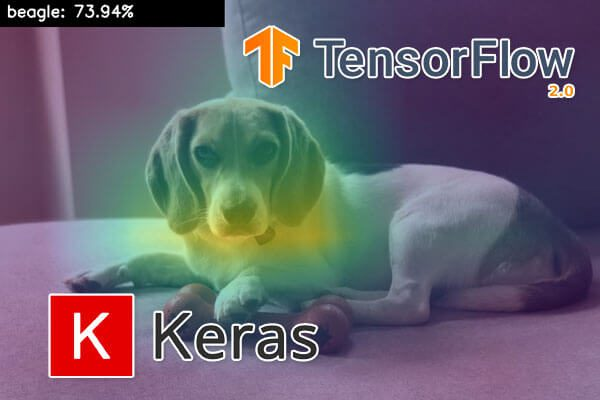
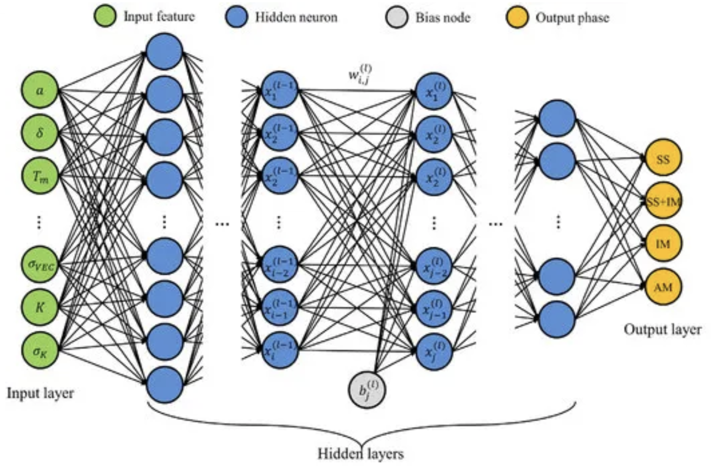
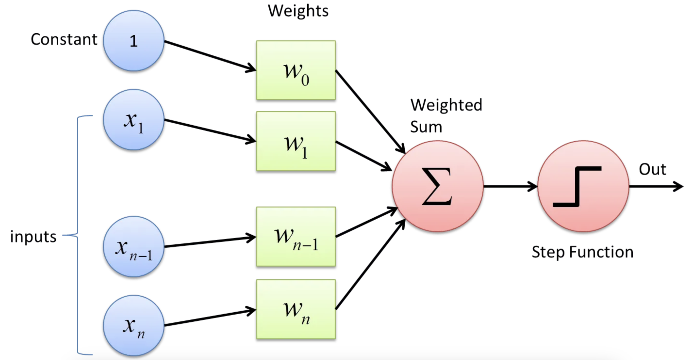
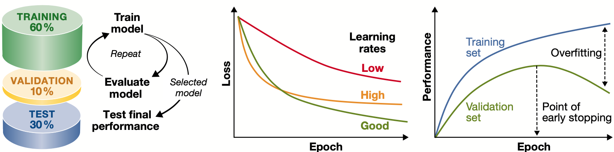
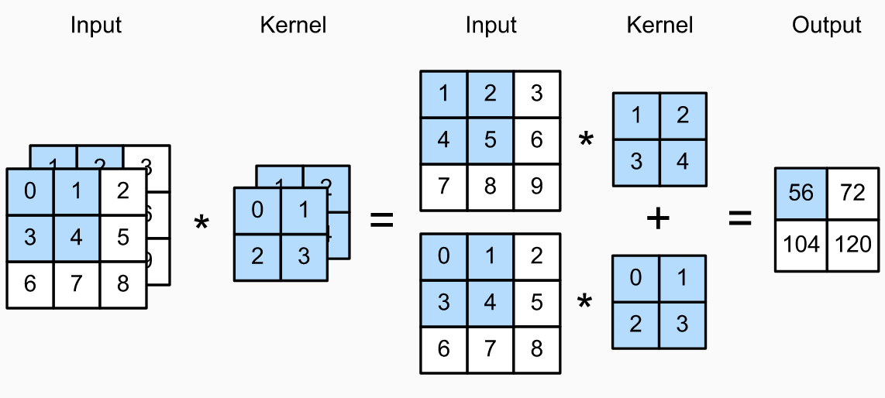
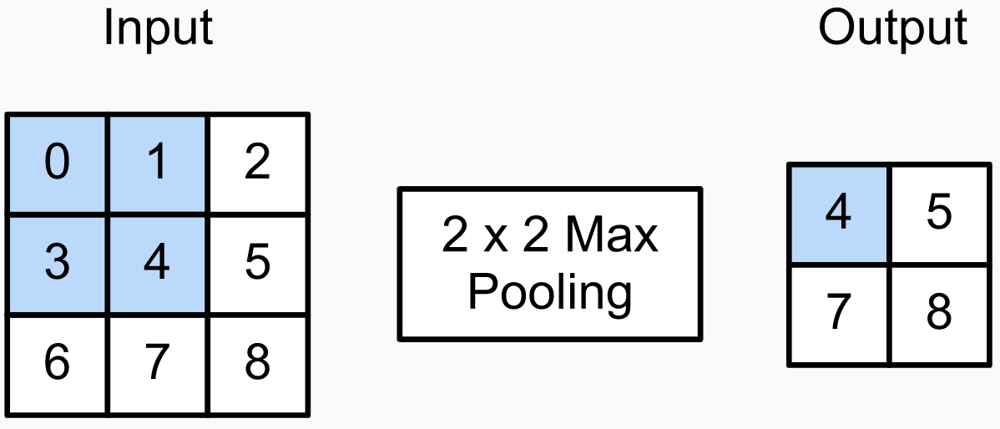
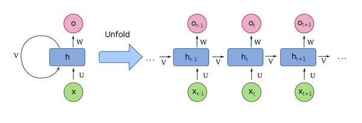
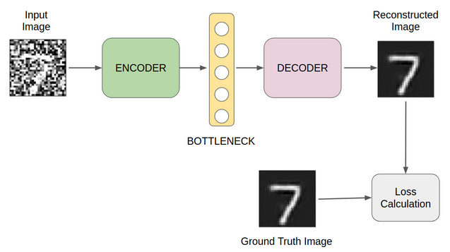
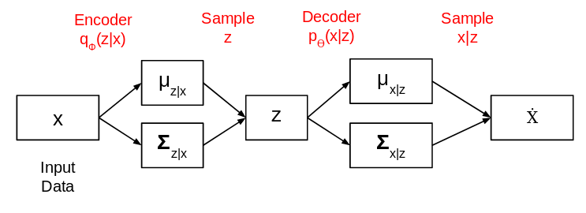

```{r xaringan-themer, include = FALSE}
library(xaringanthemer)
mono_light(
  base_color = "midnightblue",
  header_font_google = google_font("Josefin Sans"),
  text_font_google   = google_font("Montserrat", "500", "500i"),
  code_font_google   = google_font("Droid Mono"),
  link_color = "#8B1A1A", #firebrick4, "deepskyblue1"
  text_font_size = "28px"
)
```
<!-- .center[] -->

## **TensorFlow**

- Open-source machine learning framework developed by Google.

- Provides tools for building, training, and deploying ML models.

- Supports both low-level operations (e.g., tensors, gradients) and high-level APIs.

.center[]

---
## Keras

- High-level API running on top of TensorFlow.

- Simplifies building and training deep learning models.

- User-friendly, modular, and ideal for prototyping.

.center[]

---
## Types of Machine Learning Tasks

- Binary Classification

- Multiclass Classification

- Multilabel Classification

- Scalar Regression

- Vector Regression

---
## Tensor

- **Tensor**: A tensor is the fundamental data structure in TensorFlow, representing a generalization of matrices to more dimensions.
  - It holds numerical data (e.g., integers, floats, or strings) and is the input/output of operations and models.

- **Defined by rank (or dimensionality)**:
  - **0D tensor**: scalar (e.g., `3`)
  - **1D tensor**: vector (e.g., `[1, 2, 3]`)
  - **2D tensor**: matrix (e.g., `[[1, 2], [3, 4]]`)
  - **3D+ tensors**: used for sequences, images, batches, etc.

---
## Neuron

- **Neuron** - The fundamental computational unit in deep learning. A neuron receives input values ($x_i$), multiplies each by corresponding weights ($w_i$), adds a bias term ($b$), and applies an activation function ($f$) to produce output: $f(\sum_{i} w_i x_i + b)$. The weights and bias parameters are optimized during training to minimize the overall loss function.

.center[]

---
## Neuron Layer

- **Neuron layer** - A structured collection of neurons that process information in parallel, transforming inputs from the previous layer into a new representation. Each neuron in a layer typically receives inputs from all neurons in the preceding layer (in fully connected architectures) or from a local region (in convolutional architectures).

.center[]

---
## Multi-layer perceptron

- **Multilayer perceptron (MLP)** - A feedforward neural network architecture consisting of at least three layers: an input layer, one or more hidden layers, and an output layer. Each layer is fully connected to the subsequent layer, allowing MLPs to learn complex non-linear relationships between inputs and outputs through backpropagation. The network forms a directed acyclic graph where information flows only forward.

.center[]

---
## Activation function

- **Activation function** - The mathematical function $f$ that transforms a neuron's weighted input to produce its output, expressed as $f(\sum_{i} w_i x_i + b)$, where $w_i$ are weights, $x_i$ are inputs, and $b$ is the bias.

.center[]

---
## Loss, backpropagation

- **Loss** - A function that quantifies the discrepancy between predicted outputs and actual target values. It produces a scalar value representing model performance that the training process aims to minimize, with different loss functions (like MSE, cross-entropy, etc.) being appropriate for different tasks.

- **Backpropagation** - An efficient algorithm for computing gradients in neural networks by propagating error backwards from the output layer through the network, enabling optimization through gradient descent.

.center[]

---
## Stochastic Gradient Descent

- **Stochastic gradient descent (SGD)** - An optimization algorithm that approximates the true gradient by using small randomly sampled subsets ("batches" or "minibatches") of the training data for each parameter update. This approach reduces computational cost compared to full-batch gradient descent while introducing beneficial noise that can help escape local minima. Each epoch processes all batches, with different data partitioning typically used between epochs to improve generalization.

.center[]

---
## Optimizer, learning rate

- **Optimizer** - An algorithm designed to adjust model parameters (weights $w$ and biases $b$) to minimize the loss function. While many deep learning optimizers are variations of stochastic gradient descent (SGD), advanced techniques such as Adam, RMSprop, and AdaGrad incorporate momentum, adaptive learning rates, and other enhancements to improve convergence speed and training stability.

- **Learning rate** - A hyperparameter that controls the step size at which model parameters are updated during optimization. It determines how quickly or slowly weights are adjusted in response to the calculated gradient, directly impacting convergence speed and stability.

---
## Optimizer, learning rate

.center[]

---
## Overfitting and Underfitting

- **Overfitting:** High performance on training, poor generalization

- **Underfitting:** Poor performance on both training and validation

- **Generalization:** Ability to perform well on unseen data

- **Model Capacity:** Relationship between model complexity and generalization

.center[]

---
## Model Evaluation Techniques

- K-Fold Cross-Validation

- Hold-out Validation

- Early Stopping

.center[]

---
## Batch, epoch

- **Batch** - A subset of training examples processed together in one iteration of the stochastic gradient descent (SGD) algorithm within a given epoch, allowing for more efficient computation than processing individual examples.

- **Epoch** - One complete pass through the entire training dataset in SGD and related algorithms. Each epoch processes all batches in the dataset, with different batch partitioning or shuffling typically employed between epochs to improve learning.

---
## Regularization techniques

- **Weight regularization** - A technique to prevent overfitting by adding constraints to the model's parameters during training. Regularization adds a penalty term to the loss function that discourages complex models with large weights. The two most common approaches are:

- **L1 regularization (Lasso):** Adds a penalty proportional to the sum of absolute weight values ($\lambda\sum_{i}|w_i|$), promoting sparsity by driving some weights to exactly zero.

- **L2 regularization (Ridge):** Adds a penalty proportional to the sum of squared weight values ($\lambda\sum_{i}w_i^2$), which prevents any single weight from becoming excessively large and encourages smaller, more diffuse weight values across the network.

---
## Regularization techniques

- **Dropout** - A regularization technique where a specified percentage of neurons' outputs are randomly set to zero during each training iteration. The neurons affected change randomly between iterations, preventing co-adaptation among neurons and reducing overfitting by creating more robust feature representations.

- **Early stopping** - A regularization strategy that halts the training process before the model fully converges on the training data. By monitoring performance on a validation set and stopping when validation metrics begin to degrade, early stopping prevents overfitting and improves generalization.

---
## Three Main APIs for Building Keras Models

- **Sequential API** (`keras_model_sequential()`):
  - Simple, linear stack of layers.
  - Best for straightforward, feedforward models.

- **Functional API** (`keras_model()`):
  - Allows complex architectures (non-linear topology, multiple inputs/outputs).
  - Most commonly used; supports layer connectivity and visualization.

- **Model Subclassing** (`new_model_class()`):
  - Full control over model architecture by subclassing the Model class.
  - Preferred for research and novel models; requires advanced knowledge.

---
## Convolution

- **Convolution** - Mathematically, a convolution is an "integral transform" between two functions, where one function is a kernel. In discrete form, it is the weighted sum of the original function $f$ evaluated at different positions as the kernel slides across it, expressed as $(f * k)(t) = \sum_{i} f(t-i)k(i)$.

.center[]

---
## Convolutional Neural Network

- **Convolutional neural network** - A specialized neural network architecture that employs convolution operations instead of full matrix multiplication in hidden layers. A typical CNN consists of convolutional layers for feature extraction, pooling layers for dimensionality reduction, and fully connected layers for classification.

.center[]

---
## CNN filters

- **Kernel or Filter (in Convolutional Neural Networks)** - A small matrix of weights used in convolutional layers to extract features from input data, such as images. The kernel slides over the input, performing element-wise multiplication and summing the results to produce a feature map (convolution). This operation helps detect patterns like edges, textures, and objects by emphasizing specific features in the input data. The size and values of the kernel determine the types of features it can detect.

.center[]

---
## Max-pooling

- **Pooling** - A dimensionality reduction operation that replaces outputs of a convolutional layer with summary statistics of nearby outputs. Common pooling operations include max pooling (selecting the maximum value), average pooling (computing the mean), and median pooling. This technique reduces computational load, provides translation invariance, and helps extract hierarchical features in CNNs.

.center[]

---
## Time Series Fundamentals

- **Time series data:** Measurements taken at regular intervals.

- **Characteristics:** Trends, cycles, spikes.

- **Common tasks:**
  - Forecasting
  - Classification
  - Event detection
  - Anomaly detection

---
## Natural Language Processing (NLP)

- Text Classification

- Text Generation

- Machine Translation

- Sentiment Analysis

- Summarization

---
## Text Preprocessing

- **Tokenization:** word, character, k-mer tokenization

- **Standartization:** Case Conversion, Punctuation/special character removal

- **Vocabulary Construction:** Vocabulary Indexing, OOV (Out-of-Vocabulary) Token, Mask Token

---
## Text Vectorization Techniques

- Integer, One-Hot, Multi-Hot Encoding

- TF-IDF (Term Frequency-Inverse Document Frequency)

- Word Embedding (cosine similarity, learned representations)

.center[]

---
## Recurrent Neural Network (RNN)

- **Recurrent Neural Network (RNN)** - A neural network architecture designed to process sequential data by maintaining an internal state (memory) that captures information from previous timesteps. At each step $t$, the hidden state $h_t$ is computed as a function of both the current input $x_t$ and the previous hidden state $h_{t-1}$: $h_t = f(W_x x_t + W_h h_{t-1} + b)$. This recurrent connection enables RNNs to model temporal dependencies in data such as time series, text, and speech.

.center[]

---
## Long Short-Term Memory (LSTM)

- **Long Short-Term Memory (LSTM)** - A specialized RNN architecture designed to address the vanishing gradient problem. LSTMs incorporate memory cells with gating mechanisms (input, forget, and output gates) that regulate information flow, allowing the network to selectively remember or forget information over long sequences. The cell state $C_t$ acts as a conveyor belt of information, modified by these gates: $C_t = f_t \odot C_{t-1} + i_t \odot \tilde{C}_t$, where $f_t$ is the forget gate, $i_t$ is the input gate, and $\tilde{C}_t$ is the candidate cell state.

.center[]

---
## Transformer

- **Transformer Architecture** - An architecture designed to handle sequential data by leveraging self-attention mechanisms, allowing it to weigh the importance of input elements relative to each other. Unlike RNNs, transformers process entire sequences in parallel, making them more efficient for long-range dependencies. The architecture consists of an encoder and decoder, each composed of multiple layers of self-attention and feed-forward networks. The self-attention mechanism computes attention scores for each element in the sequence, enabling the model to focus on relevant parts of the input data. 

.center[]

---
## Autoencoder 

- **Autoencoder** - A neural network architecture designed to learn efficient codings of input data by compressing it into a lower-dimensional representation and then reconstructing it. It consists of an encoder, which maps the input to a latent space, and a decoder, which reconstructs the input from this latent representation. Autoencoders are used for dimensionality reduction, denoising, and feature learning.

.center[]

---
## Variational Autoencoder (VAE)

- **Variational Autoencoder (VAE)** - An extension of the autoencoder that introduces a probabilistic framework to the latent space, enabling the generation of new data samples. The encoder outputs parameters of a probability distribution (e.g., mean and variance of a Gaussian) instead of a fixed vector. The decoder then samples from this distribution to generate data. VAEs are particularly useful for generative tasks and learning smooth latent representations.

.center[]

---
## Generative adversarial network (GAN)

- **Generative adversarial network (GAN)** - A framework consisting of two competing neural networks: a generator ($G$) that learns to produce synthetic data resembling a target distribution, and a discriminator ($D$) that learns to distinguish between real and generated samples. These networks train simultaneously in a minimax game where $G$ attempts to fool $D$, and $D$ attempts to correctly classify real versus generated data, ultimately enabling $G$ to produce increasingly realistic outputs.

.center[]

