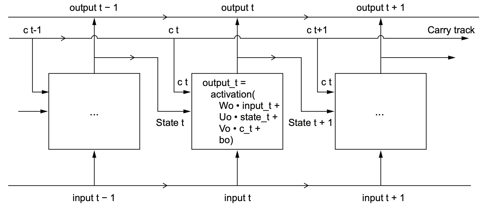
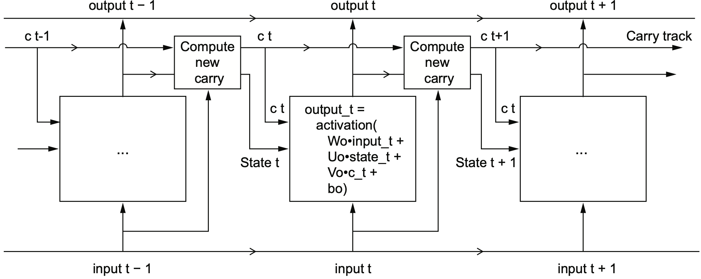

## 10.1 Different kinds of time-series tasks

## 10.2 A temperature-forecasting example

### Generating Training, Validation, and Test Datasets

We will see how to create training, validation, and test datasets from the preprocessed Jena Climate data for time series forecasting.

```{r eval=FALSE}
url <- "https://s3.amazonaws.com/keras-datasets/jena_climate_2009_2016.csv.zip"
download.file(url, destfile = basename(url))
zip::unzip(zipfile = "jena_climate_2009_2016.csv.zip",
           files = "jena_climate_2009_2016.csv")
```

```{r}
library(keras)
library(keras3)
library(tensorflow)

full_df <- readr::read_csv("jena_climate_2009_2016.csv")

writeLines(format(full_df))

# full_df$`Date Time` %<>% as.POSIXct(tz = "Etc/GMT+1", format = "%d.%m.%Y %H:%M:%S")
full_df$`Date Time` %<>% as.POSIXct(format = "%d.%m.%Y %H:%M:%S")
# full_df$`Date Time` <- as.POSIXct(full_df$`Date Time`, format="%d.%m.%Y %H:%M:%S")

plot(`T (degC)` ~ `Date Time`, data = full_df, pch = 20, cex = .3)

plot(`T (degC)` ~ `Date Time`, data = full_df[1:1440, ])
```

### Splitting the Jena Climate Dataset

We split the Jena Climate dataset into training, validation, and test sets for time series forecasting.

-   **`num_train_samples`**: This variable is assigned 50% of the total samples in the `full_df` data frame, rounded to the nearest integer using the `round()` function.
-   **`num_val_samples`**: This variable represents 25% of the total samples in the `full_df` data frame, rounded to the nearest integer.
-   **`num_test_samples`**: This variable is calculated by subtracting the number of training and validation samples from the total number of samples in `full_df`, ensuring that all samples are accounted for in the three sets.
-   The code then creates three data frames: `train_df`, `val_df`, and `test_df`, each containing the corresponding subsets of data from the `full_df` data frame.
-   **`train_df`**: This data frame contains the first `num_train_samples` from `full_df` using the `seq()` function to generate a sequence of indices.
-   **`val_df`**: This data frame is created by selecting rows from `full_df` starting from the index after the last training sample (`nrow(train_df) + 1`) and continuing for `num_val_samples` using `seq(from = , length.out = )`. This ensures that the validation set contains data that comes after the training set, which is important for time series forecasting where the goal is to predict future values based on past data.
-   **`test_df`**: This data frame selects the last `num_test_samples` from `full_df` using `seq(to = , length.out = )`, ensuring that the test set contains the most recent data. This aligns with the goal of time series forecasting, where the model's performance is evaluated on its ability to predict future values.
-   The code prints the number of samples in each set using `cat()` function. This information is helpful to verify the data splitting process and understand the size of each dataset.

```{r}
# Computing the number of samples we’ll use for each data split
num_train_samples <- round(nrow(full_df) * .5) # First 50% of rows, 1:210226
num_val_samples <- round(nrow(full_df) * 0.25) # Next 25% of rows, 210227:315339
num_test_samples <- nrow(full_df) - num_train_samples - num_val_samples # Last 25% of rows, 315340:420451

train_df <- full_df[seq(num_train_samples), ]

val_df <- full_df[seq(from = nrow(train_df) + 1,
                      length.out = num_val_samples), ]

test_df <- full_df[seq(to = nrow(full_df),
                       length.out = num_test_samples), ]

cat("num_train_samples:", nrow(train_df), "\n")
cat("num_val_samples:", nrow(val_df), "\n")
cat("num_test_samples:", nrow(test_df), "\n")
```

### 10.2.1 Preparing the data

### Normalizing Input Data for the Jena Climate Dataset

This code snippet defines a process for normalizing the input data for the Jena Climate dataset, preparing it for use in a machine learning model. Before feeding data into a neural network, it's standard practice to normalize each feature independently so they all take on small values on a similar scale. The code accomplishes this using the mean and standard deviation calculated from the training data.

-   **`input_data_colnames`**: This line of code first creates a vector of column names from the `full_df` data frame, excluding the "Date Time" column. This is achieved using the `setdiff` function from the `dplyr` package.
-   **`normalization_values`**: This line calculates the mean and standard deviation for each column in the `train_df` data frame (excluding "Date Time"). It utilizes the `lapply` function to apply the `mean` and `sd` functions to each column specified in `input_data_colnames`. The output is then structured using the `zip_lists` function to create a list of lists, where each sub-list corresponds to a column and contains the mean and standard deviation for that column. The `str` function then displays the structure of this list.
-   **`normalize_input_data`**: This function takes a data frame (`df`) as input and applies a normalization transformation to each column specified in `input_data_colnames`. For each column, it retrieves the corresponding mean and standard deviation from the `normalization_values` list. It then applies the `normalize` function, which performs Z-score normalization by subtracting the mean and dividing by the standard deviation. The normalized data frame is then returned.

```{r}
# Normalizing the data 
# All columns except for the Date Time column.
input_data_colnames <- names(full_df) %>% setdiff(c("Date Time"))

# We compute the normalization values using only the training data.
normalization_values <-
  zip_lists(mean = lapply(train_df[input_data_colnames], mean),
            sd = lapply(train_df[input_data_colnames], sd))

str(normalization_values)

# You can also call scale(col, center = train_col_mean, scale = train_col_sd)
# For clarity, we define a local function.
normalize_input_data <- function(df) {
  normalize <- function(x, center, scale)
    (x - center) / scale

  for(col_nm in input_data_colnames) {
    col_nv <- normalization_values[[col_nm]]
    df[[col_nm]] %<>% normalize(., col_nv$mean, col_nv$sd)
  }

  df
}
```

### Understanding timeseries_dataset_from_array()

Imagine you have a long sequence of numbers, like a series of daily temperatures, stock prices, or sensor readings. If you want to train a deep learning model to predict future values, you need to break this long sequence into smaller overlapping windows, where each window is a training example.

The function `timeseries_dataset_from_array()` automatically slices your time-series data into these windows. Each window (sequence) contains a fixed number of past values (input) and, optionally, a future value (target) to predict.

Consider example timeseries: \[1, 2, 3, 4, 5, 6, 7, 8, 9, 10\]. Consider the following parameters:

-   **`sequence_length = 3`** → Each sequence consists of 3 consecutive values.
-   **`batch_size = 2`** → The dataset is processed in **batches of 2 sequences at a time**.

This function will extract **overlapping sequences** from `data` (length 3 each) and map them to their corresponding `targets`:

| Input Sequence | Target (Next Value) |
|----------------|---------------------|
| \[1, 2, 3\]    | 4                   |
| \[2, 3, 4\]    | 5                   |
| \[3, 4, 5\]    | 6                   |
| \[4, 5, 6\]    | 7                   |
| \[5, 6, 7\]    | 8                   |

These sequences will be grouped into **batches of size 2**, meaning:

-   **Batch 1**: `[[1,2,3] → 4]` and `[[2,3,4] → 5]`
-   **Batch 2**: `[[3,4,5] → 6]` and `[[4,5,6] → 7]`
-   **Batch 3**: `[[5,6,7] → 8]`

```{r}
# Create a sequence of numbers from 1 to 10
int_sequence <- seq(10)  

# Define the input data: remove the last 3 elements (keep 1 to 7)
data <- head(int_sequence, -3)  

# Define the target values: remove the first 3 elements (keep 4 to 10)
targets <- tail(int_sequence, -3)  

# Create a time series dataset
dummy_dataset <- timeseries_dataset_from_array(
  data = data,            # Input time series (1 to 7)
  targets = targets,      # Corresponding targets (4 to 10)
  sequence_length = 3,    # Use 3-step sequences
  batch_size = 2          # Process in batches of 2 sequences
)

# Print the dataset structure
iterator <- as_iterator(dummy_dataset)

# Get the first batch
batch <- iterator %>% iter_next()
print(batch)

```

We can iterate over the dummy_dataset (a time series dataset) batch by batch and print each input sequence along with its corresponding target.

```{r}
library(tfdatasets)
# Convert the dataset into an iterator for batch-wise processing
dummy_dataset_iterator <- as_array_iterator(dummy_dataset)

# Loop through the dataset to print each batch
repeat {
  # Retrieve the next batch from the dataset iterator
  batch <- iter_next(dummy_dataset_iterator)
  
  # If there are no more batches, exit the loop
  if (is.null(batch)) 
    break
  
  # Extract inputs (sequences) and targets (next-step predictions)
  c(inputs, targets) %<-% batch
  
  # Loop through each sequence in the batch and print it
  for (r in 1:nrow(inputs)) {
    cat(sprintf("input: [ %s ]  target: %s\n",
                paste(inputs[r, ], collapse = " "), targets[r]))
  }
  
  # Print a separator for better readability
  cat(strrep("-", 27), "\n")
}
```

We'll use timeseries_dataset_from_array() to instantiate three datasets: one for training, one for validation, and one for testing.

```{r}
# Define key parameters for time series data processing
sampling_rate <- 6               # Sample one data point every 6 time steps (hourly sampling)
sequence_length <- 120           # Each input sequence spans 120 hours (5 days)
delay <- sampling_rate * (sequence_length + 24 - 1)  # Target value is 24 hours after the last step of input sequence
batch_size <- 256                # Number of samples per batch for training

# Function to preprocess a dataframe into inputs and targets
df_to_inputs_and_targets <- function(df) {
  inputs <- df[input_data_colnames] %>%   # Extract specified input features
    normalize_input_data() %>%            # Normalize input data to ensure consistent scale
    as.matrix()                           # Convert to matrix format for model compatibility
  
  targets <- as.array(df$`T (degC)`)      # Extract temperature values as target array
  
  # Remove the last `delay` samples from inputs and the first `delay` samples from targets
  list(
    head(inputs, -delay),   # Inputs without the last `delay` samples
    tail(targets, -delay)   # Targets without the first `delay` samples
  )
}

# Function to create a time series dataset for model training
make_dataset <- function(df) {
  c(inputs, targets) %<-% df_to_inputs_and_targets(df)  # Extract inputs and targets
  
  # Create a TensorFlow dataset from the time series data
  timeseries_dataset_from_array(
    inputs, targets,             # Input sequences and corresponding targets
    sampling_rate = sampling_rate,  # Use defined sampling rate (hourly sampling)
    sequence_length = sequence_length,  # Each sequence contains 120 time steps (5 days)
    shuffle = TRUE,              # Shuffle data to improve training
    batch_size = batch_size      # Process data in batches of 256 samples
  )
}

# Create datasets for training, validation, and testing
train_dataset <- make_dataset(train_df)  # Training dataset
val_dataset <- make_dataset(val_df)      # Validation dataset
test_dataset <- make_dataset(test_df)    # Test dataset

# Retrieve a batch of samples and targets from the training dataset
c(samples, targets) %<-% iter_next(as_iterator(train_dataset))

# Print the shapes of the samples and targets tensors
cat("samples shape: ", format(samples$shape), "\n", 
      "targets shape: ", format(targets$shape), "\n", sep = "")

```

### 10.2.2 A common-sense, non--machine learning baseline

A common-sense approach is to always predict that the temperature 24 hours from now will be equal to the temperature right now. We will use the mean absolute error (MAE) metric, defined as follows: `mean(abs(preds - targets))`

1.  **Purpose**:
    -   The `evaluate_naive_method` function calculates the Mean Absolute Error (MAE) for a simple baseline forecasting method.
    -   The baseline assumes the temperature 24 hours in the future equals the most recent temperature in the input sequence.
2.  **Key Steps**:
    -   **Unnormalization**:
        -   Temperature values in the dataset are normalized. The `unnormalize_temperature` function restores them to their original scale using stored mean (`mean`) and standard deviation (`sd`) values.
    -   **Mapping Over Dataset**:
        -   Each sequence in the dataset is processed to extract the last temperature (`last_temp_in_input`) from the input sequence.
        -   The extracted value is unnormalized and compared with the actual target (`target`) to calculate the absolute error.
    -   **Reduction**:
        -   Errors are accumulated across the entire dataset to compute the total number of samples and the total absolute error.
    -   **Mean Absolute Error**:
        -   The MAE is calculated as the total absolute error divided by the total number of samples.
3.  **Function Outputs**:
    -   The function outputs the validation and test MAE values using `sprintf` for formatted printing.

```{r}
# Define a function to evaluate a naive baseline method for time-series forecasting
evaluate_naive_method <- function(dataset) {
  
  # Helper function to unnormalize temperature values
  unnormalize_temperature <- function(x) {
    nv <- normalization_values$`T (degC)`  # Retrieve mean and standard deviation for temperature
    (x * nv$sd) + nv$mean                  # Reverse normalization: x * stddev + mean
  }

  # Identify the column index of the temperature feature
  temp_col_idx <- match("T (degC)", input_data_colnames)

  # Perform reduction over the dataset to calculate mean absolute error (MAE)
  reduction <- dataset %>%
    dataset_unbatch() %>%  # Unbatch the dataset to handle individual samples
    dataset_map(function(samples, target) { # Map function to compute absolute error
      last_temp_in_input <- samples[-1, temp_col_idx] # Extract last temperature in the input sequence
      pred <- unnormalize_temperature(last_temp_in_input) # Convert back to original scale
      abs(pred - target)  %>% tf$cast(dtype = tf$float32) # Compute the absolute error
    }) %>%
    dataset_reduce(  # Aggregate errors over the entire dataset
      initial_state = list(total_samples_seen = 0L, # Initialize counters
                           total_abs_error = 0),
      reduce_func = function(state, element) { # Update counters for each element
        state$total_samples_seen %<>% `+`(1L) # Increment sample count
        state$total_abs_error %<>% `+`(element) # Add to total absolute error
        state  # Return updated state
      }
    ) %>%
    lapply(as.numeric) # Convert results to numeric format

  # Calculate mean absolute error (MAE)
  mae <- with(reduction, total_abs_error / total_samples_seen)
  mae  # Return the computed MAE
}

# Evaluate the naive baseline on the validation and test datasets
sprintf("Validation MAE: %.2f", evaluate_naive_method(val_dataset))
sprintf("Test MAE: %.2f", evaluate_naive_method(test_dataset))
```

If you assume that the temperature 24 hours in the future will be the same as it is now, you will be off by two and a half degrees on average.

### 10.2.3 Let's try a basic machine learning model

1.  **Densely connected model**:
    -   **Input Layer**: Accepts sequences of shape `(sequence_length, ncol_input_data)` where:
        -   `sequence_length` is the number of time steps per sequence.
        -   `ncol_input_data` is the number of input features.
    -   **Flatten Layer**: Converts each input sequence into a 1D vector for processing by dense layers.
    -   **Dense Layers**:
        -   First dense layer has 16 units with ReLU activation to capture nonlinear patterns.
        -   Final dense layer has 1 unit, producing a single regression output (predicted temperature).
2.  **Training Setup**:
    -   **Checkpointing**: The `callback_model_checkpoint` saves the best model (lowest validation loss) during training.
    -   **Loss and Metrics**:
        -   `mse` (mean squared error) is used as the loss function for regression.
        -   `mae` (mean absolute error) is tracked to monitor performance.
3.  **Training**:
    -   Model is trained for 10 epochs using the `fit()` function.
    -   `train_dataset` is used for training, and `val_dataset` is used for validation.
4.  **Evaluation**:
    -   The best-performing model (saved by checkpointing) is loaded using `load_model_tf()`.
    -   `evaluate()` computes the mean absolute error (MAE) on the test dataset.
5.  **Visualization**:
    -   The `plot()` function visualizes the training and validation MAE over the 10 epochs, helping identify trends like overfitting or underfitting.

```{r}
library(keras3)

train_iterator <- as_iterator(train_dataset)
batch <- iter_next(train_iterator)

if (!is.null(batch)) {
  c(samples, targets) %<-% batch
  print(dim(samples))  # Expected: (batch_size, sequence_length, n_features)
  print(dim(targets))  # Expected: (batch_size,)
}

# Define the number of input features
ncol_input_data <- length(input_data_colnames) # Number of features in the input data

# Define the model architecture
inputs <- layer_input(shape = c(sequence_length, ncol_input_data)) # Input layer for sequences
outputs <- inputs %>%
  # layer_flatten() %>%                # Flatten input sequences into a single vector
  layer_global_average_pooling_1d() %>%
  layer_dense(16, activation = "relu") %>% # Dense layer with 16 units and ReLU activation
  layer_dense(1)                    # Dense layer with 1 unit for regression output
model <- keras_model(inputs, outputs) # Create the Keras model

# Set up model checkpointing to save the best model during training
callbacks <- list(
  callback_model_checkpoint("jena_dense.keras", # Filepath for saving the model
                            save_best_only = TRUE) # Save only the best model (lowest validation loss)
)

# Compile the model
model %>%
  compile(
    optimizer = "rmsprop",   # RMSprop optimizer for gradient descent
    loss = "mse",            # Mean squared error as the loss function for regression
    metrics = "mae"          # Track mean absolute error during training
  )

# Train the model, under 3min on CPU
history <- model %>%
  fit(
    train_dataset,            # Training dataset
    epochs = 10,              # Train for 10 epochs
    validation_data = val_dataset, # Use validation dataset for validation loss tracking
    callbacks = callbacks     # Use checkpointing callback to save the best model
  )

saveRDS(history, file = "jena_dense_training_history.rds")
history <- readRDS("jena_dense_training_history.rds")

# Load the best saved model from training
model <- load_model("jena_dense.keras")

# Evaluate the model on the test dataset
sprintf("Test MAE: %.2f", evaluate(model, test_dataset)["mae"]) # Print test MAE
#  Test MAE: 3.77

# Plot training and validation metrics
plot(history, metrics = "mae") # Plot mean absolute error (MAE) over epochs
```

### 10.2.4 Let's try a 1D convolutional model

```{r}
# Define the model architecture
inputs <- layer_input(shape = c(sequence_length, ncol_input_data)) # Input layer with sequences
outputs <- inputs %>%
  layer_conv_1d(8, 24, activation = "relu") %>%  # First 1D convolutional layer
  layer_max_pooling_1d(2) %>%                    # Max pooling to reduce dimensionality
  layer_conv_1d(8, 12, activation = "relu") %>%  # Second 1D convolutional layer
  layer_max_pooling_1d(2) %>%                    # Max pooling again
  layer_conv_1d(8, 6, activation = "relu") %>%   # Third 1D convolutional layer
  layer_global_average_pooling_1d() %>%          # Global average pooling layer
  layer_dense(1)                                 # Dense layer for regression output
model <- keras_model(inputs, outputs)            # Create the Keras model

# Define callbacks to save the best model during training
callbacks <- list(
  callback_model_checkpoint("jena_conv.keras",  # Filepath for saving the model
                            save_best_only = TRUE) # Save only the best model (lowest validation loss)
)

# Compile the model
model %>% compile(
  optimizer = "rmsprop",   # RMSprop optimizer for gradient descent
  loss = "mse",            # Mean squared error as the loss function for regression
  metrics = "mae"          # Track mean absolute error during training
)

# Train the model, under 3min on CPU
history <- model %>% fit(
  train_dataset,            # Training dataset
  epochs = 10,              # Train for 10 epochs
  validation_data = val_dataset, # Validation dataset for monitoring performance
  callbacks = callbacks     # Use checkpointing callback to save the best model
)

saveRDS(history, file = "jena_conv_training_history.rds")
history <- readRDS("jena_conv_training_history.rds")

# Load the best saved model
model <- load_model("jena_conv.keras")

# Evaluate the model on the test dataset
sprintf("Test MAE: %.2f", evaluate(model, test_dataset)["mae"]) # Print test MAE
# [1] "Test MAE: 3.23"

# Plot training and validation metrics
plot(history, metrics = "mae") # Plot mean absolute error (MAE) over epochs
```

### 10.2.5 A first recurrent baseline

```{r}
# Define the input shape for the LSTM model
# sequence_length:  the number of time steps in each input sequence
# ncol_input_data: the number of features in each time step
inputs <- layer_input(shape = c(sequence_length, ncol_input_data))

# Define the LSTM layer with 16 units 
outputs <- inputs %>%
  layer_lstm(16) %>% 
  layer_dense(1) 

# Define the model
model <- keras_model(inputs, outputs)

# Define the callbacks [2]
callbacks <- list(callback_model_checkpoint("jena_lstm.keras", 
                                            save_best_only = TRUE)) 

# Compile the model
model %>% compile(optimizer = "rmsprop", # The model is compiled with the RMSprop optimizer
                  loss = "mse", #The loss function is set to mean squared error
                  metrics = "mae") #The metric is set to mean absolute error

# Train the model, Under 10min on CPU
history <- model %>% fit( 
  train_dataset, 
  epochs = 10, 
  validation_data = val_dataset, 
  callbacks = callbacks 
)

saveRDS(history, file = "jena_lstm_training_history.rds")
history <- readRDS("jena_lstm_training_history.rds")

# Plot the training history
local({ 
  p <- plot(history, metrics = "mae") 
  p$data %<>% .[.$epoch > 1, ]
  print(p) 
})

# Load the best model
model <- load_model("jena_lstm.keras") 
# Evaluate the model on the test data
sprintf("Test MAE: %.2f", evaluate(model, test_dataset)["mae"]) 
# [1] "Test MAE: 2.59"
```

## 10.3 Understanding recurrent neural networks

```{r eval=FALSE}
# Pseudocode for a simple RNN:
# Initialize the state to zero
state_t <- 0
for (input_t in input_sequence) {
  # Compute the output using a function `f` of the current input and state
  output_t <- f(input_t, state_t)
  # Update the state for the next time step
  state_t <- output_t
}

# In a mathematical form, the RNN state update can be written as:
state_t <- 0
for (input_t in input_sequence) {
  output_t <- activation(dot(W, input_t) + dot(U, state_t) + b)
  state_t <- output_t
}
```

Base R implementation of a simple RNN

```{r}
# Define a utility to generate random arrays
random_array <- function(dim) array(runif(prod(dim)), dim)

# Parameters for the RNN
timesteps <- 100          # Number of time steps in the input sequence
input_features <- 32      # Dimensionality of input features
output_features <- 64     # Dimensionality of the RNN output

# Input data and initial state
inputs <- random_array(c(timesteps, input_features)) # Random input data
dim(inputs)
state_t <- array(0, dim = output_features)           # Initialize the state
dim(state_t)

# Weight matrices and bias
W <- random_array(c(output_features, input_features))  # Input-to-hidden weights
U <- random_array(c(output_features, output_features)) # State-to-hidden weights
b <- random_array(c(output_features, 1))               # Bias
successive_outputs <- array(0, dim = c(timesteps, output_features)) # Store outputs

# Loop through each time step
for (ts in 1:timesteps) {
  input_t <- inputs[ts, ] # Input at time step `ts`
  
  # Compute output using the current input and state
  output_t <- tanh((W %*% input_t) + (U %*% state_t) + b)
  
  # Store the output and update the state
  successive_outputs[ts, ] <- output_t
  state_t <- output_t # Update the state of the network for the next time step
}

# Final sequence of outputs
final_output_sequence <- successive_outputs
```

### 10.3.1 A recurrent layer in Keras

```{r}
# Define an RNN with a simple architecture
num_features <- 14  # Number of input features
inputs <- layer_input(shape = c(NA, num_features)) # Input layer with variable timesteps
outputs <- inputs %>% layer_simple_rnn(16)        # Simple RNN layer with 16 units

# Define an RNN that outputs only the last state
num_features <- 14
steps <- 120 # Fixed number of time steps
inputs <- layer_input(shape = c(steps, num_features))  # Input layer with fixed timesteps
outputs <- inputs %>% layer_simple_rnn(16, return_sequences = FALSE) # Output the last state
outputs$shape # Output shape: (batch_size, 16)

# Define an RNN that outputs the full sequence of states
num_features <- 14
steps <- 120 # Fixed number of time steps
inputs <- layer_input(shape = c(steps, num_features)) # Input layer with fixed timesteps
outputs <- inputs %>% layer_simple_rnn(16, return_sequences = TRUE)  # Output full sequence
outputs$shape # Output shape: (batch_size, steps, 16)
```

-   The choice between `return_sequences = FALSE` and `TRUE` depends on whether the task requires only the final output (e.g., classification) or the entire sequence (e.g., sequence prediction).

Stacking RNN layers

```{r}
# Define the number of features and time steps
inputs <- layer_input(shape = c(steps, num_features)) # Input with fixed time steps and features

# Create a stacked RNN model
outputs <- inputs %>%
  layer_simple_rnn(16, return_sequences = TRUE) %>% # First RNN layer; returns full sequence
  layer_simple_rnn(16, return_sequences = TRUE) %>% # Second RNN layer; also returns full sequence
  layer_simple_rnn(16)                              # Final RNN layer; returns only the last state (return_sequences = FALSE by default)

# The final model outputs the last hidden state for each sequence
```

#### LSTM Cell Step



```{r eval=FALSE}
output_t <- activation((state_t %*% Uo) + (input_t %*% Wo) + (c_t %*% Vo) + bo)
i_t <- activation((state_t %*% Ui) + (input_t %*% Wi) + bi)
f_t <- activation((state_t %*% Uf) + (input_t %*% Wf) + bf)
k_t <- activation((state_t %*% Uk) + (input_t %*% Wk) + bk)
```

1.  **Output Gate**: $o_t = \text{activation}(U_o \cdot \text{state}_t + W_o \cdot \text{input}_t + V_o \cdot c_t + b_o)$ \* `state_t` represents the previous hidden state. \* `input_t` is the input at the current time step. \* `c_t` is the carry track or cell state. \* `Uo`, `Wo`, and `Vo` are weight matrices for the state, input, and carry track, respectively. \* `bo` is the bias vector.

2.  **Input Gate**: $i_t = \text{activation}(U_i \cdot \text{state}_t + W_i \cdot \text{input}_t + b_i)$ \* It determines how much of the new input should be added to the cell state. \* `Ui` and `Wi` are the weight matrices for the state and input, respectively, and `bi` is the bias.

3.  **Forget Gate**: $f_t = \text{activation}(U_f \cdot \text{state}_t + W_f \cdot \text{input}_t + b_f)$ \* It decides how much of the previous cell state should be forgotten. \* `Uf` and `Wf` are the weight matrices for the state and input, respectively, and `bf` is the bias.

4.  **Candidate State**: $k_t = \text{activation}(U_k \cdot \text{state}_t + W_k \cdot \text{input}_t + b_k)$ \* `Uk` and `Wk` are the weight matrices for the state and input, respectively, and `bk` is the bias. \* These candidate values are then filtered by the input gate before being added to the cell state.



#### Cell State Update

```{r eval}
c_t+1 = i_t * k_t + c_t * f_t
```

-   Combines:
    -   **Input Gate (`i_t`)** and **Candidate State (`k_t`)**: To add new information.
    -   **Forget Gate (`f_t`)**: To retain or discard existing information.

A mechanism for **selectively retaining and updating information** across time. It addresses the vanishing gradient problem by providing a pathway for information to persist over many time steps.

-   **`c_t` (previous carry state)**: Represents the **accumulation of knowledge** or context from the past. It embodies the current understanding of the sequence based on all previous inputs.

-   **`f_t` (forget gate)**: Acts as a **filter that determines what information from the past is no longer relevant** and should be discarded. Multiplying `c_t` by `f_t` is a way to deliberately forget irrelevant information in the carry dataflow.

-   **`i_t` (input gate)**: Controls **how much of the new information is important and should be added** to the existing knowledge.

-   **`k_t` (candidate values)**: Represents the **new information being proposed** for incorporation into the cell state. This is information about the present.

-   **`i_t * k_t`**: This product represents the **filtered new information** that the LSTM deems relevant to add to its memory.

-   **`c_t * f_t`**: This product represents the **remembered past information** after irrelevant parts have been removed.

In essence, the carry track update equation philosophically mirrors a **continuous process of learning and adaptation**:

-   **Balancing Past and Present:** The LSTM uses the carry track to balance the relevance of past information with the need to incorporate new inputs.
-   **Selective Memory:** The forget gate enables the LSTM to selectively "forget" information, preventing the accumulation of irrelevant data and allowing it to focus on the most important aspects of the sequence.
-   **Continuous Update:** The input gate and candidate values allow the LSTM to continuously update its understanding of the sequence, incorporating new information as it becomes available.

The LSTM cell doesn't simply store all past information; it actively manages its memory to retain what is most relevant for future predictions. This reflects a more nuanced approach to learning, where the ability to forget is just as important as the ability to remember. The combination of these operations should be interpreted as a set of constraints on the search, not as a design in an engineering sense. The specific architecture of an LSTM cell allows past information to be reinjected at a later time, thus fighting the vanishing-gradient problem.

## 10.4 Advanced use of recurrent neural networks

-   Recurrent dropout---This is a variant of dropout, used to fight overfitting in recur- rent layers.
-   Stacking recurrent layers---This increases the representational power of the model (at the cost of higher computational loads).
-   Bidirectional recurrent layers---These present the same information to a recurrent network in different ways, increasing accuracy and mitigating forgetting issues.

### 10.4.1 Using recurrent dropout to fight overfitting

```{r}
# Define the model architecture using LSTM
inputs <- layer_input(shape = c(sequence_length, ncol_input_data)) # Input layer
outputs <- inputs %>%
  keras3::layer_lstm(32, recurrent_dropout = 0.25) %>% # LSTM layer with recurrent dropout
  layer_dropout(0.5) %>%                       # Dropout layer for additional regularization
  layer_dense(1)                               # Dense layer for regression output
model <- keras_model(inputs, outputs)          # Create the Keras model

# Define callbacks to save the best model
callbacks <- list(callback_model_checkpoint("jena_lstm_dropout.keras",
                                            save_best_only = TRUE))

# Compile the model
model %>% compile(
  optimizer = "rmsprop",   # RMSprop optimizer
  loss = "mse",            # Mean squared error loss for regression
  metrics = "mae"          # Monitor mean absolute error
)

## Training LSTM Model, takes nearly an hour on CPU
history <- model %>% fit(
  train_dataset,            # Training dataset
  epochs = 50,              # Train for 50 epochs
  validation_data = val_dataset, # Validation dataset
  callbacks = callbacks     # Save the best model during training
)

saveRDS(history, file = "jena_lstm_dropout_training_history.rds")
history <- readRDS("jena_lstm_dropout_training_history.rds")

# Plot the training history
plot(history)

## ---- Filter Epochs for Plotting ----
local({
  p <- plot(history, metrics = "mae") # Generate MAE plot
  p$data %<>% .[.$epoch > 1, ]       # Filter out the first epoch for clearer visualization
  print(p)                           # Display the filtered plot
})

# Load the best model
model <- load_model("jena_lstm_dropout.keras") 
# Evaluate the model on the test data
sprintf("Test MAE: %.2f", evaluate(model, test_dataset)["mae"]) 
# [1] "Test MAE: 2.49"
```

RNN performance considerations

-   `unroll = TRUE`: This enables the **unrolling of the for loop** in the RNN, which can speed up computation on CPUs by allowing TensorFlow to optimize the underlying computation graph. However, it also increases memory consumption and is viable for only relatively small sequences (around 100 steps or fewer), and only if the number of time steps in the data is known in advance by the model.

```{r eval=FALSE}
# Define an LSTM model with unrolling
inputs <- layer_input(shape = c(sequence_length, num_features)) # sequence_length cannot be NA when `unroll = TRUE`
x <- inputs %>%
  layer_lstm(32, recurrent_dropout = 0.2, unroll = TRUE) # Unrolled LSTM for small sequences
```

### 10.4.2 Stacking recurrent layers

-   **LSTM vs. GRU**:
    -   GRU models are simpler and computationally efficient compared to LSTMs.
    -   The choice depends on the task and available resources.
-   **Dropout and Regularization**:
    -   Dropout helps prevent overfitting, especially when using a large number of units or stacked layers.
-   **Evaluation**:
    -   Comparing test MAEs of different architectures helps select the most suitable model.

```{r}
# Define the model architecture using GRUs
inputs <- layer_input(shape = c(sequence_length, ncol_input_data)) # Input layer
outputs <- inputs %>%
  layer_gru(32, recurrent_dropout = 0.5, return_sequences = TRUE) %>% # First GRU layer with full sequence
  layer_gru(32, recurrent_dropout = 0.5) %>%                         # Second GRU layer with last state
  layer_dropout(0.5) %>%                                             # Dropout layer for regularization
  layer_dense(1)                                                     # Dense layer for regression output
model <- keras_model(inputs, outputs)                                # Create the Keras model

# Define callbacks to save the best model
callbacks <- list(
  callback_model_checkpoint("jena_stacked_gru_dropout.keras",
                            save_best_only = TRUE)
)

# Compile the model
model %>% compile(
  optimizer = "rmsprop",   # RMSprop optimizer
  loss = "mse",            # Mean squared error loss for regression
  metrics = "mae"          # Monitor mean absolute error
)

# Nearly 2 hours on CPU. Something doesn't work
history <- model %>% fit(
  train_dataset,            # Training dataset
  epochs = 50,              # Train for 50 epochs
  validation_data = val_dataset, # Validation dataset
  callbacks = callbacks     # Save the best model during training
)

saveRDS(history, file = "jena_stacked_gru_dropout_training_history.rds")
history <- readRDS("jena_stacked_gru_dropout_training_history.rds")

# Plot the training history
plot(history)

# Load the best saved GRU model
model <- load_model("jena_stacked_gru_dropout.keras")

# Evaluate the model on the test dataset
sprintf("Test MAE: %.2f", evaluate(model, test_dataset)["mae"]) # Print test MAE
```

### 10.4.3 Using bidirectional RNNs

Let's try a reversed-order LSTM by modifying the input data using `dataset_map()` before training the LSTM model.

-   **`dataset_reverse_time <- function(ds) { ... }`**: This defines a function called `dataset_reverse_time` that takes a dataset `ds` as input. This function reverses the order of the time steps in the input sequences.
    -   **`dataset_map(ds, function(samples, targets) list(samples[, NA:NA:-1, ], targets))`**: This applies a transformation to each element of the dataset `ds`. The transformation is defined by the anonymous function `function(samples, targets) ...`.
    -   **`samples[, NA:NA:-1, ]`**: This reverses the order of the time steps within each sequence. `NA:NA:-1` is used to create a sequence that steps backward through the dimensions of the data.
    -   **`targets`**: The target values are kept as is.

```{r}
# Defines a function to reverse the time order of sequences in a dataset
dataset_reverse_time <- function(ds) {
  # Applies a transformation to each element of the dataset
  dataset_map(ds, function(samples, targets)
    # Reverses the order of time steps in the 'samples' data
    # 'targets' are kept as is
    list(samples[, NA:NA:-1, ], targets))
}
```

```{r}
train_iterator <- as_iterator(train_dataset)
batch <- iter_next(train_iterator)

if (!is.null(batch)) {
  c(samples, targets) %<-% batch
  
  print("Original shape:")
  print(dim(samples))  # Should be (batch_size, sequence_length, num_features)
  
  print("Original first sequence:")
  print(samples[1, , ])  # Print the first sequence before reversing
}
# Convert the first sample (sequence) into an R matrix
sample_matrix <- as.array(samples[1, , ])

# Convert to a data frame for easier viewing
sample_df <- as.data.frame(sample_matrix)

# View the data
View(sample_df)  # Works in RStudio
print(sample_df)  # Works in all R environments


reversed_dataset <- train_dataset %>% dataset_reverse_time()
reversed_iterator <- as_iterator(reversed_dataset)
batch_reversed <- iter_next(reversed_iterator)

if (!is.null(batch_reversed)) {
  c(reversed_samples, reversed_targets) %<-% batch_reversed
  
  print("Reversed shape:")
  print(dim(reversed_samples))  # Should be same as original

  print("Reversed first sequence:")
  print(reversed_samples[1, , ])  # Print the first sequence after reversing
}
# Convert the first sample (sequence) into an R matrix
reversed_sample_matrix <- as.array(reversed_samples[1, , ])

# Convert to a data frame for easier viewing
reversed_sample_df <- as.data.frame(reversed_sample_matrix)

# View the data
View(reversed_sample_df)  # Works in RStudio
print(reversed_sample_df)  # Works in all R environments

```

```{r}
# Trains the model with the time-reversed dataset
history <- model %>% fit(
  # Applies the time-reversal transformation to the training dataset
  train_dataset %>% dataset_reverse_time(),
  epochs = 10,
  # Applies the same transformation to the validation dataset
  validation_data = val_dataset %>% dataset_reverse_time(),
  callbacks = callbacks
)

# Plot the training history
plot(history)

# Evaluate the model on the test dataset
sprintf("Test MAE: %.2f", evaluate(model, test_dataset)["mae"]) # Print test MAE
# [1] "Test MAE: 3.72"
```

-   **Performance**: A reversed-order LSTM **strongly underperforms compared to a chronological LSTM** for the Jena temperature forecasting task. This is likely because the more recent weather data points are more predictive than older data points for this particular problem.
-   **Generalizability**: Reversed-order processing can work just as well as chronological processing on text data or other kinds of data where order matters, but which order you use doesn't matter. An RNN trained on reversed sequences will learn different representations than one trained on the original sequences, offering a new angle from which to look at the data and potentially boosting performance on a task.

A **bidirectional RNN** processes input sequences in both chronological and antichronological order to capture patterns that a unidirectional RNN might miss. It uses two separate RNNs, such as GRU or LSTM layers, each processing the input sequence in one direction, and then merges their representations. This approach is particularly useful when the importance of a data point isn't tied to its position in the sequence.

```{r}
# Defines the input layer for the RNN
inputs <- layer_input(shape = c(sequence_length, ncol_input_data))

# Creates a bidirectional LSTM layer
outputs <- inputs %>%
  # 'bidirectional' layer wraps an LSTM layer to process input in both directions
  bidirectional(
    # Defines an LSTM layer with 16 units
    layer_lstm(units = 16)
  ) %>%
  # Adds a dense (fully connected) layer with a single output unit
  layer_dense(1)

# Defines the model by specifying the input and output layers
model <- keras_model(inputs, outputs)

# Configures the learning process
model %>% compile(
  # Uses the RMSprop optimizer
  optimizer = "rmsprop",
  # Specifies mean squared error as the loss function
  loss = "mse",
  # Includes mean absolute error as a metric to monitor
  metrics = "mae"
)

# Define callbacks to save the best model
callbacks <- list(
  callback_model_checkpoint("jena_lstm_bidirectional.keras",
                            save_best_only = TRUE)
)

# Trains the model, ~12 min on CPU
history <- model %>%
  fit(
    # Provides the training data
    train_dataset,
    # Trains for 10 epochs
    epochs = 10,
    # Specifies the validation data to monitor performance
    validation_data = val_dataset,
    callbacks = callbacks
  )

saveRDS(history, file = "jena_lstm_bidirectional_training_history.rds")
history <- readRDS("jena_lstm_bidirectional_training_history.rds")

# Plot the training history
plot(history)

# Load the best saved GRU model
model <- load_model("jena_lstm_bidirectional.keras")

# Evaluate the model on the test dataset
sprintf("Test MAE: %.2f", evaluate(model, test_dataset)["mae"]) # Print test MAE
# [1] "Test MAE: 2.53"
```

-   The `bidirectional` layer wraps a `layer_lstm` to process input sequences in both forward and reverse directions.

-   The `layer_lstm` has 16 units, determining the dimensionality of the hidden state.

-   A `layer_dense` with 1 unit is used for regression, mapping the LSTM output to a single continuous value.

-   For the Jena temperature forecasting task, bidirectional LSTMs might not perform as well as a regular LSTM because the antichronological half of the network tends to underperform. This is because recent data is more important than distant past data for this specific task.

-   Bidirectional RNNs are well-suited for text data where the order of information isn't strictly dependent on direction (chronological vs. antichronological).
