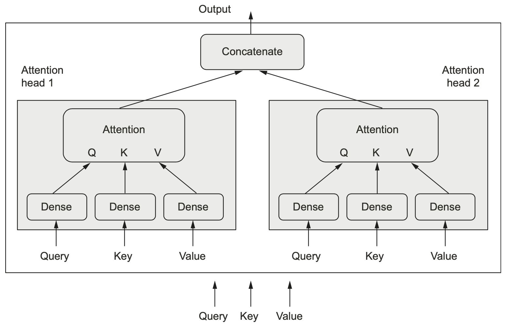
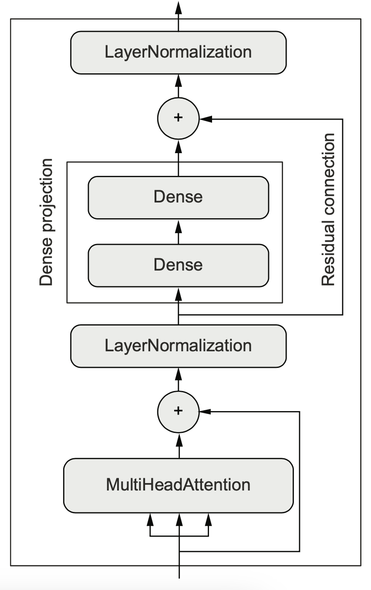
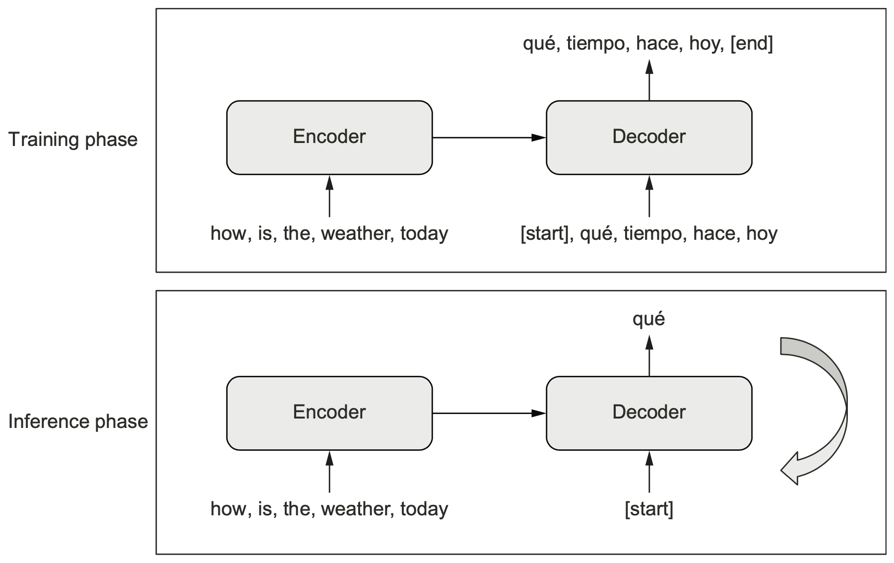
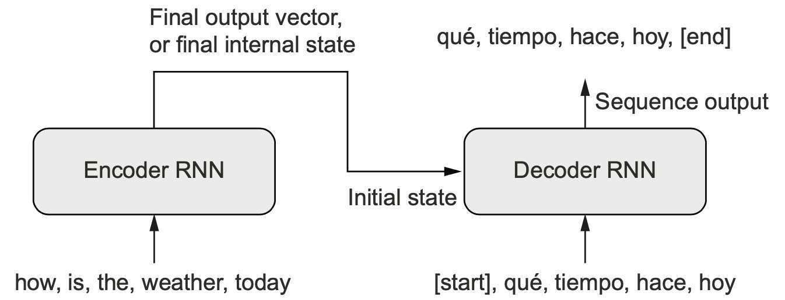
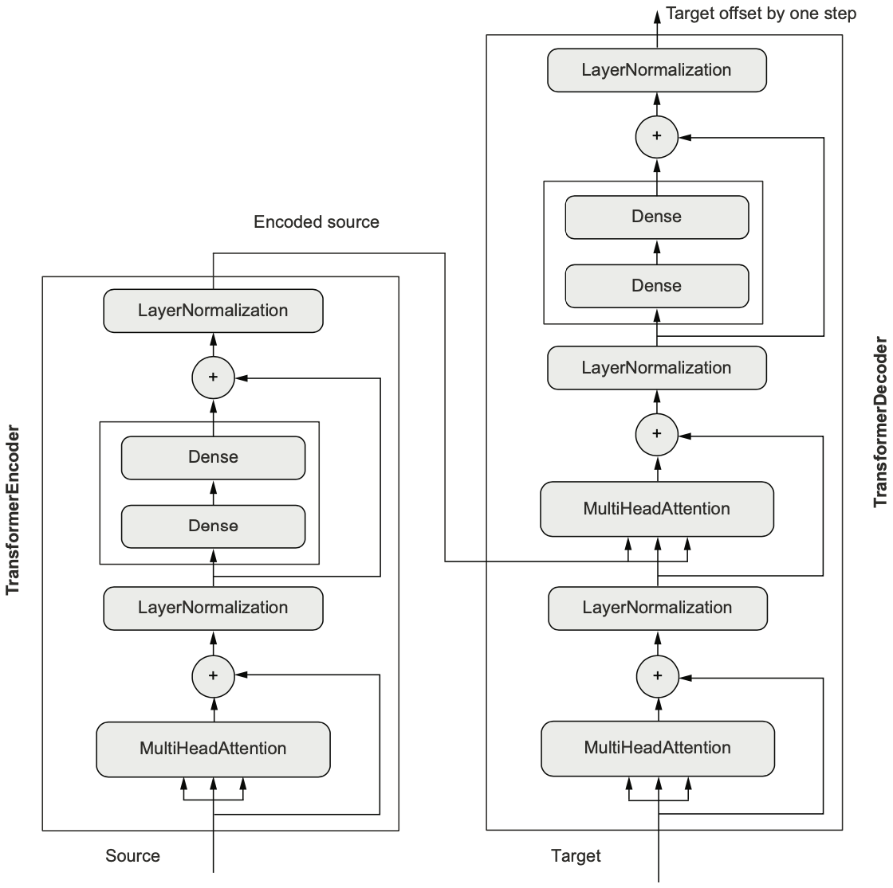

```{r}
library(keras)
library(tensorflow)
library(tfdatasets)
```

```{r}
# Define key parameters
max_length <- 600    # Maximum sequence length to consider
max_tokens <- 20000  # Maximum vocabulary size

train_ds <- text_dataset_from_directory("aclImdb/train")
val_ds <- text_dataset_from_directory("aclImdb/val")
test_ds <- text_dataset_from_directory("aclImdb/test")

# Helper function for dataset vectorization
dataset_vectorize <- function(dataset) {
    dataset %>%
        dataset_map(~ list(text_vectorization(.x), .y),
                    num_parallel_calls = 4)
}

# Create dataset with only text (no labels) for vectorization
text_only_train_ds <- train_ds %>%
    dataset_map(function(x, y) x)

# Configure text vectorization layer for integer encoding
text_vectorization <- layer_text_vectorization(
    max_tokens = max_tokens,
    output_mode = "int",  # Integer encoding instead of one-hot
    output_sequence_length = max_length  # Pad/truncate to fixed length
)

# Adapt vectorization layer and create datasets
adapt(text_vectorization, text_only_train_ds)

# Create integer-encoded datasets
int_train_ds <- train_ds %>% dataset_vectorize()
int_val_ds <- val_ds %>% dataset_vectorize()
int_test_ds <- test_ds %>% dataset_vectorize()
```

## 11.4 The Transformer architecture

**Attention Mechanism**: Token-to-token relationships; Context-aware representations; Parallel processing capability; Scaled dot-product attention

**Multi-Head Benefits**: Multiple representation subspaces; Capture different types of relationships; Improved model capacity; Better feature extraction

**Advantages for Medical Text**: Captures long-range dependencies; Handles variable context lengths; Identifies key relationships; Improved interpretability

### 11.4.1 Understanding self-attention

**Self-attention** is a mechanism that allows a model to **weigh the importance of different words within an input sequence** when processing each word. Instead of treating each word independently, self-attention enables the model to look at all the other words in the sequence and determine how relevant they are to the current word being processed.

-   For each word in the input sequence, the model calculates **attention scores** that indicate its relationship with every other word in the same sequence. A common way to measure this relationship is by taking the **dot product of their vector representations (word embeddings)**.
-   These attention scores are then used to determine how much influence each word in the sequence will have on the representation of the current word. Words with higher attention scores are considered more relevant.
-   Finally, the model computes a **new, context-aware vector representation** for each word by taking a **weighted sum of the vectors of all words in the sequence**, where the weights are determined by the attention scores. This new representation captures how the meaning of a word is influenced by its surrounding words in the sentence.

In essence, self-attention allows the model to learn **internal dependencies and relationships between the elements of a sequence**, enabling it to understand context and generate more nuanced representations. The subsequent code implementation of the `layer_multi_head_attention()` will embody these steps in a more generalized and efficient way, utilizing multiple "attention heads" to learn different types of relationships simultaneously.

#### Custom Self-Attention Implementation:

```{r}
# Helper softmax function
softmax <- function(x) {
    e <- exp(x - max(x))  # Numerically stable softmax
    e / sum(e)
}

# Self-attention function implementation
self_attention <- function(input_sequence) {
    # Extract sequence length and embedding dimensions
    c(sequence_len, embedding_size) %<-% dim(input_sequence)
    
    # Initialize output array
    output <- array(0, dim(input_sequence))
    
    # Process each token in sequence
    for (i in 1:sequence_len) {
        # Get current token's embedding (query vector)
        pivot_vector <- input_sequence[i, ]
        
        # Calculate attention scores with all tokens (including self)
        # The dot product (attention score) between the token and every other token.
        # %*% with two 1D vectors returns a scalar, the dot product. scores has shape (sequence_len).
        scores <- sapply(1:sequence_len, function(j)
            pivot_vector %*% input_sequence[j, ])
        
        # Apply scaled softmax to get attention weights
        scores <- softmax(scores / sqrt(embedding_size))
        
        # Broadcast scores for matrix multiplication into a matrix of
        # shape (sequence_len, embedding_size), the shape of input_sequence.
        broadcast_scores <- as.matrix(scores)[,rep(1, embedding_size)]
        
        # Calculate weighted sum of values
        new_pivot_representation <- colSums(input_sequence * broadcast_scores)
        
        # Store new representation
        output[i, ] <- new_pivot_representation
    }
    
    output
}

```

Multi-Head Attention Layer Setup:

```{r}
# Define sequence parameters
sequence_length <- 20
embed_dim <- 256

# Create input layer
# inputs has shape (batch_size, sequence_length, embed_dim).
inputs <- layer_input(c(sequence_length, embed_dim))

# Multi-head attention parameters
num_heads <- 4    # Number of attention heads
embed_dim <- 256  # Embedding dimension

# Create multi-head attention layer
mha_layer <- layer_multi_head_attention(
    num_heads = num_heads,
    key_dim = embed_dim
)

# Apply attention (self-attention as all inputs are the same)
outputs <- mha_layer(inputs, inputs, inputs)
```

### 11.4.2 Multi-head attention

**Generalized self-attention** extends the concept of self-attention by allowing the model to compute relationships between **three potentially different input sequences**: the **query**, the **keys**, and the **values**.

In **self-attention**, we considered a single input sequence where each token's representation is updated based on its relationship with all other tokens in the *same* sequence. This involved comparing each token to every other token within that sequence to compute attention scores and then using these scores to weight the tokens when forming the new representation.

```         
outputs <- sum(inputs * pairwise_scores(inputs, inputs))
                  C                        A       B
```

This shows that the **output** is a weighted sum of the **inputs** (acting as values - C), where the weights are determined by the pairwise scores calculated between the **inputs** (acting as queries - A) and the **inputs** (acting as keys - B).

Generalized self-attention broadens this idea. Instead of comparing an input sequence to itself, it asks: "For each element in the **query**, how much is it related to each **key**, and how should the corresponding **value** contribute to the output?".

```         
outputs <- sum(values * pairwise_scores(query, keys))
                  C                       A     B
```

Here, the **output** is a weighted sum of the **values** (C), where the weights are determined by the pairwise scores calculated between the **query** (A) and the **keys** (B).

Think a search engine - the **query** is what you're looking for, the **keys** are the descriptions of the available information (the values), and the attention mechanism determines the relevance (scores) of each **key** to the **query**, allowing you to retrieve a weighted sum of the corresponding **values**.

In practice, for tasks like sequence classification, the query, keys, and values might still originate from the same input sequence, allowing each token to attend to all other tokens within it. However, the generalized form is crucial for sequence-to-sequence tasks like machine translation, where the model needs to attend to the source sequence (**keys** and **values**) based on the partially generated target sequence (**query**). The `layer_multi_head_attention()` in Keras implements this generalized form, accepting three input arguments that correspond to the query, keys, and values.



### 11.4.3 The Transformer encoder

The **Transformer Encoder** is one of the two main components of the Transformer architecture, the other being the Transformer Decoder. It is designed to **process an input sequence and transform it into a sequence of context-aware vector representations**.

-   **Input and Output:** The Transformer Encoder takes a sequence of token embeddings as input and outputs a sequence of enriched embeddings of the same length. These output embeddings capture contextual information from the entire input sequence.

-   **Core Mechanism: Self-Attention:** The fundamental building block of the Transformer Encoder is the **self-attention mechanism**. As we discussed, self-attention allows each token in the input sequence to attend to all other tokens in the sequence, calculating **relevancy scores** and then using these scores to compute a **weighted sum of the token vectors**. This process generates context-aware representations for each token. The source code implements this using `layer_multi_head_attention()`, which signifies that the attention mechanism is typically performed in **multiple "heads"** in parallel, allowing the model to learn different types of relationships simultaneously.

-   **Additional Layers:** Following the multi-head self-attention layer, the Transformer Encoder incorporates several other important components:

    -   **Dense Projections:** The output of the attention mechanism is often passed through one or more **dense layers** to further process and transform the representations.
    -   **Residual Connections:** **Residual connections** are added around both the attention mechanism and the dense projections. This involves adding the input of a sub-layer to its output, which helps to mitigate the vanishing gradient problem and allows for the training of deeper networks.
    -   **Layer Normalization:** **Layer normalization** is applied after the residual connections. Normalization layers help to stabilize the learning process and improve gradient flow.

-   **Role in NLP:** While the full Transformer architecture was initially developed for sequence-to-sequence tasks like machine translation, the **Transformer Encoder itself can be effectively used for single-input NLP tasks such as text classification**. By processing an input text sequence through the encoder, you obtain rich, context-aware representations of the words, which can then be aggregated (e.g., using global average pooling) and fed into a classification layer.



```{r}
# Define custom Transformer Encoder layer class
layer_transformer_encoder <- new_layer_class(
    classname = "TransformerEncoder",
    
    # Initialize layer with core parameters
    initialize = function(embed_dim, dense_dim, num_heads, ...) {
        super$initialize(...)
        
        # Store layer parameters
        self$embed_dim <- embed_dim    # Embedding dimension, Size of the input token vectors
        self$dense_dim <- dense_dim    # Hidden layer dimension, Size of the inner dense layer
        self$num_heads <- num_heads    # Number of attention heads
        
        # Multi-head attention sublayer
        self$attention <- layer_multi_head_attention(
            num_heads = num_heads,
            key_dim = embed_dim
        )
        
        # Feed-forward network sublayer
        self$dense_proj <- keras_model_sequential() %>%
            # First dense layer with ReLU activation
            layer_dense(dense_dim, activation = "relu") %>%
            # Second dense layer projecting back to embedding dimension
            layer_dense(embed_dim)
        
        # Layer normalization layers
        self$layernorm_1 <- layer_layer_normalization()  # For attention sublayer
        self$layernorm_2 <- layer_layer_normalization()  # For feed-forward sublayer
    },
    
    # Forward pass function
    call = function(inputs, mask = NULL) {
        # Handle attention mask if provided
        # The mask that will be generated by the embedding layer will be 2D, but
        # the attention layer expects it to be 3D or 4D, so we expand its rank.
        if (!is.null(mask))
            mask <- mask[, tf$newaxis, ]

        # Transformer encoder forward pass:
        inputs %>%
            # 1. Self-attention with residual connection
            { self$attention(., ., attention_mask = mask) + . } %>%
            # 2. Layer normalization
            self$layernorm_1() %>%
            # 3. Feed-forward network with residual connection
            { self$dense_proj(.) + . } %>%
            # 4. Layer normalization
            self$layernorm_2()
    },

    # Configuration serialization so we can save the model.
    get_config = function() {
        config <- super$get_config()
        for(name in c("embed_dim", "num_heads", "dense_dim"))
            config[[name]] <- self[[name]]
        config
    }
)
```

------------------------------------------------------------------------

Notes on %\>% and { }

``` r
x %>% { fn(., .) + . }
```

-   This uses the **pipe operator (`%>%`)** from the `magrittr` package, which allows for cleaner, more readable code by passing values through a chain of functions.
-   `{}` creates an **anonymous function**.
-   `.` represents the value of `x` being passed into the function.
-   `fn(., .)` applies the function `fn` to `x` twice (as both arguments). The result of `fn(x, x)` is added to `x`.

```{r}
x <- 3
fn <- function(a, b) a * b
x %>% { fn(., .) + . }  # Equivalent to (3 * 3) + 3 = 12
```

-   This technique can simplify operations involving both transformations and additions based on the initial value `x`.

Keras Layer Definition (Transformer Block Example) without %\>%

```{r eval=FALSE}
# Define the forward pass (call method) for a transformer block
call = function(inputs, mask = NULL) {
  # Handle input masking for padding
  # Expand mask dimension for attention compatibility
  if (!is.null(mask))
    mask <- mask[, tf$newaxis, ]
  
  # Multi-head self-attention
  # inputs serve as queries, keys, and values
  attention_output <- self$attention(
    query = inputs,
    key = inputs,
    attention_mask = mask
  )
  
  # First residual connection and layer normalization
  # Add attention output to original input and normalize
  proj_input <- self$layernorm_1(inputs + attention_output)
  
  # Feed-forward neural network
  proj_output <- self$dense_proj(proj_input)
  
  # Second residual connection and layer normalization
  # Add FFN output to previous layer and normalize
  self$layernorm_2(proj_input + proj_output)
}
```

------------------------------------------------------------------------

**Saving Custom Layers with Configuration**

```{r eval=FALSE}
config <- layer$get_config()
new_layer <- do.call(layer_<type>, config)
```

-   **`layer$get_config()`** -- Retrieves the configuration of an existing Keras layer (`layer`). This configuration is a list containing all parameters that define the layer.
-   **`do.call()`** -- Dynamically calls the layer creation function (`layer_<type>`) with the arguments from the configuration list.
-   This process effectively **clones the layer** by re-instantiating it with the same parameters.

```{r}
# config is a regular named R list. Youcan safely save it to disk as an rds
config <- layer$get_config()
# The config does not contain weight values, so all weights in the layer 
# are initialized from scratch.
layer <- layer_dense(units = 10)
config <- layer$get_config()
new_layer <- do.call(layer_dense, config)
```

You can also access the unwrapped original layer constructor from any existing layer directly via the special symbol **class**

```{r}
layer$`__class__`
new_layer <- layer$`__class__`$from_config(config)
```

-   `layer$`**class**\`\` returns the **class type** of the layer.
-   `from_config(config)` is a class method that reconstructs a layer from its configuration.
-   This approach directly leverages the class method to create the new layer, making it more explicit and object-oriented compared to `do.call()`.

Defining the `get_config()` method in custom layer classes enables the same workflow.

```{r}
layer <- layer_transformer_encoder(embed_dim = 256, dense_dim = 32,
                                   num_heads = 2)
config <- layer$get_config()
new_layer <- do.call(layer_transformer_encoder, config)
# -- or --
new_layer <- layer$`__class__`$from_config(config)
```

-   This creates a transformer encoder layer, extracts its configuration, and reconstructs the layer either with `do.call()` or `from_config()`.
-   Transformer encoder layers typically require multiple hyperparameters like embedding dimension (`embed_dim`), dense layer size (`dense_dim`), and attention heads (`num_heads`).

**Model Saving and Loading**

```{r eval=FALSE}
filename <- tempfile(fileext = ".keras")
model <- save_model(model, filename)
model <- load_model(filename, custom_objects = list(layer_transformer_encoder))
```

-   `tempfile()` generates a temporary file path for saving the model. The `.keras` extension indicates the file format.
-   **`save_model()`** -- Saves the entire model (architecture, weights, optimizer state).
-   **`load_model()`** -- Loads the saved model, ensuring custom layers (`layer_transformer_encoder`) are recognized using the `custom_objects` argument.

**Specifying Custom Layer Names**

When saving a model that contains custom layers, the saved file will contain these configs. When loading the model from the file, you should provide the custom layer classes to the loading process, so that it can make sense of the config objects

```{r eval=FALSE}
model <- load_model(
  filename,
  custom_objects = list(TransformerEncoder = layer_transformer_encoder))
```

-   This line explicitly maps `TransformerEncoder` (as used in the saved model) to the `layer_transformer_encoder` function in R.
-   Useful for models that might use different naming conventions or when loading models from external sources.

------------------------------------------------------------------------

**Layer Normalization (Custom Implementation)**

`layer_batch_normalization()` doesn't work well for sequence data. Instead, we're using the `layer_layer_normalization()`, which normalizes each sequence independently from other sequences in the batch.

```{r}
layer_normalization <- function(batch_of_sequences) {
  # Input shape: (batch_size, sequence_length, embedding_dim)
  c(batch_size, sequence_length, embedding_dim) %<-% dim(batch_of_sequences)
  # `means` and `variances` arrays are initialized to zeros with the same shape as the input tensor.  
  means <- variances <-
    array(0, dim = dim(batch_of_sequences))
  # For each batch (`b`) and sequence (`s`), the mean and variance of the embeddings are calculated.  
  for (b in seq(batch_size))
    for (s in seq(sequence_length)) {
      # To compute mean and variance, we pool data only over the last axis (axis -1, the embedding axis)
      embedding <- batch_of_sequences[b, s, ]
      means[b, s, ] <- mean(embedding)
      variances[b, s, ] <- var(embedding)
    }
  # The input embeddings are normalized by subtracting the mean and dividing by the variance.  
  (batch_of_sequences - means) / variances
}
```

**Batch Normalization (`layer_batch_normalization()`)**

```{r}
batch_normalization <- function(batch_of_images) {
  # Extracts `batch_size`, `height`, `width`, and `channels` from the image tensor.  
  c(batch_size, height, width, channels) %<-% dim(batch_of_images)
  means <- variances <-
    array(0, dim = dim(batch_of_images))
  # Channel-wise Normalization:
  for (ch in seq(channels)) {
    # Pool the data over the batch axis (the first axis), which creates 
    # interactions between samples in a batch.
    channel <- batch_of_images[, , , ch]
    means[, , , ch] <- mean(channel)
    variances[, , , ch] <- var(channel)
  }
  # The images are normalized channel-wise by subtracting the mean and dividing by variance.  
  (batch_of_images - means) / variances
}
```

#### Building a Transformer Model (Keras Functional API)

-   **Purpose:** Builds a simple transformer-based classification model using the functional API in Keras.
-   **Input Layer:** Accepts variable-length sequences (`shape(NA)`) of integer tokens (word indices).
-   **Embedding Layer:** Maps token indices to dense vectors of dimension `embed_dim`.
-   **Transformer Encoder Layer:** Applies a transformer encoder block, focusing on sequence-to-sequence learning.
-   **Pooling Layer:** Averages embeddings across the sequence, reducing it to a single vector.
-   **Dropout Layer:** Prevents overfitting by randomly dropping 50% of units during training.
-   **Dense Layer:** Outputs a binary classification result (sigmoid activation).

```{r}
# Define model hyperparameters
vocab_size <- 20000  # Size of vocabulary (number of unique tokens)
embed_dim <- 256     # Dimensionality of embedding space
num_heads <- 2       # Number of attention heads in transformer
dense_dim <- 32      # Dimensionality of dense layer in transformer

# Create model architecture
# Define input layer - shape(NA) allows variable sequence length
inputs <- layer_input(shape(NA), dtype = "int64")

# Build model using pipe operator %>%
outputs <- inputs %>%
  # Embedding layer: converts token indices to dense vectors
  layer_embedding(
    input_dim = vocab_size,  # Size of vocabulary
    output_dim = embed_dim   # Size of embedding vectors
  ) %>%
  
  # Transformer encoder layer
  # Note: In keras3, ensure transformer package is loaded
  # This layer implements self-attention mechanism
  layer_transformer_encoder(
    embed_dim = embed_dim,   # Must match embedding dimension
    dense_dim = dense_dim,   # Dimension of feedforward network
    num_heads = num_heads    # Number of parallel attention heads
  ) %>% 
  
  # Global pooling to reduce sequence dimension to single vector
  # Because TransformerEncoder returns full sequences, we need to reduce each
  # sequence to a single vector for classification via a global pooling layer.
  layer_global_average_pooling_1d() %>%
  
  # Dropout layer for regularization (prevents overfitting)
  layer_dropout(rate = 0.5) %>%
  
  # Final dense layer for binary classification
  layer_dense(
    units = 1,              # Single output unit for binary classification
    activation = "sigmoid"  # Sigmoid activation for probability output
  )

# Create keras model by connecting inputs to outputs
model <- keras_model(inputs, outputs)
```

```{r eval=FALSE}
# Keras3 working code below

layer_transformer_encoder <- new_layer_class(
  classname = "TransformerEncoder",
  initialize = function(embed_dim, dense_dim, num_heads, ...) {
    super$initialize(...)
    self$embed_dim <- embed_dim
    self$dense_dim <- dense_dim
    self$num_heads <- num_heads
    
    # Define key_dim as embed_dim divided by num_heads
    self$attention <- layer_multi_head_attention(
      num_heads = num_heads, 
      key_dim = embed_dim %/% num_heads
    )
    
    self$dense_proj <- keras_model_sequential() %>%
      layer_dense(dense_dim, activation = "relu") %>%
      layer_dense(embed_dim)
      
    self$layernorm_1 <- layer_layer_normalization()
    self$layernorm_2 <- layer_layer_normalization()
  },
  
  call = function(inputs, mask = NULL) {
    attention_mask <- NULL
    if (!is.null(mask)) {
      attention_mask <- mask[, tf$newaxis, tf$newaxis, ]
    }
    
    # Explicitly specify query, key, value
    attention_output <- self$attention(
      query = inputs,
      key = inputs,
      value = inputs,
      attention_mask = attention_mask
    )
    
    # First residual connection and normalization
    first_output <- self$layernorm_1(inputs + attention_output)
    
    # Second residual block
    proj_output <- self$dense_proj(first_output)
    
    # Second residual connection and normalization
    return(self$layernorm_2(first_output + proj_output))
  },
  
  get_config = function() {
    config <- super$get_config()
    for(name in c("embed_dim", "num_heads", "dense_dim"))
      config[[name]] <- self[[name]]
    config
  }
)

# Define parameters
vocab_size <- 20000
embed_dim <- 256
num_heads <- 2
dense_dim <- 32

# Create model with proper dimensions
inputs <- layer_input(shape = c(NA), dtype = "int64") 

# Debug the embedding layer directly
outputs <- inputs %>%
  layer_embedding(input_dim = vocab_size, output_dim = embed_dim) %>%
  # We need to reshape if the embedding is giving a 4D tensor
  layer_reshape(target_shape = c(-1, embed_dim)) %>%
  layer_transformer_encoder(embed_dim, dense_dim, num_heads) %>%
  layer_global_average_pooling_1d() %>%
  layer_dropout(0.5) %>%
  layer_dense(1, activation = "sigmoid")

model <- keras_model(inputs, outputs)
```

**Model Compilation and Training with Callbacks:**

Takes over 2 hours on a Mac, CPU

```{r}
# Compile model with optimization settings
model %>% compile(
  optimizer = "rmsprop",             # RMSprop optimization algorithm
  loss = "binary_crossentropy",      # Loss function for binary classification
  metrics = c("accuracy")            # Track accuracy during training
)

# Display model summary
model

# Set up model checkpointing callback
# This saves the best model weights during training
callbacks = list(
  callback_model_checkpoint(
    filepath = "transformer_encoder.keras",  # Path to save model
    save_best_only = TRUE                   # Only save when model improves
  )
)

# Record start time
start_time <- Sys.time()

# Train the model
# Uses previously prepared training and validation datasets
model %>% fit(
  # Training data - expected to be a TensorFlow dataset
  int_train_ds,
  
  # Validation data for monitoring performance
  validation_data = int_val_ds,
  
  # Number of complete passes through the training data
  epochs = 20,
  
  # List of callbacks to execute during training
  callbacks = callbacks
)

# Record end time
end_time <- Sys.time()

# Calculate and print the elapsed time
training_time <- end_time - start_time
print(paste("Training Time:", training_time))

# Load the best model saved during training
model <- load_model_tf(
  # Path to saved model
  "transformer_encoder.keras",
  
  # Specify custom layers used in the model
  # Required because transformer_encoder is not a built-in layer
  custom_objects = layer_transformer_encoder
)

# Evaluate model on test dataset and print accuracy
# sprintf formats the output string with 3 decimal places
sprintf("Test acc: %.3f", evaluate(model, int_test_ds)["accuracy"])
# "Test acc: 0.853"
# "Test acc: 0.775"
```

#### Using Positional Encoding to Reinject Order Information

**Custom Positional Embedding Layer**

```{r}
# Define a custom layer class for positional embeddings
# This is crucial for transformer architectures to maintain sequence order information
layer_positional_embedding <- new_layer_class(
  # Name of the custom layer class
  classname = "PositionalEmbedding",

  # Initialize method: called when creating a new instance of the layer
  # A downside of position embeddings is that the sequence length needs to be known in advance.
  initialize = function(sequence_length, input_dim, output_dim, ...) {
    # Call parent class initializer
    super$initialize(...)
    
    # Create embedding layer for tokens
    self$token_embeddings <- layer_embedding(
      input_dim = input_dim,    # Vocabulary size
      output_dim = output_dim   # Embedding dimension
    )
    
    # Create embedding layer for positions
    self$position_embeddings <- layer_embedding(
      input_dim = sequence_length,  # Maximum sequence length
      output_dim = output_dim       # Must match token embedding dimension
    )
    
    # Store layer parameters
    self$sequence_length <- sequence_length
    self$input_dim <- input_dim
    self$output_dim <- output_dim
  },

  # Forward pass computation
  call = function(inputs) {
    # Get sequence length from input shape
    # tf$shape(inputs)[-1] extracts the last element of the shape, 
    # the size of the embedding dimension. (tf$shape() returns the shape as a tensor.)
    length <- tf$shape(inputs)[-1]
    
    # Create position indices (0, 1, 2, ...)
    # tf$range() is similar to seq() in R, makes a integer sequence: [0, 1, 2, …, limit - 1].
    positions <- tf$range(
      start = 0L,           # Start from position 0
      limit = length,       # Up to sequence length
      delta = 1L            # Increment by 1
    )
    
    # Get embeddings for both tokens and positions
    embedded_tokens <- self$token_embeddings(inputs)
    embedded_positions <- self$position_embeddings(positions)
    
    # Combine token and position embeddings through addition
    embedded_tokens + embedded_positions
  },

  # Like layer_embedding(), this layer should be able to generate a mask 
  # so we can ignore padding 0s in the inputs. The compute_mask()
  # method will called automatically by the framework, and the mask
  # will be propagated to the next layer.
  # Define mask for padding tokens
  compute_mask = function(inputs, mask = NULL) {
    # Create mask where non-zero inputs are True
    # This helps the model ignore padding tokens (0s)
    inputs != 0
  },

  # Configuration method for serialization
  get_config = function() {
    # Get base configuration from parent class
    config <- super$get_config()
    
    # Add custom parameters to config
    for(name in c("output_dim", "sequence_length", "input_dim"))
      config[[name]] <- self[[name]]
    config
  }
)
```

#### Putting it All Together: a Text-Classification Transformer

```{r}
# Model hyperparameters
vocab_size <- 20000        # Size of vocabulary
sequence_length <- 600     # Maximum length of input sequences
embed_dim <- 256          # Embedding dimensionality
num_heads <- 2            # Number of attention heads
dense_dim <- 32          # Dimension of dense layer in transformer

# Define model input
# shape(NULL) allows variable batch size
inputs <- layer_input(shape(NULL), dtype = "int64")

# Build model architecture using pipe operator
outputs <- inputs %>%
  # Add positional embeddings to token embeddings
  layer_positional_embedding(
    sequence_length = sequence_length,
    input_dim = vocab_size,
    output_dim = embed_dim
  ) %>%
  
  # Transformer encoder layer for self-attention
  layer_transformer_encoder(
    embed_dim = embed_dim,
    dense_dim = dense_dim,
    num_heads = num_heads
  ) %>%
  
  # Global pooling to get fixed-size representation
  layer_global_average_pooling_1d() %>%
  
  # Dropout for regularization
  layer_dropout(rate = 0.5) %>%
  
  # Output layer for binary classification
  layer_dense(units = 1, activation = "sigmoid")

# Create and compile model
model <- keras_model(inputs, outputs) %>%
  compile(
    optimizer = "rmsprop",
    loss = "binary_crossentropy",
    metrics = "accuracy"
  )

# Display model summary
model

# Set up model checkpointing
callbacks <- list(
  callback_model_checkpoint(
    filepath = "full_transformer_encoder.keras",
    save_best_only = TRUE
  )
)

# Record start time
start_time <- Sys.time()

# Train the model
model %>% fit(
  int_train_ds,           # Training dataset
  validation_data = int_val_ds,  # Validation dataset
  epochs = 20,           # Number of training epochs
  callbacks = callbacks  # Save best model during training
)

# Record end time
end_time <- Sys.time()

# Calculate and print the elapsed time
training_time <- end_time - start_time
print(paste("Training Time:", training_time))

# Load the best model
# Note: Need to specify both custom layers in custom_objects
model <- load_model_tf(
  "full_transformer_encoder.keras",
  custom_objects = list(
    layer_transformer_encoder = layer_transformer_encoder,
    layer_positional_embedding = layer_positional_embedding
  )
)

# Evaluate and print test accuracy
cat(sprintf("Test acc: %.3f\n", evaluate(model, int_test_ds)["accuracy"]))
# From the book: Test acc: 0.886
```

### 11.4.4 When to use sequence models over bag-of-words models

The decision of when to use sequence models versus bag-of-words models for text classification can be guided by a heuristic based on the **ratio between the number of samples in your training data and the mean number of words per sample**.

If the ratio of **(number of training samples) / (mean number of words per sample) is small---less than 1,500---then a bag-of-bigrams model** is likely to perform better. As a bonus, bag-of-bigrams models are also generally **faster to train and iterate on** in such cases.

If this ratio is **higher than 1,500, then a sequence model** is recommended. This suggests that **sequence models work best when a large amount of training data is available and when each individual sample is relatively short**.

In the IMDB movie review classification task, there were 20,000 training samples and an average of 233 words per review, resulting in a ratio of approximately 85.8. This falls below the 1,500 threshold, and indeed, the bag-of-bigrams model performed well.

## 11.5 Beyond text classification: Sequence-to-sequence learning



During training:

-   An *encoder* model turns the source sequence into an intermediate representation.
-   A *decoder* is trained to predict the next token i in the target sequence by looking at both previous tokens (1 to i - 1) and the encoded source sequence.

During inference, we don't have access to the target sequence - we're trying to predict it from scratch. We'll have to generate it one token at a time:

-   We obtain the encoded source sequence from the encoder.
-   The decoder starts by looking at the encoded source sequence as well as an initial "seed" token (such as the string $start$), and uses that to predict the first real token in the sequence.
-   The predicted sequence so far is fed back into the decoder, which generates the next token, and so on, until it generates a stop token (such as the string $end$).

### 11.5.1 A machine translation example

**Downloading and Preparing the Dataset**

```{r eval=FALSE}
# The Spanish-English translation dataset is downloaded and extracted from TensorFlow’s storage.  
# The dataset contains text pairs for training a sequence-to-sequence (seq2seq) translation model.  
download.file("http://storage.googleapis.com/download.tensorflow.org/data/spa-eng.zip",
              destfile = "spa-eng.zip")
zip::unzip("spa-eng.zip")
```

```{r}
library(keras)
library(tensorflow)
library(tidyverse)
library(magrittr)
# Read and prepare translation data
text_file <- "spa-eng/spa.txt"
# Read tab-separated English-Spanish pairs
# Each line contains an English phrase and its Spanish translation, tab separated.
text_pairs <- text_file %>%
  readr::read_tsv(
    col_names = c("english", "spanish"),  # Name columns
    col_types = c("cc")                   # Both columns as characters
  ) %>%
  # Add start and end tokens to Spanish text
  within(spanish %<>% paste("[start]", ., "[end]"))

# Set random seed for reproducibility
set.seed(1)

# Display random sample to inspect data structure
str(text_pairs[sample(nrow(text_pairs), 1), ])

# Split data into train/test/validation sets
num_test_samples <- num_val_samples <- round(0.15 * nrow(text_pairs))  # 15% each for test and val
num_train_samples <- nrow(text_pairs) - num_val_samples - num_test_samples  # 70% for training

# Create grouping vector for random split
pair_group <- sample(c(
  rep("train", num_train_samples),
  rep("test", num_test_samples),
  rep("val", num_val_samples)
))

# Split pairs into respective sets
train_pairs <- text_pairs[pair_group == "train", ]
test_pairs <- text_pairs[pair_group == "test", ]
val_pairs <- text_pairs[pair_group == "val", ]

# Define text standardization
# Essentially, [[:punct:]], except it omits "[" and "]" and adds "¿" and "¡".
punctuation_regex <- "[^[:^punct:][\\]]|[¡¿]"

library(tensorflow)
# Custom standardization function for Spanish text
custom_standardization <- function(input_string) {
  input_string %>%
    tf$strings$lower() %>%                              # Convert to lowercase
    tf$strings$regex_replace(punctuation_regex, "")     # Remove punctuation
}

# Test standardization function
input_string <- as_tensor("[start] ¡corre! [end]")
custom_standardization(input_string)
```

Original code, some tensor-data frame mismatches.

```{r}
# Set up vectorization parameters
vocab_size <- 15000        # Maximum vocabulary size
sequence_length <- 20      # Maximum sequence length

# Create vectorization layer for English (source) text
source_vectorization <- keras::layer_text_vectorization(
  max_tokens = vocab_size,
  output_mode = "int",
  output_sequence_length = sequence_length
)

# Create vectorization layer for Spanish (target) text
target_vectorization <- keras::layer_text_vectorization(
  max_tokens = vocab_size,
  output_mode = "int",
  # Generate Spanish sentences that have one extra token, because
  # we’ll need to offset the sentence by one step during training.
  output_sequence_length = sequence_length + 1,         # +1 for shift in target sequence
  standardize = custom_standardization                  # Apply custom standardization
)

# Learn the vocabulary of each language.
keras::adapt(source_vectorization, train_pairs$english)
keras::adapt(target_vectorization, train_pairs$spanish)

# Format function to prepare data for training
format_pair <- function(pair) {
  # Vectorize English and Spanish text
  # The vectorization layer can be called with either batched or unbatched data.
  # Here, we apply the vectorization before batching the data.
  eng <- source_vectorization(pair$english)
  spa <- target_vectorization(pair$spanish)
  
  # Create inputs (include all but last token of Spanish)
  inputs <- list(
    english = eng,
    spanish = spa[NA:-2]  # Omit the last token from the Spanish sentence, so inputs and targets are the same length.
  )
  # Create targets (all but first token of Spanish)
  targets <- spa[2:NA]    # [2:NA] drops the first element of a tensor.
  
  list(inputs, targets)
}

# Set batch size for training
batch_size <- 64

# Create TensorFlow dataset pipeline
library(tfdatasets)
make_dataset <- function(pairs) {
  tensor_slices_dataset(pairs) %>%
    dataset_map(format_pair, num_parallel_calls = 4) %>%  # Apply formatting in parallel
    dataset_cache() %>%                                   # Cache after preprocessing
    dataset_shuffle(2048) %>%                            # Shuffle with buffer
    dataset_batch(batch_size) %>%                        # Create batches
    dataset_prefetch(16)                                 # Prefetch for performance
}

# Create training and validation datasets
train_ds <- make_dataset(train_pairs)
val_ds <- make_dataset(val_pairs)

# Inspect data structure
c(inputs, targets) %<-% iter_next(as_iterator(train_ds))
str(inputs)
str(targets)
```

### 11.5.2 Sequence-to-sequence learning with RNNs

The simplest, naive way to use RNNs to turn a sequence into another sequence is to keep the output of the RNN at each time step.

```{r}
# Simple LSTM-based sequence model (baseline example)
inputs <- layer_input(shape = c(sequence_length), dtype = "int64")
outputs <- inputs %>%
  layer_embedding(input_dim = vocab_size, output_dim = 128) %>%
  layer_lstm(32, return_sequences = TRUE) %>%
  layer_dense(vocab_size, activation = "softmax")
model <- keras_model(inputs, outputs)
```

However, this approach has two major issues:

-   The target sequence must always be the same length as the source sequence.

-   Due to the step-by-step nature of RNNs, the model will be looking only at tokens 1...N in the source sequence to predict token N in the target sequence. This constraint makes this setup unsuitable for most tasks, particularly translation.

In a proper sequence-to-sequence setup, you would first use an RNN (the encoder) to turn the entire source sequence into a single vector (or set of vectors). This could be the last output of the RNN, or alternatively, its final internal state vectors. Then you would use this vector (or vectors) as the initial state of another RNN (the decoder), which would look at elements 1...N in the target sequence, and try to predict step N+1 in the target sequence.

 Almost 8 hours on CPU

```{r}
# Define architecture parameters
embed_dim <- 256    # Embedding dimension
latent_dim <- 1024  # Size of the encoder's latent space

# Encoder architecture
source <- layer_input(c(NA), dtype = "int64", name = "english")
encoded_source <- source %>%
  # Embedding layer with mask_zero for variable length sequences
  # Don’t forget masking: it’s critical in this setup.
  layer_embedding(vocab_size, embed_dim, mask_zero = TRUE) %>%
  # Bidirectional GRU encoder
  # Our encoded source sentence is the last output of a bidirectional GRU.
  bidirectional(layer_gru(units = latent_dim), merge_mode = "sum")

# Decoder architecture
# Create GRU layer to be used in decoder
decoder_gru <- layer_gru(units = latent_dim, return_sequences = TRUE)

# Define decoder input and processing
past_target <- layer_input(shape = c(NA), dtype = "int64", name = "spanish")
target_next_step <- past_target %>%
  # Embedding layer for target language
  layer_embedding(vocab_size, embed_dim, mask_zero = TRUE) %>%
  # GRU decoder using encoder state
  # The encoded source sentence serves as the initial state of the decoder GRU.
  decoder_gru(initial_state = encoded_source) %>%
  # Dropout for regularization
  layer_dropout(0.5) %>%
  # Output layer predicting next token
  layer_dense(vocab_size, activation = "softmax")

# Create full seq2seq model
seq2seq_rnn <- keras::keras_model(
  inputs = list(source, past_target),
  outputs = target_next_step
)

# Setup model checkpointing to save best model
callbacks = list(
    callback_model_checkpoint("seq2seq_rnn.keras", save_best_only = TRUE)
)

# Compile model
compile(seq2seq_rnn,
  optimizer = "rmsprop",
  loss = "sparse_categorical_crossentropy",
  metrics = "accuracy"
)

# Record start time
start_time <- Sys.time()

# Train the model
seq2seq_rnn %>% fit(train_ds, epochs = 15, validation_data = val_ds, 
                    callbacks = callbacks)

# Record end time
end_time <- Sys.time()

# Calculate and print the elapsed time
training_time <- end_time - start_time
print(paste("Training Time:", training_time))

# Load the best saved model
model <- load_model_tf("seq2seq_rnn.keras")

# Evaluate the model on the test dataset
sprintf("Test accuracy: %.2f", evaluate(model, val_ds)["accuracy"]) # Print test accuracy
# [1] "Test accuracy: 0.63"
```

Let's use our model for inference. We'll pick a few sentences in the test set and check how our model translates them. We'll start from the seed token, "$$start$$", and feed it into the decoder model, together with the encoded English source sentence. We'll retrieve a next-token prediction, and we'll reinject it into the decoder repeatedly, sampling one new target token at each iteration, until we get to "$$end$$" or reach the maximum sentence length.

```{r}
# Get vocabulary for Spanish tokens, to convert token index predictions to string tokens.
spa_vocab <- get_vocabulary(target_vectorization)
max_decoded_sentence_length <- 20

# R implementation of sequence decoding
decode_sequence <- function(input_sentence) {
  # Vectorize input sentence
  tokenized_input_sentence <-
    source_vectorization(array(input_sentence, dim = c(1, 1)))
  decoded_sentence <- "[start]" # Seed token
  
  # Generate translation token by token
  for (i in seq(max_decoded_sentence_length)) {
    # Vectorize current output
    tokenized_target_sentence <-
      target_vectorization(array(decoded_sentence, dim = c(1, 1)))
    
    # Get next token predictions
    next_token_predictions <- seq2seq_rnn %>%
      predict(list(tokenized_input_sentence, # Sample next token
                  tokenized_target_sentence))
    
    # Select token with highest probability
    sampled_token_index <- which.max(next_token_predictions[1, i, ])
    # Convert the next token prediction to a string, and append it to the generated sentence.
    sampled_token <- spa_vocab[sampled_token_index]
    
    # Add token to output
    decoded_sentence <- paste(decoded_sentence, sampled_token)
    
    # Stop if end token is generated
    if (sampled_token == "[end]")
      break
  }
  decoded_sentence
}

# Test R implementation
for (i in seq(20)) {
    input_sentence <- sample(test_pairs$english, 1)
    print("-")
    print(input_sentence)
    print(decode_sequence(input_sentence))
}
```

Let's rewrite `decode_sentence()` to be compiled by `tf_function()`. This means that instead of using eager R functions like `seq()`, `predict()`, and `which.max()`, we will use TensorFlow equivalents, like `tf$range()`, calling `model()` directly, and `tf$argmax()`.

Because `tf$range()` and `tf$argmax()` return a 0-based value, we'll set a function local option: `option(tensorflow.extract.style = "python")`. This changes the behavior of `[` for tensors to be 0-based as well.

```{r}
# TensorFlow implementation of sequence decoding
tf_decode_sequence <- tf_function(function(input_sentence) {
  # Use Python-style extraction (0-based indexing until this function exits)
  # Now all Tensor subsetting with [ will be 0-based until this function exits.
  withr::local_options(tensorflow.extract.style = "python")

  # Vectorize input
  tokenized_input_sentence <- input_sentence %>%
    as_tensor(shape = c(1, 1)) %>%
    source_vectorization()

  # Convert vocabulary to tensor
  spa_vocab <- as_tensor(spa_vocab)

  # Initialize output with start token
  decoded_sentence <- as_tensor("[start]", shape = c(1, 1))

  # Generate translation
  for (i in tf$range(as.integer(max_decoded_sentence_length))) {
    # Vectorize current output
    tokenized_target_sentence <- decoded_sentence %>%
      target_vectorization()

    # Get predictions
    next_token_predictions <-
      seq2seq_rnn(list(tokenized_input_sentence,
                      tokenized_target_sentence))

    # Select best token
    # i from tf$range() is 0-based
    sampled_token_index <- tf$argmax(next_token_predictions[0, i, ])
    # tf$argmax() returns a 0-based index.
    sampled_token <- spa_vocab[sampled_token_index]
    
    # Add to output
    decoded_sentence <-
      tf$strings$join(c(decoded_sentence, sampled_token),
                     separator = " ")

    # Stop at end token
    if (sampled_token == "[end]")
      break
  }

  decoded_sentence
})

# Test TensorFlow implementation
for (i in seq(20)) {
    input_sentence <- sample(test_pairs$english, 1)
    # Convert to a tensor before calling tf_decode_sequence(),
    # then convert output back to an R character.
    cat("-\n")
    cat(input_sentence, "\n")
    cat(input_sentence %>% as_tensor() %>%
          tf_decode_sequence() %>% as.character(), "\n")
}
```

### 11.5.3 Sequence-to-sequence learning with Transformer



-   **Transformer Encoder:** The encoder takes the **entire source sequence as input**. It first adds **positional embeddings** to the word embeddings to incorporate information about the order of words. This sequence of position-aware embeddings is then processed through one or more layers of **Transformer Encoder blocks**. Each block consists of **multi-head self-attention** to create **context-aware representations for each token by attending to all other tokens in the source sequence**, followed by feed-forward dense layers, with **residual connections and layer normalization** applied around each sub-layer. Unlike our previous RNN encoder, the output of the Transformer Encoder is a **sequence of encoded, context-aware embedding vectors** representing the source sentence.

-   **Transformer Decoder:** The Transformer Decoder is used to generate the target sequence. During training, it takes the **target sequence so far as input**, also with **positional embeddings**. It consists of one or more layers of **Transformer Decoder blocks**. Each block has two main attention mechanisms:

-   First, a **masked multi-head self-attention** mechanism is applied to the target sequence. The "masking" (**causal padding**) ensures that when the model is predicting the $N^{th}$ token, it can only attend to the tokens before and including the $(N-1)^{th}$ token, preventing it from "looking into the future."

-   Second, a **multi-head attention** mechanism attends to the **output of the Transformer Encoder** (which acts as the "memory" of the source sequence). In this attention layer, the queries come from the output of the masked self-attention of the decoder, while the keys and values come from the encoded source sequence. This allows the decoder to focus on the relevant parts of the source sentence as it generates each token of the target sentence. Each attention mechanism is followed by feed-forward dense layers, with **residual connections and layer normalization**. The final output of the Transformer Decoder is then passed through a dense layer with a softmax activation to predict the probability distribution over the next token in the target sequence. During inference, the decoder generates the target sequence one token at a time, using its previous predictions as input for the next step, until it generates an "$$end$$" token.

#### THE TRANSFORMER DECODER

**Causal padding** is absolutely critical to successfully training a sequence-to-sequence Transformer. Unlike an RNN, which looks at its input one step at a time, and thus will only have access to steps $1...N$ to generate output step $N$ (which is token $N+1$ in the target sequence), the TransformerDecoder is order agnostic: it looks at the entire target sequence at once. If it were allowed to use its entire input, it would simply learn to copy input step $N+1$ to location $N$ in the output.

The fix is simple: we'll mask the upper half of the pairwise attention matrix to prevent the model from paying any attention to information from the future - only information from tokens $1...N$ in the target sequence should be used when generating target token N+1. To do this, we'll add a `get_causal_attention_mask(inputs)` method to our TransformerDecoder to retrieve an attention mask that we can pass to our MultiHeadAttention layers.

**mask** is a square matrix with shape (sequence_length, sequence_length), with 1s in the lower triangle and 0s everywhere else. For example, if sequence_length is 4, mask is:

tf.Tensor($$\[1 0 0 0$$ $$1 1 0 0$$ $$1 1 1 0$$ $$1 1 1 1$$], shape=(4, 4), dtype=int32)

```{r}
# Define custom transformer decoder layer
layer_transformer_decoder <- new_layer_class(
  classname = "TransformerDecoder",

  # Initialize the layer with its components
  initialize = function(embed_dim, dense_dim, num_heads, ...) {
    super$initialize(...)
    
    # Store configuration parameters
    self$embed_dim <- embed_dim    # Embedding dimension
    self$dense_dim <- dense_dim    # Dense layer dimension
    self$num_heads <- num_heads    # Number of attention heads
    
    # First attention layer - self attention on decoder sequence
    self$attention_1 <- layer_multi_head_attention(
      num_heads = num_heads,
      key_dim = embed_dim
    )
    
    # Second attention layer - attention over encoder outputs
    self$attention_2 <- layer_multi_head_attention(
      num_heads = num_heads,
      key_dim = embed_dim
    )
    
    # Feed-forward neural network
    self$dense_proj <- keras_model_sequential() %>%
      layer_dense(dense_dim, activation = "relu") %>%  # First dense layer with ReLU
      layer_dense(embed_dim)                          # Project back to embedding dim
    
    # Layer normalization layers
    self$layernorm_1 <- layer_layer_normalization()  # After self attention
    self$layernorm_2 <- layer_layer_normalization()  # After encoder attention
    self$layernorm_3 <- layer_layer_normalization()  # After feed-forward network
    
    # Enable masking support
    # This attribute ensures that the layer will propagate its input mask
    # to its outputs; masking in Keras is explicitly opt-in. If you pass a mask
    # to a layer that doesn’t implement compute_mask() and that doesn’t
    # expose this supports_masking attribute, that’s an error.
    self$supports_masking <- TRUE
  },

  # Configuration method for serialization
  get_config = function() {
    config <- super$get_config()
    # Add custom parameters to config
    for (name in c("embed_dim", "num_heads", "dense_dim"))
      config[[name]] <- self[[name]]
    config
  },

  # Create causal mask to prevent attending to future tokens
  get_causal_attention_mask = function(inputs) {
    # Extract dimensions from input shape
    # The third axis is encoding_length; we do not use it here.
    c(batch_size, sequence_length, .) %<-%
      tf$unstack(tf$shape(inputs))
    
    # Create range for indices
    x <- tf$range(sequence_length) # Integer sequence [0, 1, 2, … sequence_length-1]
    i <- x[, tf$newaxis]          # Column vector
    j <- x[tf$newaxis, ]          # Row vector
    
    # Create lower triangular matrix with shape (sequence_length, sequence_length), 
    # with 1s in the lower triangle and 0s everywhere else.
    # Use Tensor broadcasting in our >= operation. Cast dtype bool to int32.
    mask <- tf$cast(i >= j, "int32")
    
    # Add a batch dimension to mask, then tile (rep()) along the batch dim for batch_size
    # times. The returned tensor has shape (batch_size, sequence_length, sequence_length).
    tf$tile(mask[tf$newaxis, , ],
            tf$stack(c(batch_size, 1L, 1L)))
  },

  # Forward pass of the layer
  call = function(inputs, encoder_outputs, mask = NULL) {
    # Get causal mask for decoder self-attention
    causal_mask <- self$get_causal_attention_mask(inputs)
    
    # Combine with input mask if provided
    if (is.null(mask))
      # The mask supplied in the call is the padding mask (it describes padding
      # locations in the target sequence).
      mask <- causal_mask
    else
      # Combine the padding mask with the causal mask.
      mask %<-% { tf$minimum(tf$cast(.[, tf$newaxis, ], "int32"),
                            causal_mask) }
    
    # Process sequence through decoder layers
    inputs %>%
      # 1. Self-attention with causal mask
      { self$attention_1(
          query = .,
          value = .,
          key = .,
          attention_mask = causal_mask) + . } %>% 
      # The output of attention_1() with residual added is passed to layernorm_1().
      self$layernorm_1() %>%
      
      # 2. Attention over encoder outputs
      { self$attention_2(
          query = .,
          # Use encoder_outputs supplied in the call as the value and key to attention_2().
          value = encoder_outputs,
          key = encoder_outputs,
          # Pass the combined mask to the second attention layer, which
          # relates the source sequence to the target sequence.
          attention_mask = mask) + . } %>%  # Add residual connection
      self$layernorm_2() %>%
      
      # 3. Feed-forward network
      { self$dense_proj(.) + . } %>%  # Add residual connection
      self$layernorm_3()
  }
)
```

#### PUTTING IT ALL TOGETHER: A TRANSFORMER FOR MACHINE TRANSLATION

```{r}
# Define model hyperparameters
embed_dim <- 256    # Embedding dimension
dense_dim <- 2048   # Dimension of feed-forward networks
num_heads <- 8      # Number of attention heads

# Build Encoder
# Create input layer for source language (English)
encoder_inputs <- layer_input(shape(NA), dtype = "int64", name = "english")

# Process through encoder layers
encoder_outputs <- encoder_inputs %>%
  # Add positional information to embeddings
  layer_positional_embedding(
    sequence_length = sequence_length,
    input_dim = vocab_size,
    output_dim = embed_dim
  ) %>%
  # Process through transformer encoder
  layer_transformer_encoder(
    embed_dim = embed_dim,
    dense_dim = dense_dim,
    num_heads = num_heads
  )

# Initialize transformer decoder layer
transformer_decoder <- layer_transformer_decoder(
  NULL,             # No masks specified at initialization
  embed_dim = embed_dim,
  dense_dim = dense_dim,
  num_heads = num_heads
)


# decoder_intermediate <- transformer_decoder(
#   decoder_outputs
# ) %>%
#   layer_dropout(rate = 0.5) %>%
#   layer_dense(
#     units = vocab_size,
#     activation = "softmax"
#   )

# Build Decoder
# Create input layer for target language (Spanish)
decoder_inputs <- layer_input(shape(NA), dtype = "int64", name = "spanish")

# Process through decoder layers
decoder_outputs <- decoder_inputs %>%
  # Add positional information to embeddings
  layer_positional_embedding(
    sequence_length = sequence_length,
    input_dim = vocab_size,
    output_dim = embed_dim
  ) %>%
  # Process through transformer decoder. Note: encoder_outputs are passed as second argument
  transformer_decoder(., encoder_outputs) %>%
  # Add dropout for regularization
  layer_dropout(rate = 0.5) %>%
  # Final layer to predict next token
  layer_dense(
    units = vocab_size,
    activation = "softmax"
  )

# Create full transformer model
transformer <- keras_model(
  inputs = list(encoder_inputs, decoder_inputs),
  outputs = decoder_outputs
)

# Compile model
transformer %>% compile(
  optimizer = "rmsprop",
  loss = "sparse_categorical_crossentropy",
  metrics = "accuracy"
)

# Train model
transformer %>% fit(
  train_ds,                  # Training dataset
  epochs = 30,              # Number of training epochs
  validation_data = val_ds  # Validation dataset
)
# From the book: 67% accuracy


# Code for loading saved model (commented out)
transformer <- load_model_tf(
  "end_to_end_transformer.keras",
  custom_objects = list(
    layer_positional_embedding,
    layer_transformer_decoder,
    layer_transformer_encoder
  )
)
```

```{r}
# Define TensorFlow function for sequence decoding
tf_decode_sequence <- tf_function(function(input_sentence) {
  # Use Python-style tensor extraction
  withr::local_options(tensorflow.extract.style = "python")

  # Prepare input sentence
  tokenized_input_sentence <- input_sentence %>%
    as_tensor(shape = c(1, 1)) %>%        # Reshape for batch processing
    source_vectorization()                 # Convert to token indices
  
  # Convert vocabulary to tensor for efficient lookup
  spa_vocab <- as_tensor(spa_vocab)
  
  # Initialize output with start token
  decoded_sentence <- as_tensor("[start]", shape = c(1, 1))

  # Generate translation token by token
  for (i in tf$range(as.integer(max_decoded_sentence_length))) {
    # Prepare current partial translation
    # Remove last token for proper sequence alignment
    tokenized_target_sentence <-
      target_vectorization(decoded_sentence)[,NA:-1]

    # Get next token predictions from transformer
    next_token_predictions <-
      transformer(list(tokenized_input_sentence,
                      tokenized_target_sentence))

    # Select token with highest probability
    sampled_token_index <- tf$argmax(next_token_predictions[0, i, ])
    sampled_token <- spa_vocab[sampled_token_index]
    
    # Add new token to output
    decoded_sentence <-
      tf$strings$join(c(decoded_sentence, sampled_token),
                     separator = " ")

    # Stop if end token is generated
    if (sampled_token == "[end]")
      break
  }

  decoded_sentence
})

# Test the translation model
for (i in seq(20)) {
    # Randomly sample a test pair
    c(input_sentence, correct_translation) %<-%
      test_pairs[sample.int(nrow(test_pairs), 1), ]
    
    # Print input, reference, and model translation
    cat("-\n")
    cat(input_sentence, "\n")                          # Input English sentence
    cat(correct_translation, "\n")                     # Reference Spanish translation
    cat(input_sentence %>%                            # Model's translation
          as_tensor() %>%
          tf_decode_sequence() %>%
          as.character(), "\n")
}
```
